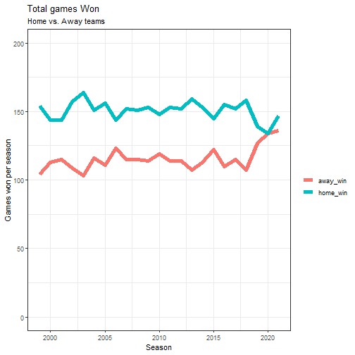

<!-- README.md is generated from README.Rmd. Please edit that file -->

<!-- badges: start -->
<!-- badges: end -->


# **NFL Win Predictions using Machine Learning**
##### This repository houses scripts and utility functions used for cleaning, aggregating and manipulating NFL play-by-play data. The resulting aggregated data is then fed into a machine learning model workflow that attempts to predict the winners of NFL games. The raw NFL play-by-play data is obtained using the `nflfastR` package. All of the in-house functions mentioned throughout this document are located in the `utils.R` script in the `utils/` directory of this repo.

<style>
div.blue { background-color:#e6f0ff; border-radius: 5px; padding: 20px;}
</style>
<div class = "blue">

<h5>For a detailed write up of the modeling process and results go [here](https://anguswg-ucsb.github.io/nfl_wins/). This README just highlights the data ingestion steps to get the necessary features and data in a model-ready format.</h5>

</div>


<br>

## **Data ingest**
##### The starting data used in this repo comes from the outputs of the `nflfastR::load_pbp` and `nflfastR::fast_scraper_schedules()` functions, so many thanks to the people at [nflfastR](https://www.nflfastr.com/index.html)

<br>

### **Play-by-play data** 

##### First, we need a vector of the years of NFL seasons that we want to get data for

```r
# unique seasons
seasons_lst <- 1999:2021
```

<br>

##### Using `lapply()`, We extract play-by-play data for each season in **season_lst**, and send the this data to `aggreg_games()`. The `aggreg_games()` function, takes the play-by-play data output from `nflfastR::load_pbp` and summarize the play-by-play level data into game level data.

```r
# unique seasons
seasons_lst <- 1999:2021

# Retrieve team play-by-play data between 1999 - 2021 and aggregate to game level data
game_stats <- lapply(seasons_lst, FUN = function(x) {
  
  logger::log_info("Retrieving {x} game data...")
  
  # Get play-by-play data and summarize to game level
  games <- nflfastR::load_pbp(x) %>% 
    aggreg_games()
  }
) %>% 
  dplyr::bind_rows()
```


```r
# view game level data 
game_stats %>% 
  dplyr::glimpse()
#> Rows: 12,268
#> Columns: 27
#> $ season                       <dbl> 1999, 1999, 1999, 1999, 1999, 1999, 1999, 1999, 19…
#> $ week                         <dbl> 1, 1, 1, 1, 1, 1, 1, 1, 1, 1, 1, 1, 1, 1, 1, 1, 1,…
#> $ game_id                      <chr> "1999_01_ARI_PHI", "1999_01_ARI_PHI", "1999_01_BUF…
#> $ posteam                      <chr> "ARI", "PHI", "BUF", "IND", "CAR", "NO", "CIN", "T…
#> $ home                         <dbl> 0, 1, 0, 1, 0, 1, 0, 1, 0, 1, 0, 1, 1, 0, 1, 0, 1,…
#> $ div_game                     <dbl> 1, 1, 1, 1, 1, 1, 1, 1, 1, 1, 0, 0, 0, 0, 0, 0, 0,…
#> $ qtr_pts_1                    <dbl> 0, 21, 0, 7, 0, 7, 7, 14, 7, 3, 3, 0, 7, 3, 7, 0, …
#> $ qtr_pts_2                    <dbl> 6, 3, 6, 7, 10, 3, 14, 12, 7, 10, 22, 7, 13, 0, 0,…
#> $ qtr_pts_3                    <dbl> 6, 0, 8, 7, 0, 9, 8, 0, 0, 22, 0, 7, 0, 7, 7, 7, 0…
#> $ qtr_pts_4                    <dbl> 13, 0, 0, 10, 0, 0, 6, 10, 21, 0, 3, 6, 0, 7, 7, 1…
#> $ score_diff                   <dbl> -11.640, 10.087, -8.962, 6.548, -6.411, 5.259, -3.…
#> $ score_diff_qtr_1             <dbl> -8.826, 5.967, -2.947, 0.722, -6.955, 7.000, -5.38…
#> $ score_diff_qtr_2             <dbl> -17.800, 15.714, -8.781, 6.560, -4.478, 2.429, -12…
#> $ score_diff_qtr_3             <dbl> -14.516, 12.000, -12.200, 8.318, -5.211, 2.609, -0…
#> $ score_diff_qtr_4             <dbl> -5.419, 6.667, -11.920, 10.591, -9.000, 9.000, 2.9…
#> $ dscore_diff_qtr_1            <dbl> -21, 21, -7, 7, -1, 0, 0, 7, 4, -4, 3, -3, 7, -4, …
#> $ dscore_diff_qtr_2            <dbl> 6, 0, -1, 4, 10, -7, 2, -4, -9, 10, 9, -8, 13, -10…
#> $ dscore_diff_qtr_3            <dbl> 6, 0, 1, -1, -9, 9, 8, 0, -22, 22, -7, 7, -7, 7, 7…
#> $ dscore_diff_qtr_4            <dbl> 13, -7, -7, 10, 0, 0, -4, 7, 21, -14, -3, 3, -7, 0…
#> $ qb_epa                       <dbl> -0.085, -0.171, -0.151, 0.027, -0.312, -0.169, 0.1…
#> $ third_down_pct               <dbl> 0.389, 0.154, 0.333, 0.533, 0.167, 0.294, 0.438, 0…
#> $ turnovers                    <dbl> 4, 4, 3, 3, 3, 0, 2, 4, 3, 2, 2, 1, 2, 1, 1, 0, 3,…
#> $ drive_time_of_possession_sec <dbl> 2947, 1509, 1883, 2389, 1628, 2443, 2606, 1395, 25…
#> $ top_pct                      <dbl> 0.661, 0.339, 0.441, 0.559, 0.400, 0.600, 0.651, 0…
#> $ ndrives                      <dbl> 15, 15, 12, 13, 15, 15, 13, 13, 14, 14, 15, 13, 12…
#> $ score_drives                 <dbl> 6, 4, 3, 4, 2, 3, 6, 6, 5, 6, 5, 3, 4, 2, 3, 6, 2,…
#> $ score_drives_pct             <dbl> 0.400, 0.267, 0.250, 0.308, 0.133, 0.200, 0.462, 0…
```

<br>

### **Team records**
##### Next, we will retrieve game outcome data using `nflfastR::fast_scraper_schedules()` and run this data through the `get_schedule()` function I created. `get_schedule` will calculate the necessary columns we need for modeling and return a tibble ready to join with the rest of the game level data created above. 

```r
# pull schedules for every year and apply get_schedule()
team_records <- lapply(seasons_lst, FUN = function(x) {

  logger::log_info("Season schedules: {x}")

  # Get season results
  schedule <- nflfastR::fast_scraper_schedules(x) %>%
    get_schedule()
  }
) %>%
  dplyr::bind_rows()
```


```r
team_records %>% 
  dplyr::glimpse()
#> Rows: 12,274
#> Columns: 15
#> $ season       <dbl> 1999, 1999, 1999, 1999, 1999, 1999, 1999, 1999, 1999, 1999, 1999, …
#> $ week         <dbl> 1, 2, 3, 4, 5, 6, 8, 9, 10, 11, 12, 13, 14, 15, 16, 17, 1, 2, 3, 4…
#> $ game_id      <chr> "1999_01_ARI_PHI", "1999_02_ARI_MIA", "1999_03_SF_ARI", "1999_04_A…
#> $ team         <chr> "ARI", "ARI", "ARI", "ARI", "ARI", "ARI", "ARI", "ARI", "ARI", "AR…
#> $ opponent     <chr> "PHI", "MIA", "SF", "DAL", "NYG", "WAS", "NE", "NYJ", "DET", "DAL"…
#> $ home_away    <chr> "away_team", "away_team", "home_team", "away_team", "home_team", "…
#> $ rest_days    <dbl> 7, 7, 8, 6, 7, 7, 14, 7, 7, 7, 7, 7, 7, 7, 7, 7, 7, 8, 6, 7, 7, 7,…
#> $ win          <dbl> 1, 0, 0, 0, 1, 0, 0, 0, 1, 1, 1, 1, 0, 0, 0, 0, 0, 0, 0, 0, 1, 0, …
#> $ home_score   <dbl> 24, 19, 10, 35, 14, 10, 3, 12, 23, 13, 24, 21, 28, 21, 37, 49, 14,…
#> $ away_score   <dbl> 25, 16, 24, 7, 3, 24, 27, 7, 19, 9, 34, 17, 3, 31, 14, 24, 17, 7, …
#> $ home_win     <dbl> 0, 0, 0, 0, 1, 1, 1, 0, 2, 3, 0, 4, 0, 4, 0, 0, 0, 0, 0, 0, 0, 0, …
#> $ away_win     <dbl> 1, 1, 0, 1, 0, 0, 0, 1, 0, 0, 2, 0, 2, 0, 2, 2, 0, 0, 0, 0, 1, 0, …
#> $ win_pct      <dbl> 1.000, 0.500, 0.333, 0.250, 0.400, 0.333, 0.286, 0.250, 0.333, 0.4…
#> $ home_win_pct <dbl> 0.000, 0.000, 0.000, 0.000, 0.500, 0.333, 0.250, 0.250, 0.400, 0.5…
#> $ away_win_pct <dbl> 1.000, 0.500, 0.500, 0.333, 0.333, 0.333, 0.333, 0.250, 0.250, 0.2…
```

<br>

### **Elo ratings**
##### We can then take our team_records data frame and calculate Elo ratings for each season of data using `get_nfl_elo`

```r
# Filter team records to just home POV and split dataframe into list by season to then lapply() over
nfl_split <- 
  team_records %>% 
  dplyr::filter(home_away == "home_team") %>%
  dplyr::select(
    season, week, game_id, team, opponent, 
    win, home_score, away_score
    ) %>% 
  dplyr::group_by(season) %>% 
  dplyr::group_split()

# pull rosters for every year
nfl_elo <- lapply(nfl_split, FUN = function(x) {
  
  elo_rating <- get_nfl_elo(x)
  
}
) %>%
  dplyr::bind_rows()
```


```r
nfl_elo %>% 
  dplyr::glimpse()
#> Rows: 12,274
#> Columns: 6
#> $ season  <dbl> 1999, 1999, 1999, 1999, 1999, 1999, 1999, 1999, 1999, 1999, 1999, 1999,…
#> $ week    <dbl> 3, 5, 6, 8, 10, 11, 13, 15, 1, 4, 6, 8, 9, 13, 16, 17, 2, 3, 7, 8, 12, …
#> $ game_id <chr> "1999_03_SF_ARI", "1999_05_NYG_ARI", "1999_06_WAS_ARI", "1999_08_NE_ARI…
#> $ win     <dbl> 0, 1, 0, 0, 1, 1, 1, 0, 0, 0, 0, 1, 0, 1, 1, 1, 0, 1, 0, 0, 0, 1, 1, 1,…
#> $ team    <chr> "ARI", "ARI", "ARI", "ARI", "ARI", "ARI", "ARI", "ARI", "ATL", "ATL", "…
#> $ elo     <dbl> 1490.000, 1500.288, 1490.279, 1480.559, 1491.118, 1501.374, 1511.334, 1…
```

<br>

### **Lagged data**
##### Next, we need to create lagged versions of our data so *our model only has data for all the weeks leading up to the prediction week.* Using the helper functions, `rolling_offense`, `rolling_record`, `rolling_elo` we create lagged data and where it is appropriate we create lagged cumulative averages of our data.

```r
# cumalative offense
lag_game_stats  <- rolling_offense(game_stats)

# Cumalative win %
lag_record      <- rolling_record(team_records)

# lagged Elo ratings
lag_elo         <- rolling_elo(nfl_elo)
```

<br>

##### The lagged data frames will then all be joined together and we will create a dataset for the home team... 

```r
# lagged data from home team POV
home_df <- 
  lag_record %>% 
  dplyr::select(
    season, week, game_id, team, opponent, rest_days,
    win_pct, home_win_pct, away_win_pct, win
    ) %>% 
  dplyr::left_join(
    lag_game_stats,
    by = c("season", "week", "game_id", "team" = "posteam")
  ) %>% 
  dplyr::left_join(
    dplyr::select(lag_elo, game_id, team, elo),
    by = c("game_id", "team")
  )
```

<br>

##### and a dataset for the away team...

```r
# lagged data from away team POV
away_df <- 
  lag_record %>% 
  dplyr::select(
    season, week, game_id, team, opponent, 
    rest_days, win_pct, home_win_pct, away_win_pct, win
    ) %>% 
  dplyr::left_join(
    lag_game_stats,
    by = c("season", "week", "game_id", "team" = "posteam")
  ) %>% 
  dplyr::left_join(
    dplyr::select(lag_elo, game_id, team, elo),
    by = c("game_id", "team")
  ) %>% 
  setNames(c("season", "week", "game_id", "team", "opponent", paste0("opp_", names(.)[6:44]))) %>%
  dplyr::select(-team)
```

<br>

### **Final data for modelling**
##### Finally, we join the **home_df** with the **away_df**, and we have our data set ready for modeling! 

```r
# Final join of all data
model_data <- 
  home_df %>% 
  dplyr::left_join(
    away_df,
    by = c("season", "week", "game_id", "team" = "opponent")
  ) %>% 
  dplyr::select(
    -div_game, -opp_win, -opp_home, -opp_div_game,
    -contains("dscore"), -contains("qtr"), -contains("ndrives")
    ) %>%                                                        # remove extraneous columns
  dplyr::relocate(
    season, week, game_id, team, opponent,
    win, win_pct, home_win_pct, away_win_pct, home
    )                                                            # logically order starting columns
```


```r
# Glimpse the rows, columns of the final dataset for modelling, keeping only the home team POV
model_data %>% 
  dplyr::filter(home == 1) %>% 
  dplyr::glimpse()
#> Rows: 6,134
#> Columns: 33
#> $ season                           <dbl> 1999, 1999, 1999, 1999, 1999, 1999, 1999, 1999…
#> $ week                             <dbl> 3, 5, 6, 8, 10, 11, 13, 15, 1, 4, 6, 8, 9, 13,…
#> $ game_id                          <chr> "1999_03_SF_ARI", "1999_05_NYG_ARI", "1999_06_…
#> $ team                             <chr> "ARI", "ARI", "ARI", "ARI", "ARI", "ARI", "ARI…
#> $ opponent                         <chr> "SF", "NYG", "WAS", "NE", "DET", "DAL", "PHI",…
#> $ win                              <dbl> 0, 1, 0, 0, 1, 1, 1, 0, 0, 0, 0, 1, 0, 1, 1, 1…
#> $ win_pct                          <dbl> 0.500, 0.250, 0.400, 0.333, 0.250, 0.333, 0.45…
#> $ home_win_pct                     <dbl> 0.000, 0.000, 0.500, 0.333, 0.250, 0.400, 0.50…
#> $ away_win_pct                     <dbl> 0.500, 0.333, 0.333, 0.333, 0.250, 0.250, 0.40…
#> $ home                             <dbl> 1, 1, 1, 1, 1, 1, 1, 1, 1, 1, 1, 1, 1, 1, 1, 1…
#> $ rest_days                        <dbl> 8, 7, 7, 14, 7, 7, 7, 7, 7, 7, 7, 6, 7, 7, 7, …
#> $ score_diff                       <dbl> -6.904, -10.831, -7.024, -6.778, -7.183, -5.90…
#> $ qb_epa                           <dbl> -0.132, -0.162, -0.150, -0.143, -0.157, -0.144…
#> $ third_down_pct                   <dbl> 0.310, 0.320, 0.287, 0.281, 0.255, 0.252, 0.26…
#> $ turnovers                        <dbl> 4.000, 4.000, 3.200, 3.333, 2.875, 2.667, 2.45…
#> $ drive_time_of_possession_sec     <dbl> 2468.000, 2171.500, 2100.400, 2042.833, 1948.2…
#> $ top_pct                          <dbl> 0.569, 0.500, 0.498, 0.484, 0.468, 0.475, 0.49…
#> $ score_drives                     <dbl> 4.500, 3.000, 2.800, 2.667, 2.250, 2.556, 2.90…
#> $ score_drives_pct                 <dbl> 0.300, 0.210, 0.198, 0.189, 0.160, 0.182, 0.20…
#> $ elo                              <dbl> 1461.762, 1480.760, 1500.288, 1490.280, 1462.7…
#> $ opp_rest_days                    <dbl> 8, 7, 14, 7, 7, 7, 7, 7, 7, 7, 7, 7, 7, 7, 7, …
#> $ opp_win_pct                      <dbl> 0.500, 0.500, 0.750, 0.714, 0.750, 0.556, 0.25…
#> $ opp_home_win_pct                 <dbl> 1.000, 0.500, 0.500, 0.750, 0.800, 1.000, 0.33…
#> $ opp_away_win_pct                 <dbl> 0.000, 0.500, 1.000, 0.667, 0.667, 0.200, 0.16…
#> $ opp_score_diff                   <dbl> -7.355, -5.244, 3.718, -0.277, 2.955, 5.743, -…
#> $ opp_qb_epa                       <dbl> -0.164, -0.077, 0.194, 0.028, -0.023, -0.021, …
#> $ opp_third_down_pct               <dbl> 0.126, 0.242, 0.366, 0.397, 0.324, 0.358, 0.28…
#> $ opp_turnovers                    <dbl> 3.000, 2.000, 0.750, 1.571, 1.500, 1.778, 2.08…
#> $ opp_drive_time_of_possession_sec <dbl> 1770.000, 2150.000, 2124.500, 1831.429, 2045.3…
#> $ opp_top_pct                      <dbl> 0.424, 0.502, 0.507, 0.446, 0.496, 0.548, 0.44…
#> $ opp_score_drives                 <dbl> 2.000, 2.750, 6.250, 4.143, 4.125, 3.444, 2.91…
#> $ opp_score_drives_pct             <dbl> 0.158, 0.220, 0.446, 0.317, 0.321, 0.268, 0.23…
#> $ opp_elo                          <dbl> 1458.588, 1482.314, 1491.139, 1503.825, 1521.3…
```

<br> 

And here is a quick visualization of the number of games won each season by the home and away teams!

```r
  model_data %>%
  dplyr::group_by(season, home) %>% 
  dplyr::select(season, game_id, home, win) %>% 
  na.omit() %>% 
  dplyr::mutate(
    home_away = dplyr::case_when(
      home == 1 ~ "home",
      home == 0 ~ "away"
    )
  ) %>% 
  dplyr::ungroup() %>% 
  dplyr::select(-home) %>%
  tidyr::pivot_wider( names_from = "home_away", values_from = "win") %>% 
  dplyr::group_by(season) %>% 
  dplyr::summarise(
    home_win = sum(home, na.rm = T),
    away_win = sum(away, na.rm = T)
  ) %>% 
  tidyr::pivot_longer(cols = c(-season)) %>% 
  ggplot2::ggplot() +
  ggplot2::geom_line(aes(x = season, y = value, col = name), size = 2) +
  ggplot2::scale_y_continuous(limits = c(0, 200), breaks = seq(0, 200, by = 50)) +
  ggplot2::labs(
    title    = "Total games Won", 
    subtitle = "Home vs. Away teams",
    col      = "", 
    x        = "Season",
    y        = "Games won per season"
  ) +
  ggplot2::theme_bw()
```




