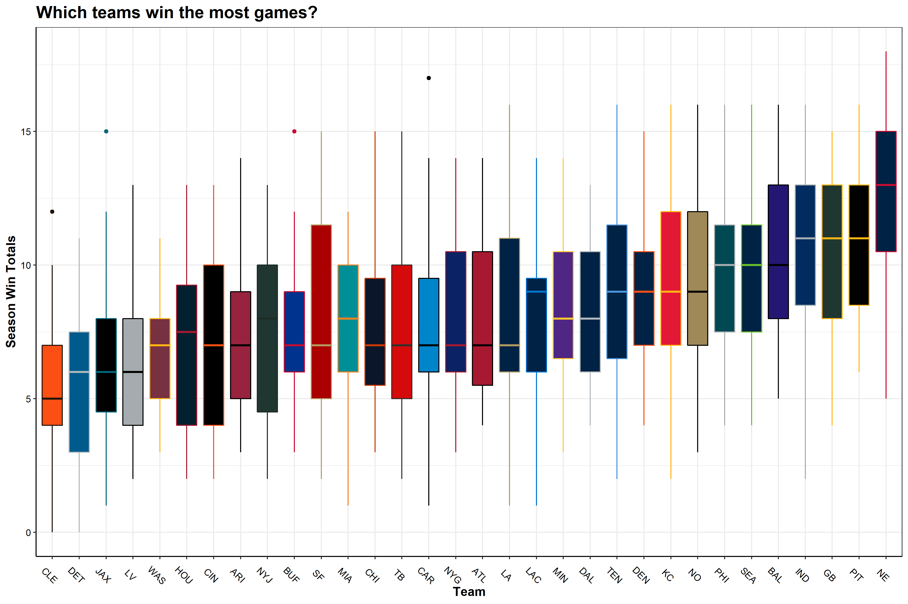
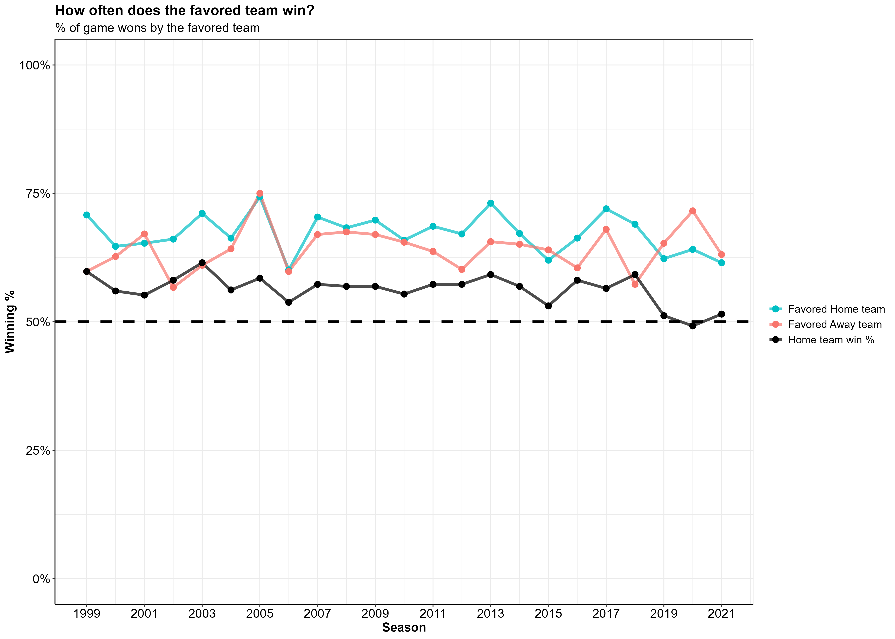
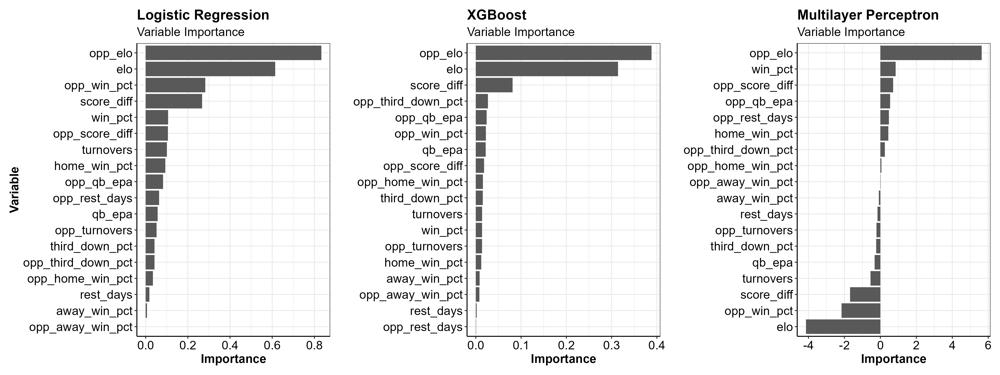
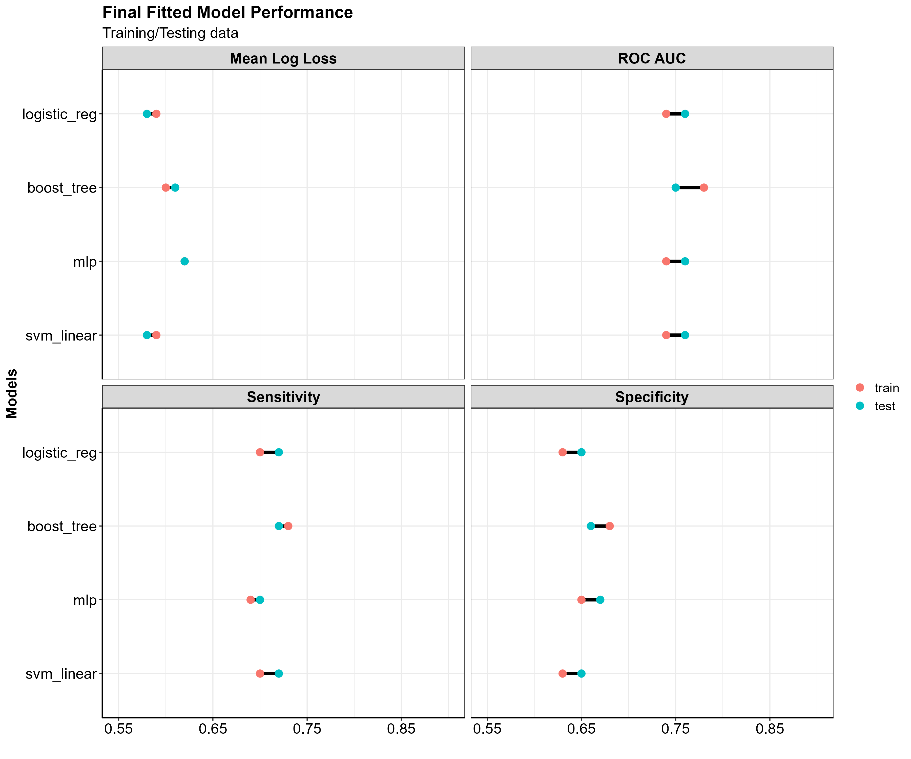
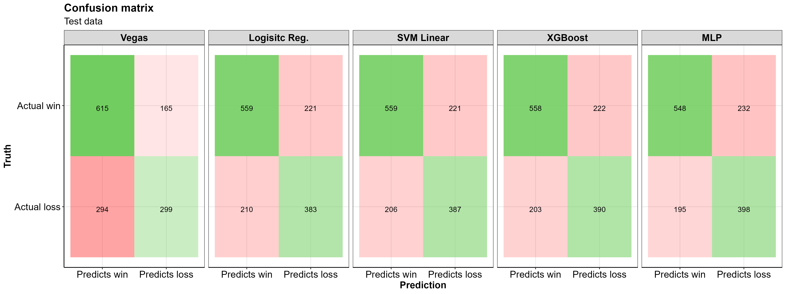
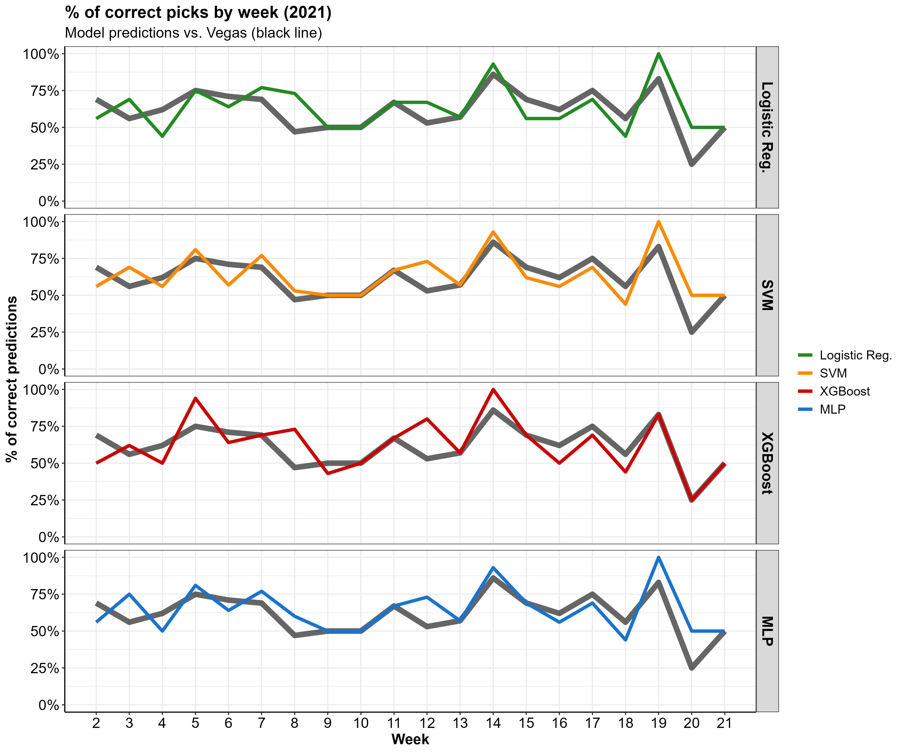

```{r setup, include = FALSE}
knitr::opts_chunk$set(eval = FALSE, warning = FALSE, message = FALSE) 
```

```{r, eval = TRUE, echo = FALSE}

# remove(list = ls())  # clear all workspace variables

library(rmarkdown)
library(knitr)
library(ggplot2)
library(dplyr)
library(flextable)
library(tidymodels)

source("../utils/utils.R")

nfl        <- readRDS(here::here("data", "football_wins.rds"))

nfl_data <- 
  nfl %>% 
  dplyr::select(names(holdout_df)) %>% 
  dplyr::select(-fav, -div_game)

# Load entire dataset
model_dat <- readRDS(here::here("data", "football_wins_lag_elo.rds")) 

pred_holdout <- readRDS(here::here("data", "holdout_predictions.rds"))
pred_table   <- readRDS(here::here("data", "holdout_predictions_table.rds"))
confmat_tbl  <- readRDS(here::here("img", "conf_mat_metrics.png"))
nfl_split       <- readRDS(here::here("data", "class_split_data.rds"))
nfl_train       <- readRDS(here::here("data", "class_train_data.rds"))
nfl_test        <- readRDS(here::here("data", "class_test_data.rds"))

wfs_ranks       <- readRDS(here::here("data", "class_wfs_ranks.rds"))

roc_df          <- readRDS(here::here("data", "win_roc.rds"))
vip_df          <- readRDS(here::here("data", "win_variable_importance.rds"))
confmat_df      <- readRDS(here::here("data", "win_conf_matrix.rds"))
metrics_df      <- readRDS(here::here("data", "win_metrics.rds"))

holdout_result  <- readRDS(here::here("data", "holdout_year_predictions.rds"))

holdout_df <-
  model_dat %>% 
  dplyr::filter(season == 2021, home == 1) %>% 
  dplyr::select(-abs_spread_line, -home, -home_fav, -spread_line) %>% 
  dplyr::select(season, week, game_id, team, opponent, fav, win, 
                div_game, rest_days, opp_rest_days, elo, opp_elo,
                score_diff, opp_score_diff, turnovers, opp_turnovers,
                win_pct, away_win_pct,
                home_win_pct,  opp_win_pct, opp_away_win_pct,
                opp_home_win_pct, qb_epa, opp_qb_epa,
                third_down_pct, opp_third_down_pct, 
                score_drives, opp_score_drives) 

holdout_test <- 
  model_dat %>% 
  dplyr::filter(home == 1, game_id %in% nfl_test$game_id) %>%
  dplyr::select(names(holdout_df)) 
# Logisitc regression model
log_reg_model      <- readRDS(here::here("data", "win_model_logistic_reg.rds"))
# log_reg_last_fit   <- readRDS(here::here("data", "win_resamples_logistic_reg.rds"))
# log_reg_last_fit %>% 
#   collect_predictions() %>%
#   conf_mat(win, .pred_class) %>%
#   autoplot("heatmap")


# XGBoost model
xgb_model <- readRDS(here::here("data", "win_model_boost_tree.rds"))

# SVM Poly model
svm_poly_model <- readRDS(here::here("data", "win_model_svm_poly.rds"))

# SVM RBF model
svm_rbf_model <- readRDS(here::here("data", "win_model_svm_rbf.rds"))

# SVM RBF model
mlp_model <- readRDS(here::here("data", "win_model_svm_poly.rds"))

# nfl_wfs <- readRDS("D:/nfl/classification/wfs/win_classification_wfs2.rds")
```

<br>

# **Introduction**

My goal with this project was to try to answer the age old sports
question of **"So, who is supposed to win this game?"**

I wanted to see if I could use historic information about a team's
offensive and defensive performances to garner an accurate prediction on
whether or not they will win their upcoming game.

All data ingestion, processing, analysis, and modeling was done in R, and
I leaned heavily on the `tidyverse` and `tidymodels` ecosystems to get
this done. <br> <br>

------------------------------------------------------------------------

# **Data Retrieval**

I pulled NFL play-by-play data together using the `nflFastR R package`.
I then did some data cleaning and wrangling tasks to get the data into a
usable format.

I started by getting the full play-by-play data sets from 1999-2021. Each season there are some ~50,000 plays run, and for each play, there are 372
columns of data giving information about what happened on that play.

**Note:** While exploring the data and creating the features I wanted to
use in the model, I created a host of utility helper functions that work
off of the play-by-play output data from the `nflFastR` package. Those
helper functions can be found
[here](https://github.com/anguswg-ucsb/nfl_wins/blob/main/utils/utils.R).

The function below takes in the NFL play-by-play returned from the `nflFastR::nflfastR::load_pbp()` function, and aggregates the data to game level team statistics. 

```{r, eval = FALSE, echo = FALSE}
# takes in NFL fast R play-by-play data and returns a cleaned tibble with game level offensive stats
get_offense <- function(season_pbp) {

  logger::log_info("\n\nCalculating {season_pbp$season[1]} offensive stats...")
  
  # Remove overtime, calculate drive time of possession, identify home teams
  season_df <-
    season_pbp %>%
    dplyr::group_by(game_id, posteam) %>%
    dplyr::ungroup() %>% 
    dplyr::group_by(game_id, qtr, posteam) %>% 
    dplyr::arrange(-game_seconds_remaining, .by_group = T) %>% 
    dplyr::mutate(
      drive_time_of_possession_sec =  
        60*as.numeric(sub(':.*', '', drive_time_of_possession)) + as.numeric(sub('.*:', '', drive_time_of_possession))
    ) %>% 
    dplyr::mutate(
      home = dplyr::case_when(
        posteam == home_team ~ 1,
        TRUE                 ~ 0
      )
    ) %>% 
    dplyr::ungroup() %>% 
    dplyr::filter(qtr < 5)  %>% 
    dplyr::filter(!posteam == "")
  
  # total scoring drives and % of drives ending with a score
  off_drive_stats <-
    season_df %>%
    dplyr::group_by(game_id, qtr, posteam, drive) %>%
    dplyr::summarize(
      drive_ended_with_score  = max(drive_ended_with_score,na.rm = F)
    ) %>%
    dplyr::ungroup() %>% 
    dplyr::group_by(game_id, drive, posteam) %>% 
    dplyr::slice(1) %>% 
    dplyr::ungroup() %>% 
    dplyr::group_by(game_id, posteam) %>% 
    dplyr::mutate(ndrives = n()) %>% 
    dplyr::summarize(
      ndrives          = mean(ndrives, na.rm = T),
      score_drives     = sum(drive_ended_with_score, na.rm = T),
      score_drives_pct = score_drives/ndrives
    ) %>%
    na.omit() %>% 
    dplyr::ungroup() %>% 
    dplyr::select(-ndrives)
  
  # Offensive quarter stats, turnovers, third down conversions, QB EPA
  off_stats <- 
    season_df %>% 
    dplyr::group_by(game_id, posteam) %>%
    dplyr::summarize(
      across(c(fumble_lost, interception, third_down_converted, third_down_failed), sum, na.rm = T),
      across(c(qb_epa), mean, na.rm = T),
      across(c(home, div_game), max, na.rm = F)
    ) %>%
    dplyr::mutate(
      third_down_pct = third_down_converted/(third_down_converted + third_down_failed),
      turnovers      = fumble_lost + interception
    ) %>% 
    dplyr::ungroup() %>% 
    dplyr::select(-third_down_converted, -third_down_failed, -fumble_lost, -interception) %>%
    dplyr::filter(!is.na(posteam)) %>% 
    dplyr::relocate(game_id, posteam, home, div_game, third_down_pct, turnovers)
  
  # Quarter score differential of possession
  off_qtr_points <- 
    season_df %>% 
    dplyr::select(game_id, qtr, drive, play_id, game_seconds_remaining, 
                posteam, posteam_score_post) %>% 
    dplyr::group_by(game_id, qtr, posteam) %>%
    dplyr::arrange(drive, .by_group = T) %>% 
    dplyr::slice(
      which.min(play_id),
      which.max(play_id)
    ) %>% 
    na.omit() %>%
    dplyr::mutate(
      start_end = dplyr::case_when(
        play_id == min(play_id) ~ "start_qtr",
        play_id == max(play_id) ~ "end_qtr"
      )
    ) %>% 
    dplyr::ungroup() %>%
    tidyr::pivot_wider(
      id_cols     = c(game_id, qtr, posteam), 
      names_from  = "start_end", 
      values_from = "posteam_score_post"
    ) %>% 
    dplyr::mutate(
      qtr_pts = end_qtr - start_qtr
    ) %>% 
    dplyr::select(game_id, qtr, posteam, qtr_pts) %>% 
    dplyr::ungroup() %>% 
    dplyr::mutate(qtr_name = paste0("qtr_", qtr)) %>%
    tidyr::pivot_longer(cols = c(qtr_pts)) %>%
    tidyr::pivot_wider(
      id_cols     = c(game_id, posteam),
      names_from  = c(name, qtr),
      names_glue  = "{name}_{qtr}",
      values_from = value
    ) %>% 
    dplyr::mutate(
      pts_scored = qtr_pts_1 + qtr_pts_2 + qtr_pts_3 + qtr_pts_4
    )
  
  # Join all data 
  off_game <-
    off_stats %>% 
    dplyr::ungroup() %>% 
    dplyr::left_join(
      off_drive_stats,
      by = c("game_id", "posteam")
    ) %>% 
    dplyr::left_join(
      off_qtr_points,
      by = c("game_id", "posteam")
    )  %>% 
    dplyr::mutate(
      season = as.numeric(substr(game_id, 1, 4)),
      week   = as.numeric(substr(game_id, 6, 7))
    ) %>% 
    dplyr::relocate(season, week, game_id, posteam, home, div_game) %>% 
    dplyr::filter(posteam != "") %>% 
    dplyr::mutate(across(where(is.numeric), round, 3))
  
  return(off_game)

}
```


In the end I used data from the 1999-2021 seasons, however I completed
omitted the entire 2021 season to use as a holdout set of data to test
my models against. Another thing to note is that I ended up using only data from the perspective of the home team.

Initially I had been running models with 2 data points for each game,
one being the home team perspective and the other being the away team
perspective. I pretty quickly ran into some major overfitting in my
models and realized **it was a better idea to only use data from the
home team.**


<br> 
<br>
<br>

------------------------------------------------------------------------

# **Exploratory Data Analysis**

Let's dig into some of the data and see what we can learn about the NFL and the data we are working with. 

<br>

## Season win totals

First thing I wanted to see was how many games on average each NFL franchise won per season between 1999 and 2021. The box plot below shows the average season win totals on the Y axis and the NFL franchises on the x axis with the x axis arranged by mean annual win total. The boxes are colored to match the color scheme for each NFL team. 

<br>

<center>



</center>

<br>

**TLDR;** 
Patriots good, Browns bad (sorry Cleveland!)

This confirms what I already know from my experience watching the NFL. The New England Patriots are leading the league with an
average of 12.6 wins per season. The Patriots are followed by the
Steelers, Packers, Colts, Ravens, all teams that have seen consistent
success over the last 23 years. At the bottom of the league are the
Browns, Lions, Jaguars, and the Raiders.  

<br> 
<br>
<br>

## QB performances

Next I wanted to see which, NFL team's had the best quarterbacks over the last 23 seasons. Quarterback EPA is a
metric that determines how likely a team is to score points as a result
of a play, and more specifically the quarterbacks effect on that play. 

<br>

**If a QB does something good (long completion, run for a first
down), then there team is more likely to score points on the ensuing
play, thus Expected points were added (EPA is positive). On the other
hand if a QB does something bad (incompletion, takes a big sack), then
there team is less likely to score points on the ensuing play and
expected points were removed (EPA is negative).**

Below is a plot showing the for each team, the average QB EPA across the
all seasons.

<center></center>

**TLDR;** 
Tom Brady good, <insert long list of Browns QBs> bad 

This makes sense, teams like the Patriots, Packers, and Colts are at the
top of the league in terms of average QB EPA seeing as though these
teams had great quarterbacks for most of these years, Tom Brady,
Brett Favre/Aaron Rodgers, and Peyton Manning/Andrew Luck, respectively. This plot
matches very closely with the above season win totals boxplot. 
Safe to say, good quarterback play positively impacts winning games.

## Relating end of season win totals to team metrics

Next thing I wanted to see what the end of season win totals for each team across all 23 seasons, looked like when plotted against some average team level statistics for that season. The plot below shows 6 team metrics with the X axis displaying end of season win totals and the Y axis being the season average for each team. 

**Note:** The Y axis values are not meant to be compared across plots as they are in different units. The purpose of this figure is to show the relationship between team metrics and end-of-season win totals From top left to bottom right:

```{r, eval = TRUE, echo=FALSE}
team_met_tbl <- tibble::tibble(
  
  Variable    = c(  "% Time of possesion",
                    "QB EPA",
                  "Score Differential",
                  "Scoring Drive", 
                  "Third Down %", 
                  "Turnovers"
                  ),
  "Y Axis"      =  c(
    "Average percent of the game the team had possession of the ball",
    "EPA value w/ negative values indicating a negative impact on scoring",
    "Average Score Differential",
    "Number of scoring drives per game",
    "Average percent of third downs converted to first downs",
    "Number of turnovers per game"
  )
)

team_met_tbl %>% 
  kableExtra::kable() %>% 
  kableExtra::kable_material(c("striped", "hover"))
```

<br>

<center></center>

Important takeaways from these plots:

  - Greater % time of possession, the more total wins at the end of the season 
  - Higher QB EPA, the more total wins at the end of the season 
  - More positive score differential, the more total wins at the end of the season 
  - Higher number of scoring drives per game, the more total wins at the end of the season 
  - Higher third down %, the more total wins at the end of the season 
  - Lower number of turnovers per game, the more total wins at the end of the season 
  
  
## Elo Rating

I created an Elo rating system for each season to create a metric that
keeps track of a teams rank relative to the rest of the league. Elo
rating systems were first created to rate chess players and are now
commonly used in many sports such as American Football, baseball,
basketball, etc. Special thanks to the creators of the
[elo](https://eheinzen.github.io/elo/) package, your package made my
life a lot easier. Here is more information on [Elo Rating
Systems](https://en.wikipedia.org/wiki/Elo_rating_system) and its
inventor [Arpad Elo](https://en.wikipedia.org/wiki/Arpad_Elo).

<center></center>

Sadly for Browns fans, the same take home message as we saw before... Patriots good, Browns bad :'(

<br> 
<br>

## Favored teams

Because I am going to make predictions on the outcome of NFL games I thought it best to see how the teams that were favored to win their game (according to Las Vegas) actually did in those games. Specifically, I wanted to see how often does a favored home team win? and a favored away team? and how often do home teams win overall? 
 
I'm curious about how often the home team wins, furthermore, what
percent of the time does the team favored by Vegas win? And how often does a favored home team win? and a favored away team? 

<br>

The black line indicates the percent of games won by the home team per season. The aqua blue line show the percent of games that favored home teams won and the coral color line shows the  percent of games that favored away teams won.

```{r, echo = FALSE, eval = FALSE}

# % games won by home team
home_wins <- 
  nfl %>% 
  dplyr::filter(week < 19) %>% 
  # dplyr::group_by(season, week, home) %>% 
  dplyr::group_by(season, home) %>% 
  dplyr::mutate(
    loss = dplyr::case_when(
      win == 0 ~ 1,
      win != 0 ~ 0,
      TRUE ~ 0
    )
  ) %>% 
  dplyr::summarise(
    win  = sum(win, na.rm = T),
    loss = sum(loss, na.rm = T),
  ) %>% 
  dplyr::ungroup() %>% 
  dplyr::mutate(
    games = win + loss
  ) %>% 
  na.omit() %>% 
  dplyr::mutate(
    home_win_pct = round(win/games, 3)
  ) %>% 
  dplyr::filter(home == 1) %>% 
  dplyr::select(season, home_win_pct)

# % of games the home favorite wins
favwin <- 
  nfl %>% 
  dplyr::filter(week < 19) %>% 
  dplyr::select(game_id, season, home, win, fav, abs_spread_line) %>% 
  dplyr::mutate(
    fav_win = dplyr::case_when(
      win == 1 & fav == 1 ~ 1,
      TRUE                ~ 0
    ),
    home = factor(home, levels = c(1, 0))
  ) %>% 
  dplyr::group_by(season, home, fav) %>%
  dplyr::mutate(
    games = n()
  ) %>% 
  dplyr::ungroup() %>% 
  dplyr::filter(fav == 1) %>% 
  dplyr::group_by(season, win, home) %>% 
  count() %>% 
  dplyr::ungroup() %>% 
  dplyr::group_by(season, home) %>% 
  dplyr::mutate(
    fav_win_pct = round(n/sum(n), 3)
  ) %>% 
  dplyr::ungroup() %>% 
  dplyr::group_by(season) %>%
  dplyr::mutate(
    nsum            = sum(n)
  ) %>%
  dplyr::filter(win == 1) %>% 
  dplyr::ungroup()

# Overall favorites win %
all_fav_wins <- 
  favwin %>% 
  dplyr::group_by(season) %>% 
  dplyr::summarise(
    fav_win_pct = round(sum(n)/nsum, 3)
  ) %>% 
  dplyr::slice(1) %>% 
  dplyr::ungroup()

# Join home win % with favorites win %
vegas_favorites <- 
  favwin %>% 
  dplyr::mutate(
    home_away = dplyr::case_when(
      home == 1 ~ "home_fav_win_pct",
      home == 0 ~ "away_fav_win_pct"
    )
  ) %>% 
  tidyr::pivot_wider(
    id_cols = c(season),
    names_from  = home_away,
    values_from = fav_win_pct
    ) %>% 
  dplyr::left_join(
    all_fav_wins,
    by = "season"
    ) %>% 
  dplyr::left_join(
    home_wins,
    by = "season"
  )

# Plot win % of home/away team and favorited teams
home_favorite_plot <-
    vegas_favorites %>% 
    tidyr::pivot_longer(cols = c(-season)) %>% 
    dplyr::mutate(
      name = dplyr::case_when(
        name == "home_fav_win_pct" ~ "Favored Home team",
        name == "away_fav_win_pct" ~ "Favored Away team",
        name == "fav_win_pct"      ~ "Favored Teams",
        name == "home_win_pct"     ~ "Home team win %"
      ),
      name = factor(name, levels = c("Favored Home team", "Favored Away team", "Favored Teams", "Home team win %"))
    ) %>% 
  dplyr::filter(name != "Favored Teams") %>% 
    ggplot2::ggplot() +
    ggplot2::geom_hline(yintercept = 0.5, size = 1.5, alpha = 1, linetype = "dashed") +
    ggplot2::geom_line(aes(x = season, y = value, col = name), size = 1.5, alpha = 0.7) +
    ggplot2::geom_point(aes(x = season, y = value, col = name), size = 3, alpha = 1) +
    ggplot2::scale_x_continuous(breaks = seq(1999, 2021, 2)) +
    ggplot2::scale_color_manual(values = c( "#00BFC4", "#F8766D", "black")) +
    # scale_x_continuous(breaks = seq(2000, 2020, 2)) +
    ggplot2::scale_y_continuous(limits = c(0, 1),
      labels = function(x) paste0(x*100, "%")
      ) +
    ggplot2::labs(
      title    = "How often does the favored team win?",
      subtitle = "% of game wons by the favored team",
      x        = "Season",
      y        = "Winning %"
    ) +
    apatheme 
# home_favorite_plot
# # 
# ggplot2::ggsave(
#     here::here("img", "home_favorite_win_pct2.png"),
#     home_favorite_plot,
#     width  = 14,
#     height = 10
#   )
```

<br>
<br>

<center>


</center

<br> 

Overall, it looks like a favored home team is winning ~ 5-10% more of the games they're favored in than a favored away team does. Anything else would be suprising seeing as a though a favored away team is at an inherit disadvantage in there game compared to a favored home team (because they're ***not*** the home team).

<br> 
<br>
<br>

------------------------------------------------------------------------

# **Feature engineering and selection**

I decided I wanted to focus the model features on **offensive metrics** and a handful of **other off-field factors** that I suspected might
influence a teams likelihood to win their upcoming game. For all the metrics I describe below, in order to capture both the home team and the away team, I created two sets of the same metric, one for the home team and one for the away team.

**Note:** Later on you will see features whose names start with **"opp_"**, which just means that feature is representing the away team. 

<br>
<br>

## Offense

Originally, I had created many more features (including time of possession as a percent of the game, points scored in each quarter, turnovers by the defense and many more) but as I made some initial models I found that all of these were not necessary. The features you see below are the features that had the most predictive power after I trimmed away some of the fat. 


```{r, eval = TRUE, echo=FALSE}


off_table <- tibble::tibble(
  Variable    = c("Score Differential",
                  "Third Down Conversion Rate", 
                  "Turnovers",
                  "QB EPA",
                  "Scoring Drive"
                  ),
  "Model Variable" = c("score_diff", "third_down_pct", "turnovers", "qb_epa", "score_drives"),
  Type        = c("Numeric", "Numeric","Numeric", "Numeric", "Numeric"),
  Description = c("Average score differential throughtout the game",
                  "Percent of 3rd downs converted by offense",
                  "Total Turnovers by the offense (Fumbles lost + Interceptions",
                  "Average Quarterback EPA across the whole game",
                  "Number of drives in a game that result in a score (touchdown/fieldgoal)"
                  )
)

off_table %>% 
  kableExtra::kable() %>% 
  kableExtra::kable_material(c("striped", "hover"))
```

<br>
<br>

## Off field factors

I included a handful of other information known prior to the game such
as the number of days of rest between games, the team's overall, home, and away winning
percentages, and the team's ranking via an Elo rating.

```{r, eval = TRUE, echo=FALSE}
other_fact_table <- tibble::tibble(
  Variable    = c("Rest days",
                  "Win %", "Home Win %", "Away Win %", "Elo rating"
                  ),
  "Model Variable" = c("rest_days", "win_pct", "home_win_pct", "away_win_pct", "elo"),
  Type        = c("Numeric", "Numeric", "Numeric", "Numeric", "Numeric"),
  Description = c("Numeric variable for the amount of rest the team had between games",
                  "Percent of all games won",
                  "Percent of home games won",
                  "Percent of away games won",
                  "Elo rating per week in each season, relative to rest of the league"
                  )
)
other_fact_table %>% 
  kableExtra::kable() %>% 
  kableExtra::kable_material(c("striped", "hover"))
```

<br>

Once all of the above variables were wrangled, cleaned, and aggregated
from the NFL play-by-play data, I was left with a data frame that had 1
row for every home game played during the season, with two columns for
each of the variables shown in the tables above (1 for the home team and 1 for the away team).

<br>
<br>

```{r, eval = TRUE, echo = TRUE}
nfl_data %>% 
  head(10)
```

## Corrolation

Let's take a look at how our game level summary data relates to winning a game.

<br>

Below is a correlation matrix that highlights the relationship between
variables in the data. We are most interested in the bottom row of this
plot, which indicates the correlation between a team winning there game
and all the other variables in the data. 

Darker green colors indicate positive correlations while darker red colors indicate negative
correlations.

<br>

<center></center>

<br>
<br>

We see that Elo rating has a relatively strong positive correlation with
winning, which makes a lot of sense, a higher Elo rating (higher ranked
team) is more likely to end up with a win. The average score
differential for a team also makes good sense, if a team on average has
a higher score differential (they score more points than are scored
against them) then it's logical that they would end up winning more
games. The turnover variable has a strong negative correlation with
winning, so if a team on average has fewer turnovers, they are more
likely to end up winning the game.

<br>

At this point in my analysis, I was working with ***a posteriori***
data, so data that was collected as a product of what happened on the
field that week. If I want to make any useful predictions about the
coming week, I would need to conjur up some ***a priori*** data.

<br>

## Cumulative Averages

To capture how well a team is doing throughout each season, I created
lagged cumulative means for all of the above variables. Such that, for
each week a team plays a game, the cumulative mean of all the
***preceeding*** weeks of data are calculated for every variable leading
into the upcoming slate of games.

Below is the general method I used to get these lagged Cumulative
averages values. Note, for some variables like winning percentage, the
lagged cumulative averages was ***not*** calculated and rather only the
lagged value were used. In the example code below, the lagged
winning percentage, and the lagged cumulative average QB EPA is
calculated for the Arizona Cardinals 2014 season.

```{r, eval = TRUE, echo = TRUE}
nfl %>% 
  dplyr::filter(season == 2014, team == "ARI") %>% 
  dplyr::select(season, week, team, win, win_pct, qb_epa) %>% 
  dplyr::group_by(season, team) %>% 
  dplyr::arrange(season, week, .by_group = T) %>% 
  dplyr::mutate(
    across(c(win_pct), ~dplyr::lag(.x), .names = "{col}_lag"),
    across(c(qb_epa),  ~dplyr::lag(dplyr::cummean(.x)), .names = "{col}_lag")
    ) %>% 
  dplyr::mutate(across(c(win_pct:qb_epa_lag), round, 2)) %>% 
  dplyr::ungroup() %>% 
  dplyr::relocate(season, week, team, win, win_pct, win_pct_lag, qb_epa, qb_epa_lag)

```

<br>

If you take a look at ARI's week 5 game (row 5), the **win_pct_lag**
column for week 5 is represented by the teams **win_pct** from the
previous week, week 4 in this case, or in other words, the team's
winning percentage ***leading into*** the week 5 match up. On the other
hand, the **qb_epa_lag** column was calculated using the mean of
**qb_epa** from weeks 1-4.

<br>

I did this lagging process across all of my variables such that for each
row with a game outcome (win/loss), that team has variables representing
their performances up until that point in the season.

<br>

Now our data is set up so that all the information used to inform our
prediction is data that would be available to us ***prior*** to the
upcoming week of games. This is important because information such as
the number of turnovers during the game is not information we would have
prior to the game, and thus can't be used as a predictor in our model,
we can only use historic data to inform our predictions.

<br> 
<br>
<br>

------------------------------------------------------------------------

# **Modeling**

I decided I wanted to run my data across a panel of 6 different models
and see how they all perform against each other

-   [Logistic
    Regression](https://parsnip.tidymodels.org/reference/details_logistic_reg_glmnet.html)
-   [K-nearest
    neighbors](https://parsnip.tidymodels.org/reference/details_nearest_neighbor_kknn.html)
-   [Gradient Boosted Decision
    Trees](https://parsnip.tidymodels.org/reference/details_boost_tree_xgboost.html)
-   [Multilayer
    Perceptron](https://parsnip.tidymodels.org/reference/details_mlp_nnet.html)
-   [Radial basis function Support Vector
    Machines](https://parsnip.tidymodels.org/reference/details_svm_rbf_kernlab.html)
-   [Polynomial Support Vector
    Machines](https://parsnip.tidymodels.org/reference/details_svm_poly_kernlab.html)

## Data Budget/Splits

The first step was to split up our data into testing and training splits
(75% training, 25% testing). When I split my data, I chose to stratify
the data by the binary win/loss value to ensure there was the same
proportion of wins and losses in our training and testing data splits.

```{r, echo = TRUE, eval = FALSE}
# Set random seed
set.seed(234)

# Partition training/testing data, stratified by win/loss
nfl_split <- rsample::initial_split(nfl_df, strata = win)

# training data split - 75%
nfl_train <- rsample::training(nfl_split)

# testinng data split - 25%
nfl_test  <- rsample::testing(nfl_split)
```

```{r, echo = FALSE, eval = TRUE}
# Partition training/testing data, stratified by win/loss
nfl_split
```

<br>

## Data Preprocessing

Using the `recipes` package, I made ID variables for information about
the game and when it happened. I then applied some recipe steps to my
training data. Because I decided to only use the home teams data, this
meant that there was going to be more wins than losses in my dataset
because the home team tends to win more often then the away team (56%
wins / 44% losses). To account for the slight imbalance of wins to
losses in the data, I chose to use the `themis` package to upsample my
data using the `themis::step_smote()` function.

<br>

### Recipe steps

-   `step_zv` is applied to all predictors to remove all variables with
    only one variable (zero-variance)
-   `step_normalize` is used to normalize all the numeric predictors in
    the training data so that they all have a standard deviation of 1
    and a mean of 0
-   `step_smote` is applied to our dependent **win** variable to fix the
    class imbalance due to having slightly more wins than losses in the
    data. The `step_smote` function works by upsampling the minority
    class and generating new, synthetic data by using the
    nearest-neighbors of the minority class instances.

Below I create the two recipe steps that we will apply to our training
data before modeling.

```{r, echo = TRUE, eval = FALSE}
# Base recipe
base_recipe <- 
  recipes::recipe(
  formula = win ~ ., 
  data    = nfl_train
  ) %>% 
  recipes::update_role(
    game_id, team, opponent, season, week, new_role = "ID"
  ) 

# Normalize, SMOTE algo upsampling recipe
norm_smote_recipe <- 
  base_recipe %>% 
  recipes::step_zv(recipes::all_predictors()) %>% 
  recipes::step_normalize(recipes::all_numeric_predictors())
  themis::step_smote(win, over_ratio = 0.9,  skip = T)
  
# zero variance SMOTE algo upsampling recipe
zv_smote_recipe <- 
  base_recipe %>% 
  recipes::step_zv(all_predictors()) %>% 
  themis::step_smote(win, over_ratio = 0.9,  skip = T)
```

<br>

## Cross-validation folds

I created 10 cross-validation folds from the training data. As I did
with the initial training/testing split, I made sure to create
**stratified resamples using the win/loss variable to ensure the same
proportion of wins and losses appear in CV folds as the do in the
original data.**

```{r, echo = TRUE, eval = FALSE}
# Set random seed 
set.seed(432)

# Cross-validation folds
nfl_folds <- rsample::vfold_cv(nfl_train, v = 10, strata = win)
```

<br>

## workflowsets

Using the `workflowsets` I created a `workflow_set` object containing
each of the data preprocessing recipes and corresponding model
specifications.

```{r, echo = TRUE, eval = FALSE}
# Workflow set of candidate models
nfl_wfs <-
  workflowsets::workflow_set(
    preproc = list(
      kknn_rec        = norm_smote_recipe,
      glmnet_rec      = norm_smote_recipe,
      xgboost_rec     = zv_smote_recipe,
      nnet_rec        = norm_smote_recipe,
      svm_poly_rec    = norm_smote_recipe,
      svm_rbf_rec     = norm_smote_recipe
    ),
    models  = list(
      knn            = knn_spec,
      glmnet         = glmnet_spec,
      xgboost        = xgboost_spec,
      nnet           = nnet_spec,
      svm_poly       = svm_poly_spec,
      svm_rbf        = svm_spec
    ),
    cross = F
  )
```

<br>

## Tuning Hyperparameters

The next step was to tune our hyperparameters for each of models. Using
the `tune` package I applied the `tune::tune_grid()` function across my
workflowset object containing my model recipes and specifications. 20
random candidate parameters were created using the
`dials::grid_latin_hypercube()` function from the `dials` package

### Parallel processing

This step is the most time consuming and resource intensive process of a
machine learning workflow. So, to speed up the process I run the tuning
process across multiple cores on my computer, making use of my
computer's multiple processors.

### Racing methods

To get another boost in processing time, I made use of the
`tune_race_anova` from the `finetune` package, which makes use of a
repeated measure ANOVA model to iterativily eliminates tuning parameters
that are unlikely to yield the best results. Combining **parrallel
processing** and **racing methods** can improve processing times by
[\~35
fold](https://finetune.tidymodels.org/reference/tune_race_anova.html).

```{r, eval = FALSE, echo = TRUE}

# Choose metrics
my_metrics <- yardstick::metric_set(roc_auc, pr_auc, accuracy, mn_log_loss)

# Set up parallelization, using computer's other cores
parallel::detectCores(logical = FALSE)
modeltime::parallel_start(6, .method = "parallel")

# Set Random seed
set.seed(589)

# Tune models in workflowset
nfl_wfs <-
  nfl_wfs %>%
  workflowsets::workflow_map(
    "tune_grid",
    resamples = nfl_folds ,
    grid      = 20,
    metrics   = my_metrics,
    control   = tune::control_grid(
      verbose   = TRUE,
      save_pred = TRUE),
    verbose   = TRUE
  )

  # Stop parrallelization
modeltime::parallel_stop()
```

<br> 
<br>
<br>

------------------------------------------------------------------------

# **Model Evaluation**

Now we can compare how all of our models did compared to one another and
make a decision as to which one we want to use to make predictions. The
plots below shows how the 6 models performed on the set of resampling
data.

<center></center>

If you take a look at the **ROC AUC** and **mean log loss plots** the
best performing models are the Logistic Regression (logistic_reg), the
Support Vector Machines (svm_poly/svm_rbf), the Multilayer Perceptron
(mlp) and the Gradient Boosted Decision Trees (boost_trees).

I decided to set aside the Multilayer Perceptron model due to the slight
increase in mean log loss relative to the other top performing models.

In particular, the boosted trees looks to perform at approximately the
same level asthe mlp model when it comes from correctly predicting wins
(sensitivity) and correctly predicting losses (specificity), without the
increase in log loss.

<br>

A standard threshold for log loss when it comes to binary predictions is
\~0.69 because anything higher than that and you aren't beating the
probability of a 50-50 guess. The table below shows the mean log loss
for each model. The best log loss you can have is 0 and the larger the
number gets the worse the model is at predicting the correct outcome.

The table belows shows the performance metrics for how each model.

```{r, eval = TRUE, echo=FALSE}
resamp_metrics <-
  wfs_ranks %>%
  dplyr::filter(.metric %in% c("accuracy", "roc_auc", "sensitivity", "specificity" ,"mn_log_loss")) %>% 
  dplyr::group_by(model, .metric) %>% 
  dplyr::slice(1) %>% 
  dplyr::ungroup() %>% 
  tidyr::pivot_wider(
    id_cols     = c(model, rank),
    names_from  = .metric, 
    values_from = mean
    ) %>% 
  dplyr::rename(mean_log_loss = mn_log_loss) %>%
  dplyr::arrange(rank) %>% 
  dplyr::mutate(across(where(is.numeric), round, 3)) 

# Flextable of metrics
resamp_metrics %>% 
  flextable::flextable() %>% 
  flextable::add_header_row(
    values    = c("", "", "Resample Metrics"),
    colwidths = c(1, 1, 5)
    ) %>%
  flextable::theme_box() %>%
  flextable::align(align = "center", part = "all")
```

```{r}
resamp_metrics %>% 
  dplyr::arrange(mean_log_loss) %>% 
  ggplot() +
  geom_point(aes(x = reorder(model, mean_log_loss), y = mean_log_loss), size = 2) +
  geom_hline(yintercept = 0.69, size = 1.5) 
```

<br>

## Variable Importance

Looking at at variable importance plots, generated from the `vip`
package, can give us an idea of which variables are the most important
to ours models.

Below is the variable importance scores for the Logistic Regression,
XGBoost, and Multilayer Perceptron models. If you want to read more
about what makes up the variable importance score you can click here.

<center></center>

<br>
<br>

The most important variables in both models looks to be the team's Elo
ratings, the cumulative average score differential and the opponent's
winning percentage.

```{r, eval = FALSE, echo = FALSE}
# library(patchwork)
# # xgb_vip <-
# mlp_vip <- 
# # log_reg_vip <-
#   vip_df %>%
#       dplyr::filter(model == "mlp") %>%
#   # dplyr::filter(model == "logistic_reg") %>%
#     # dplyr::filter(model == "boost_tree") %>%
#   ggplot() +
#   geom_col(aes(x = Importance, y = reorder(Variable, Importance))) +
#   ggplot2::labs(
#     # title = "Logistic Regression",
#     title = "Multilayer Perceptron",
#     subtitle = "Variable Importance",
#     # title = "Variable Importance",
#     # subtitle = "Logistic Regression",
#     # y = "Variable"
#         y = ""
#     ) +
#   apatheme
# xgb_vip
# log_reg_vip
# vip_plots <- log_reg_vip + xgb_vip + mlp_vip
# 
# ggsave(
#     here::here("img", "var_importance.png"),
#     vip_plots,
#     width  = 16,
#     height = 6
#   )
```

<br> 
<br>
<br>

------------------------------------------------------------------------

# **Model Performance on Test Data**

I then selected the tuning parameters for each model that had the best
performance metrics on the data resamples. Using these model parameters,
I refit each model for the last time using just the initial data split,
fitting one last time on the training data and evaluating on the testing
data. I then used the final fitted models to make predictions. Let's
check out the results!

```{r, eval = FALSE, echo=FALSE}

# train_test_plot <-
  metrics_df %>% 
  dplyr::filter(!.metric %in% c("accuracy", "kap")) %>% 
  dplyr::group_by(model, .metric) %>% 
  dplyr::mutate(
    model = factor(model, levels = rev(c("nearest_neighbor","logistic_reg", "boost_tree", "mlp", "svm_poly", "svm_rbf"))),
    data = factor(data, levels = c("train","test")),
    .metric = dplyr::case_when(
      # .metric == "roc_auc	"    ~ "ROCAUC",
      .metric == "mn_log_loss" ~ "Mean Log Loss",
      .metric == "sens"        ~ "Sensitivity",
      .metric == "spec"        ~ "Specificity"
    )
  ) %>% 
  replace(is.na(.), "ROC AUC") %>% 
  dplyr::mutate(across(where(is.numeric), round, 2)) %>% 
  ggplot2::ggplot() +
  ggplot2::geom_line(aes(y = model, x = .estimate), size = 1.5) + 
  ggplot2::geom_point(aes(y = model, x = .estimate, col = data), size = 3) +
  ggplot2::facet_wrap(~.metric) +
  ggplot2::scale_x_continuous(limits = c(0.55, 0.9), breaks = seq(0.55, 0.9, 0.1)) +
  labs(
    title = "Final Fitted Model Performance", 
    subtitle = "Training/Testing data",
    color   = "Data Split",
    x     = "",
    y = "Models"
  ) + 
  apatheme 
  # ggplot2::theme(
  #   legend.title = element_text(size = 10)
  # )
# train_test_plot
#   ggsave(
#     # paste0(here::here("img"), "/vip_", unique(vip_df$model)[i], ".png"),
#     here::here("img", "train_test_metrics.png"),
#     train_test_plot,
#     width  = 12,
#     height = 10
#   )
```

<center></center>

<br>

And in table form...

<br>

```{r, eval = TRUE, echo=FALSE}
metrics_df %>% 
  dplyr::filter(.metric != "kap") %>% 
  dplyr::group_by(model, .metric) %>% 
  tidyr::pivot_wider(
      id_cols     = c(model, data),
      names_from  = .metric, 
      values_from = .estimate
    ) %>% 
  dplyr::mutate(across(where(is.numeric), round, 2)) %>% 
  dplyr::rename(mean_log_loss = mn_log_loss, Model = model,  "Data split" = data, sensitivity = sens, specificity = spec) %>% 
  flextable::flextable() %>% 
  flextable::add_header_row(
    values    = c("", "", "Best model metrics"),
    colwidths = c(1, 1, 5)
    ) %>%
  flextable::theme_box() %>%
  flextable::align(align = "center", part = "all") %>% 
  flextable::hline(i = c(2, 4, 6, 8, 10), 
                   part = "body",
                   border = officer::fp_border(color = "black", width = 3)) %>% 
  flextable::hline(i = c(2), 
                   part = "header",
                   border = officer::fp_border(color = "black", width = 2))
```

<br>

The nearest neighbor model sees a big drop in mean log loss between the
training and testing data, besides this, the remaining models appear to
perform similarly with both the training and testing data, which gives
us some more confidence that these models would perform similarly in the
real world.

<br> <br>

## ROC Curves

Receiver Operator Characteristic curves, (aka ROC curves) are a way of
understanding how well a model is predicting the True Positive events
vs. the False Positive events.

In our scenario, with models that are trying to predict if an NFL team
will win, a **True Positive event would be that the model predicts a win
and the team actually wins, while in the False Positive event the model
predicts a win, and the team actually loses**.

The True Positive Rate (TPR) is on the Y axis and the False Positive
Rate (FPR) is on the X axis.

The TPR, or **sensitivity**, along the Y axis indicates the probability
that the model predicted a win and the team actually won. While FPR or,
**1 - specificity**, along the X axis indicates the probability that the
model predicted a win and the team actually lost.

The closer the ROC curve is to the top left corner of the plot the
better the model is doing at correctly classifying the data. A perfect
ROC Curve would be a 90 degree angle along the top left corner of the
plot and would indicate that the model is able to perfectly classify the
data correctly.

```{r, eval = FALSE, echo = TRUE, fig.align="center"}
roc_curve <-
  roc_df %>%
  ggplot2::ggplot() +
  ggplot2::geom_abline(
    lty   = 2, 
    alpha = 0.7,
    color = "black", 
    size  = 1)  +
  ggplot2::geom_line(
    ggplot2::aes(
      x     = 1 - specificity, 
      y     = sensitivity,
      color = model), 
    alpha = 0.6, 
    size  = 1
    ) +
  # ggplot2::scale_color_manual(values = RColorBrewer::brewer.pal(6, "Dark2")) +
  ggplot2::scale_color_manual(values = c( "red3", "forestgreen", "dodgerblue3", "coral3", "cyan3", "darkorange")) +
  ggplot2::coord_equal() +
  ggplot2::labs(
      title    = "ROC Curves",
      subtitle = "Test data",
      x        = "False Positive Rate (1 - Specificity)",
      y        = "True Positive Rate (Sensitivity)",
      col      = "Models"
    )  +
  apatheme 

# ggsave(
#     here::here("img", "roc_curve.png"),
#     roc_curve,
#     width  = 12,
#     height = 10
#   )

```

<center></center>

<br>

Looks like all of the models are performing
similarly on the test data, except for the K-nearest neighbors model, which is much worse
at classifying the data then the rest of the models. This ROC curve just
visually confirms what we saw in the model metric summary table. Based
on these metrics, I am going to drop the K nearest neighbors model for
now and focus on the rest of the models. I will also just use the better performing of the two SVM models (SVM RBF, Radial basis function Support Vector
    Machines)

<br>

## Confusion Matrices

A confusion matrix is a helpful way of understanding where a
classification model is correct or incorrect in it's predictions. At
first glance, I thought the name confusion matrix came from the fact
that *I was confused*. Turns out the name has more meaning, its purpose
is to highlight *where a classification model is confused in its
predictions*...

<br>

So, if this is your first time seeing a confusion matrix this
illustration might help.

**Insert hot dog confusion matrix image**

```{r, eval = FALSE, echo = FALSE, fig.align="center", fig.width=6, fig.height=6}
# confusion matrix
cm_df <-
  holdout_test %>%
  dplyr::select(win, fav) %>% 
  yardstick::conf_mat(truth = win, fav) %>% 
  .$table %>% 
  as.data.frame() %>%
  dplyr::mutate(
    goodbad = ifelse(Prediction == Truth, "good", "bad"),
    prop    = Freq/sum(Freq),
    Prediction = dplyr::case_when(
    Prediction == 1 ~ "Model Predicts win",
    Prediction == 0 ~ "Model Predicts loss"
    ),
    Truth = dplyr::case_when(
      Truth == 1 ~ "Actual win",
      Truth == 0 ~ "Actual loss"
      ),
    model = "vegas"
    ) %>% 
    dplyr::bind_rows(confmat_df) %>% 
    dplyr::filter(model %in% c("vegas", "logistic_reg", "svm_rbf", "mlp", "boost_tree")) %>%
    dplyr::mutate(
      model = dplyr::case_when(
        model == "logistic_reg"       ~ "Logisitc Reg.",
        # model == "svm_poly"           ~ "SVM Poly",
        model == "boost_tree"         ~ "XGBoost",
        model == "vegas"              ~ "Vegas",
        model == "svm_rbf"            ~ "SVM RBF",
        model == "mlp"                ~ "MLP"
        # model == "nearest_neighbor"   ~ "KNN"
        ),
      Prediction = gsub("Model ", "", Prediction),
      Prediction = factor(Prediction, levels = c("Predicts win", "Predicts loss")),
      # model      = factor(model, levels = c("Vegas", "Nearest Neighbor", "Logisitc Reg.","XGBoost", "MLP", "SVM Poly", "SVM RBF"))
      model      = factor(model, levels = c("Vegas", "Logisitc Reg.", "SVM RBF", "XGBoost", "MLP"))
  ) %>% 
  dplyr::mutate(
    cm = dplyr::case_when(
      Prediction == "Predicts win"  & Truth == "Actual win"   ~ "TP",
      Prediction == "Predicts loss" & Truth == "Actual loss"  ~ "TN",
      Prediction == "Predicts win"  & Truth == "Actual loss"  ~ "FN",
      Prediction == "Predicts loss" & Truth == "Actual win"   ~ "FP"
    ),
     Freq_txt = paste0(cm, " = ", Freq)
    # Freq_txt = paste0(Freq, "\n(", cm, ")")
  )
cm_plot <- 
  cm_df %>% 
  ggplot2::ggplot(ggplot2::aes(
    x = Prediction,
    y = Truth,
    fill = goodbad)) +
  ggplot2::geom_tile(ggplot2::aes(alpha = prop)) +
  # ggplot2::facet_wrap(~model) +
  # ggplot2::facet_grid(model~.) +
  ggplot2::facet_grid(~model) +
  ggplot2::scale_fill_manual(values = c(good = "#71CD5F", bad = "red")) + 
  ggplot2::geom_text(ggplot2::aes(
    label = sprintf("%1.0f", Freq)
    # label = Freq_txt
    ),
    vjust = 1) +
  ggplot2::labs(
    title    = "Confusion matrix",
    subtitle = "Test data",
    x        = "Prediction",
    y        = "Truth"
    ) +
  apatheme +
  ggplot2::theme(
    legend.position  = "none"
    )
#     # axis.title       = ggplot2::element_text(size = 12),
#     axis.title.x     = ggplot2::element_text(hjust=0.5,  vjust = -2),
#     axis.title.y     = ggplot2::element_text(hjust=0.5, vjust = 2),
#     axis.text.y      = ggplot2::element_text(size = 10),
#     axis.text.x      = ggplot2::element_text(size = 10, angle = 0)
#       )
# cm_plot
# ggsave(
#     here::here("img", "cm_plot.png"),
#     cm_plot,
#     width  = 16,
#     height = 6
#   )

```

<center></center>

<br>

**A few notes from looking at this confusion matrix:** - All three of my
models do a better job of correctly predicting losses in the test data
than Las Vegas did in the same games

-   The Support Vector Machine has more total correct predictions than
    both other models

-   The SVM RBF Model is the highest sensitivity model, it correctly
    predict wins better than the all other models as well as Las Vegas's
    predictions

-   The Logistic Reg. Model predicts losses better than the SVM and
    XGBoost models

-   \~35% of correct predictions are losses, the remaining \~65% are
    correctly predicted wins (\~43% of the test data were actual losses
    so this isn't ***too*** far off)

-   For this data/domain, having the model predict more wins than losses
    makes logical sense, **the home team tends to win more often than
    they lose**

-   In general, the models have the most trouble classifying FP

<br>

And here are the summary statistics for these confusion matrices

```{r, eval = FALSE, echo = FALSE, fig.align="center", fig.width=6, fig.height=6}
confmat_tbl <-
  holdout_test %>%
  dplyr::select(win, fav) %>% 
  yardstick::conf_mat(truth = win, fav) %>% 
  .$table %>% 
  as.data.frame() %>%
  dplyr::mutate(
    goodbad = ifelse(Prediction == Truth, "good", "bad"),
    prop    = Freq/sum(Freq),
    Prediction = dplyr::case_when(
    Prediction == 1 ~ "Model Predicts win",
    Prediction == 0 ~ "Model Predicts loss"
    ),
    Truth = dplyr::case_when(
      Truth == 1 ~ "Actual win",
      Truth == 0 ~ "Actual loss"
      ),
    model = "vegas"
    ) %>% 
  dplyr::bind_rows(confmat_df) %>% 
#   confmat_df %>%
  dplyr::filter(model %in% c("vegas", "logistic_reg", "svm_rbf", "boost_tree", "mlp")) %>%
  dplyr::mutate(
    model = dplyr::case_when(
      model == "vegas"            ~ "Vegas",
      model == "logistic_reg"     ~ "Logisitc Reg.",
      model == "svm_rbf"          ~ "SVM RBF",
      model == "boost_tree"       ~ "XGBoost",
      model == "mlp"              ~ "MLP"
      # model == "nearest_neighbor" ~ "KNN"
    ),
    Prediction = gsub("Model ", "", Prediction),
    Prediction = factor(Prediction, levels = c("Predicts win", "Predicts loss")),
    model      = factor(model, levels = c("Vegas", "Logisitc Reg.", "SVM RBF", "XGBoost", "MLP"))
  ) %>% 
  dplyr::mutate(
    cm = dplyr::case_when(
      Prediction == "Predicts win" & Truth == "Actual win" ~ "TP",
      Prediction == "Predicts loss" & Truth == "Actual loss" ~ "TN",
      Prediction == "Predicts win" & Truth == "Actual loss" ~ "FN",
      Prediction == "Predicts loss" & Truth == "Actual win" ~ "FP"
    ),
     Freq_txt = paste0(cm, " = ", Freq)
  ) %>% 
  tidyr::pivot_wider(
    id_cols     = c(model),
    names_from  = cm, 
    values_from = Freq
    ) %>% 
  dplyr::mutate(
    Accuracy          = round((TP + TN) / (TP + TN + FP + FN), 2),
    Misclassification = round((FP + FN) / (TP + TN + FP + FN), 2),
    Precision         = round((TP) / (TP + FP), 2),
    Sensitivity       = round((TP) / (TP + FN), 2),
    Specificity       = round((TN) / (TN + FP), 2)
    # f1_score          = round(2*((Precision * Sensitivity) / (Precision + Sensitivity)), 2)
  ) %>%
  dplyr::rename("Model" = "model") %>% 
  dplyr::select(-TP, -FP, -FN, -TN) %>% 
  dplyr::arrange(Model)

```

```{r, eval = TRUE, echo = TRUE, fig.align="center", fig.width=6, fig.height=6}
confmat_tbl %>%
  flextable::flextable() %>% 
  flextable::add_header_row(
    values    = c("", "Metrics"),
    colwidths = c(1, 5)
    ) %>%
  flextable::theme_box() %>% 
  flextable::align(align = "center", part = "all")

```

<br>

Looking at the SVM model in the table above, we see a **sensitivity** of
\~0.72, which means the SVM model ***correctly predicted the home team
to win 72% of the time.*** The **specificity** of 0.73 indicates that
***73% of home team losses were correctly predicted***. Among all the
models, the SVM model looks to do the best at correctly identifying wins
and losses for the home team.

<br>

## Prediction from the test data

If we look at the 25% of the data we split off as a testing dataset, we are looking at 1373 games. We can generate predictions
for those games, and calculate the percent of games each year
that our models predicted the correct outcome for. 

<br>

```{r, eval = FALSE, echo = FALSE}

# Predict on 2021 season, data held out from model
pred_season <-
  holdout_test %>% 
  dplyr::bind_cols(setNames(stats::predict(log_reg_model, holdout_test), "log_reg_pred")) %>%
  dplyr::bind_cols(setNames(stats::predict(svm_rbf_model, holdout_test), "svm_pred")) %>%
  dplyr::bind_cols(setNames(stats::predict(xgb_model, holdout_test), "xgb_pred")) %>%
  dplyr::bind_cols(setNames(stats::predict(mlp_model, holdout_test), "mlp_pred")) %>%
  dplyr::bind_cols(setNames(stats::predict(log_reg_model, holdout_test, type = "prob"),
                           c("log_reg_prob_1", "log_reg_prob_0"))) %>%
  dplyr::bind_cols(setNames(stats::predict(svm_rbf_model, holdout_test, type = "prob"),
                           c("svm_prob_1", "svm_prob_0"))) %>%
  dplyr::bind_cols(setNames(stats::predict(xgb_model, holdout_test, type = "prob"),
                           c("xgb_prob_1", "xgb_prob_0"))) %>%
  dplyr::bind_cols(setNames(stats::predict(mlp_model, holdout_test, type = "prob"),
                           c("mlp_prob_1", "mlp_prob_0"))) %>%
  dplyr::select(season, week, team, opponent, fav, win,
                log_reg_pred, svm_pred, xgb_pred, mlp_pred,
                log_reg_prob_1, svm_prob_1 , xgb_prob_1, mlp_prob_1) %>% 
  dplyr::mutate(across(where(is.numeric), round, 3)) %>% 
  dplyr::mutate(
      vegas_pct = dplyr::case_when(
        win == fav ~ 1,
        win != fav ~ 0
      ),
      log_reg_pct = dplyr::case_when(
        win == log_reg_pred ~ 1,
        win != log_reg_pred ~ 0
      ),
      svm_pct = dplyr::case_when(
        win == svm_pred ~ 1,
        win != svm_pred ~ 0
      ),
      xgb_pct = dplyr::case_when(
        win == xgb_pred ~ 1,
        win != xgb_pred ~ 0
      ),
      mlp_pct = dplyr::case_when(
        win == mlp_pred ~ 1,
        win != mlp_pred ~ 0
      )
    ) %>%
  dplyr::group_by(season) %>% 
  dplyr::summarize(
    across(c(vegas_pct:mlp_pct), sum, na.rm = T),
    games = n()
    ) %>% 
  dplyr::mutate(
    vegas_pct   = vegas_pct/games,
    log_reg_pct = log_reg_pct/games,
    svm_pct     = svm_pct/games,
    xgb_pct     = xgb_pct/games,
    mlp_pct     = mlp_pct/games
  ) %>% 
  round(2) %>% 
  dplyr::select(-games)

pred_seasons_plot <-
  pred_season %>% 
  setNames(c("season", "Vegas", "Logistic Reg.", "SVM RBF", "XGBoost", "MLP")) %>% 
  tidyr::pivot_longer(c("Vegas":"MLP")) %>%
  dplyr::mutate(
    name = factor(name, levels = c("Logistic Reg.", "SVM RBF",  "XGBoost", "MLP", "Vegas"))
    ) %>%
  ggplot2::ggplot() +
  ggplot2::geom_line(ggplot2::aes(x  = season, y = value, col = name, alpha = name, size = name)) +
  ggplot2::scale_color_manual(values = c("forestgreen",  "darkorange", "red3", "dodgerblue3", "black")) +
  ggplot2::scale_size_manual(values  = c(1.2, 1.2, 1.2, 1.2, 2.5)) +
  ggplot2::scale_alpha_manual(values = c(0.7, 0.7, 0.7, 0.7, 0.7))  +
  ggplot2::scale_x_continuous(breaks = seq(2000, 2020, 2))  +
  ggplot2::scale_y_continuous(limits = c(0, 1),
    labels = function(x) paste0(x*100, "%")) +
  ggplot2::labs(
      title    = "What % of games did we correctly predict the outcome?",
      # title    = "What % of games is the outcome correctly predicted?",
      # title = "Model predictions vs. Vegas favorites",
      # title    = "Picking the game winners on the test data",
      subtitle = "Test data",
      # subtitle = "Model predictions and Vegas favorites for the test data",
      # subtitle = "Model predictions vs. Vegas favorites",
      x        = "Season",
      y        = "% of correct predictions"
    ) + 
    apatheme 
    # ggplot2::theme(
      # plot.title = element_text(size = 20)
#       axis.text.x         = ggplot2::element_text(angle = -45),
#       axis.title.x        = ggplot2::element_text(hjust=0.5,  vjust = -2),
#       axis.title.y        = ggplot2::element_text(hjust=0.5, vjust = 2)
    # )
# pred_seasons_plot
# ggsave(
#     here::here("img", "test_data_prediction_plot.png"),
#     pred_seasons_plot,
#     width  = 14,
#     height = 8
#   )
```

<center></center>

<br> <br>

## Holdout dataset (2021 Predictions)

Now let's apply the fitted models to the 2021 season holdout data and
see how those predictions fare against Vegas' predicted winners.

We can visualize percent of games that Las Vegas got correct in 2021 and
compare it to the ML models % of correct predictions. The X axis has the
percent of correct predictions and the Y axis is the week of the NFL
season.

```{r, eval = FALSE, echo=FALSE}
correct_picks <-
  pred_holdout %>%
  dplyr::arrange(week) %>%
  dplyr::mutate(
      vegas_pct = dplyr::case_when(
        win == fav ~ 1,
        win != fav ~ 0
      ),
      log_reg_pct = dplyr::case_when(
        win == log_reg_pred ~ 1,
        win != log_reg_pred ~ 0
      ),
      svm_pct = dplyr::case_when(
        win == svm_pred ~ 1,
        win != svm_pred ~ 0
      ),
      xgb_pct = dplyr::case_when(
        win == xgb_pred ~ 1,
        win != xgb_pred ~ 0
      ),
      mlp_pct = dplyr::case_when(
        win == mlp_pred ~ 1,
        win != mlp_pred ~ 0
      )
    ) %>%
  dplyr::group_by(week) %>%
  dplyr::summarize(
    across(c(vegas_pct:mlp_pct), sum, na.rm = T),
    games       = n()
    ) %>%
  dplyr::mutate(
    vegas_pct    = vegas_pct/games,
    log_reg_pct  = log_reg_pct/games,
    svm_pct      = svm_pct/games,
    xgb_pct      = xgb_pct/games,
    mlp_pct      = mlp_pct/games
  ) %>%
  round(2) %>%
  dplyr::select(-games)
```

```{r, eval = FALSE, echo=FALSE}
# % of correct picks by week
week_picks <- 
  correct_picks %>% 
  dplyr::filter(week <= 21) %>%
  setNames(c("week", "Vegas", "Logistic Reg.", "SVM", "XGBoost", "MLP")) %>%
  tidyr::pivot_longer(c("Logistic Reg.":"MLP")) %>%
  dplyr::mutate(
    name = factor(name, levels = c("Logistic Reg.", "SVM",  "XGBoost", "MLP"))
    ) 

holdout_grid_plot <- 
  ggplot2::ggplot() +
  ggplot2::geom_line(data = week_picks, aes(x = week, y = Vegas), col = "black", alpha = 0.6, size = 2.5) +
  ggplot2::geom_line(data = week_picks, aes(x = week, y = value, col = name), size = 1.5) +
  ggplot2::facet_grid(name~.) +
  ggplot2::scale_color_manual(values = c("forestgreen",  "darkorange", "red3", "dodgerblue3")) +
  ggplot2::scale_x_continuous(breaks = seq(2, 22, 1)) +
  ggplot2::scale_y_continuous(limits = c(0, 1),
    labels = function(x) paste0(x*100, "%")
    ) +
  ggplot2::labs(
      title    = "% of correct picks by week (2021)",
      subtitle = "Model predictions vs. Vegas (black line)",
      x = "Week",
      y = "% of correct predictions"
    ) + 
    apatheme +
    ggplot2::theme(
      # axis.title.x        = ggplot2::element_text(hjust=0.5,  vjust = -2),
      # axis.title.y        = ggplot2::element_text(hjust=0.5, vjust = 2),
      panel.grid.minor.x = element_blank()
    )
holdout_grid_plot
ggsave(
  here::here("img", "holdout_facet_line_plot.png"),
  holdout_grid_plot,
  width  = 12,
  height = 10
  )

# # % of correct picks by week
# point_picks_plot <- 
  lollipop_df <- 
    correct_picks %>%
  dplyr::filter(week <= 21) %>%
  setNames(c("week", "Vegas", "Logistic Reg.", "SVM", "XGBoost", "MLP")) %>%
  tidyr::pivot_longer(c("Logistic Reg.":"MLP")) %>%
  tidyr::pivot_longer(c("Vegas"), names_to = "vegas_name", values_to = "vegas_val") %>%
  # tidyr::pivot_longer(c("Vegas":"MLP")) %>%
  dplyr::mutate(
    name = factor(name, levels = c("Logistic Reg.", "SVM",  "XGBoost", "MLP")),
    vegas_name = factor(vegas_name, levels = c("Vegas")),
    )
  # tidyr::pivot_longer(c(vegas_pct:xgb_pct)) %>%
 lollipop_points_plot <-
  # lollipop_wrap_plot <-
   lollipop_df %>% 
    ggplot2::ggplot() +
    ggplot2::geom_segment(aes(x = week, xend = week, y = value, yend = vegas_val), col = "black", alpha = 0.6, size = 1) +
    ggplot2::geom_point(aes(x = week, y = value, col = name), size = 5) +
    ggplot2::facet_wrap(~name) +
    ggplot2::geom_point(aes(x = week, y = vegas_val, col = vegas_name), alpha = 0.7, size = 5) +
    ggplot2::scale_color_manual(values = c("forestgreen",  "dodgerblue3", "darkorange", "black", "red3")) + 
    # ggplot2::scale_size_manual(values = c(4, 4, 4, 4, 6)) +
    # ggplot2::scale_alpha_manual(values = c(0.8, 0.8, 0.8, 0.8, 0.8)) +
    ggplot2::scale_x_continuous(breaks = seq(2, 22, 1)) +
    ggplot2::scale_y_continuous(limits = c(0, 1),
      labels = function(x) paste0(x*100, "%")
      ) +
    # ggplot2::geom_line(aes(x = week, y = value, col = name)) 
    ggplot2::labs(
        title    = "% of correct picks by week (2021)",
        subtitle = "Model predictions vs. Vegas",
        x = "Week",
        y = "% of correct predictions"
      ) +
      apatheme +
      ggplot2::theme(
        axis.title.x        = ggplot2::element_text(hjust=0.5,  vjust = -2),
        axis.title.y        = ggplot2::element_text(hjust=0.5, vjust = 2),
        panel.grid.minor.x = ggplot2::element_blank()
      )

# ggsave(
#     here::here("img", "holdout_lollipop_wrap_plot.png"),
#     lollipop_wrap_plot,
#     width  = 12,
#     height = 10
#   )
# ggsave(
#     here::here("img", "holdout_lollipop_plot.png"),
#     lollipop_points_plot,
#     width  = 12,
#     height = 10
#   )
```

<br>

<center></center>

Looks like our predictions are right in line with Vegas, in some weeks
we do better than Vegas are predicting the correct game outcomes and
some weeks we do worse.

```{r, eval = FALSE, echo=FALSE}
# Predict on 2021 season, data held out from model
# pred_holdout <-
#   holdout_df %>% 
#   dplyr::bind_cols(setNames(stats::predict(log_reg_model, holdout_df), "log_reg_pred")) %>%
# 
#   dplyr::bind_cols(setNames(stats::predict(svm_rbf_model, holdout_df), "svm_pred")) %>%
#   dplyr::bind_cols(setNames(stats::predict(xgb_model, holdout_df), "xgb_pred")) %>%
#     dplyr::bind_cols(setNames(stats::predict(mlp_model, holdout_df), "mlp_pred")) %>%
#   dplyr::bind_cols(setNames(stats::predict(log_reg_model, holdout_df, type = "prob"),
#                            c("log_reg_prob_1", "log_reg_prob_0"))) %>%
#   dplyr::bind_cols(setNames(stats::predict(svm_rbf_model, holdout_df, type = "prob"),
#                            c("svm_prob_1", "svm_prob_0"))) %>%
#   dplyr::bind_cols(setNames(stats::predict(xgb_model, holdout_df, type = "prob"),
#                            c("xgb_prob_1", "xgb_prob_0"))) %>%
#   dplyr::bind_cols(setNames(stats::predict(mlp_model, holdout_df, type = "prob"),
#                            c("mlp_prob_1", "mlp_prob_0"))) %>%
#   dplyr::select(season, week, team, opponent, fav, win,
#                 log_reg_pred, svm_pred, xgb_pred, mlp_pred,
#                 log_reg_prob_1, svm_prob_1 , xgb_prob_1, mlp_prob_1) %>% 
#   dplyr::mutate(across(where(is.numeric), round, 3))

```

```{r, eval = FALSE, echo=FALSE}
# # Clean data for table, set colors 
# pred_table <- 
#   pred_holdout %>% 
#   dplyr::mutate(
#     actual_outcome = dplyr::case_when(
#       win == 1 ~ "win",
#       win == 0 ~ "loss"
#     ),
#     vegas_pred = dplyr::case_when(
#       fav == 1 ~ "win",
#       fav == 0 ~ "loss"
#     ),
#     log_reg_pred = dplyr::case_when(
#       log_reg_pred == 1 ~ "win",
#       log_reg_pred == 0 ~ "loss"
#     ),
#     svm_pred = dplyr::case_when(
#       svm_pred == 1 ~ "win",
#       svm_pred == 0 ~ "loss"
#     ),
#     xgb_pred = dplyr::case_when(
#       xgb_pred == 1 ~ "win",
#       xgb_pred == 0 ~ "loss"
#       ),
#     mlp_pred = dplyr::case_when(
#       mlp_pred == 1 ~ "win",
#       mlp_pred == 0 ~ "loss"
#       )
#     ) %>% 
#   dplyr::arrange(week) %>% 
#   dplyr::select(week, home_team = team, away_team = opponent, actual_outcome, vegas_pred,
#                 log_reg_pred,
#                 svm_pred,
#                 xgb_pred,
#                 mlp_pred
#                 )
```

<br>

The table below shows the actual outcomes of the 2021 season, the
favored team according to Las Vegas, and the prediction's from my fitted
models. Green highlighted cells indicate that the prediction lined up
with the actual game outcome, and red highlighted cells mean that the
prediction was incorrect. The table is from the home team's persepctive
(i.e. a win in the actual_outcome column means the home team won).

First we'll can check out one of the weeks that our models outperformed
Vegas.

```{r, eval = TRUE, echo=FALSE}
# # Color code TP and TN as green and FP and FN as red
# colormatrix  <- ifelse(pred_table[, c(5, 6, 7, 8, 9)] == pred_table[, c(4, 4, 4, 4, 4)], "#85E088", "indianred2")
# 
# # Flextable with color coding
# pred_table %>% 
#   flextable::flextable() %>% 
#   flextable::bg(j = c(5:9), bg = colormatrix) %>% 
#   flextable::add_header_row(
#     values    = c(" ", "Vegas", "Models"), 
#     colwidths = c(4, 1, 4)
#     ) %>% 
#   flextable::theme_box() %>% 
#   flextable::align(align = "center", part = "all")
```

## Good week of predictions

All of our models did better than Vegas in week 12 (i.e. we correctly predicted the outcome more that Vegas did)

<br>


```{r, eval = TRUE, echo = TRUE, ft.htmlscroll = FALSE}


# A week with more correct preditions than Las Vegas
good_week <- 
  pred_table %>% 
  dplyr::filter(week == 12) 
  # dplyr::select(-mlp_pred)

# Color code TP and TN as green and FP and FN as red
good_week_color <- ifelse(good_week[, c(5, 6, 7, 8, 9)] == good_week[, c(4, 4, 4, 4, 4)], "#85E088", "indianred2")
# good_week_color <- ifelse(good_week[, c(5, 6, 7, 8)] == good_week[, c(4, 4, 4, 4)], "#85E088", "indianred2")
# Flextable with color coding

good_week %>% 
  flextable::flextable() %>% 
  flextable::bg(j = c(5:9), bg = good_week_color) %>%
  # flextable::bg(j = c(5:8), bg = good_week_color) %>%
  flextable::add_header_row(
    values    = c(" ", "Vegas", "Models"), # values = c(" ","Vegas Predictions", "Model Predictions"),
    colwidths = c(4, 1, 4)
    # colwidths = c(4, 1, 3)
    # values    = c(" ", "Vegas / Model Predictions"), colwidths = c(4, 4)
    ) %>% 
  flextable::theme_box() %>% 
  flextable::align(align = "center", part = "all") %>% 
  flextable::fit_to_width(max_width = 6)
```

<br> <br>
<br>


## Bad week of predictions
And now a bad week...

<br>

```{r, eval = TRUE, echo = TRUE, fig.align="center", fig.width=12, fig.height=10}
# A week with fewer correct preditions than Las Vegas
bad_week <- 
  pred_table %>% 
  dplyr::filter(week == 15)

# Color code TP and TN as green and FP and FN as red
bad_week_color <- ifelse(bad_week[, c(5, 6, 7, 8, 9)] == bad_week[, c(4, 4, 4, 4, 4)], "#85E088", "indianred2")

# Flextable with color coding
bad_week %>% 
  flextable::flextable() %>% 
  flextable::bg(j = c(5:9), bg = bad_week_color) %>% 
  flextable::add_header_row(
    values    = c(" ", "Vegas", "Models"), 
    colwidths = c(4, 1, 4)
    ) %>% 
  flextable::theme_box() %>% 
  flextable::align(align = "center", part = "all") %>% 
   flextable::fit_to_width(max_width = 6)

```

<br> 
<br>
<br>

------------------------------------------------------------------------

# **Conclusion**

We did it, we implemented NFL data into a Machine learning workflow and
generated some reasonably accurate predictions!

To recap what I did: - Started with raw NFL play-by-play data - Cleaned
and processed the data into a model-ready format - Selected a handful of
ML models, - trained and tested the models with our prepped data, -
Split our data into training and testing datasets - Trained our models
using the training data and evaulated them using 10 fold cross
validation. - Determined optimal hyperparameters and used these to refit
our models on the entire dataset - Generated predictions and compared
our predictions to the predicted favorites according to Las Vegas

I'm not a huge sports bettor, but I really just wanted to make a model
that could potentially make me money if I was.
