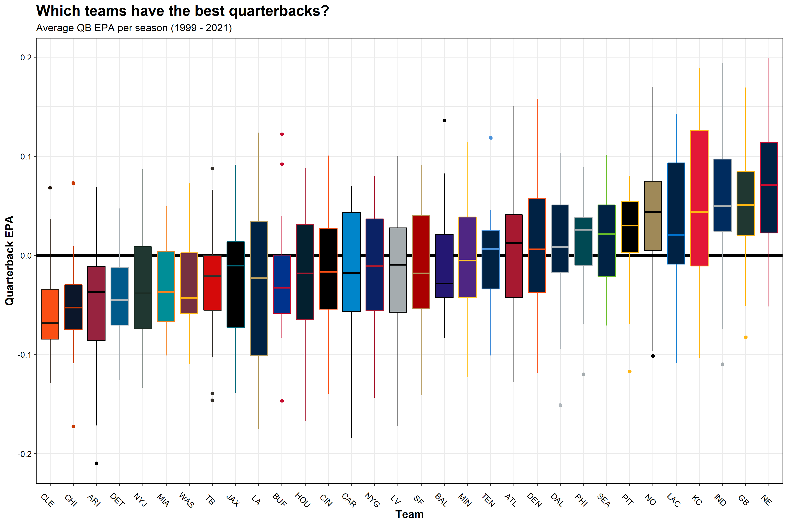

```{r setup, include = FALSE}
# source("utils/find_google_drive.R") # drive_dir
knitr::opts_chunk$set(warning = FALSE, message = FALSE) 
```

```{r, echo = FALSE}
library(rmarkdown)
library(knitr)
library(ggplot2)
library(dplyr)

offense <- readRDS(here::here("data", "offensive.rds"))
defense <- readRDS(here::here("data", "defensive.rds"))
```


# Intro
My goal with this project was make an attempt at answering the age old sports question of **"So, Who is going to win this game?"** I wanted to see if I could use historic information about a teams offensive and defensive performances to garner an accurate prediction on whether or not they will win there upcoming game. 

# Data Retrieval
I pulled NFL play-by-play data together using the `nflFastR R package`. I then did some data cleaning and wrangling tasks to get the data into a usable format. 

I started by getting the full play-by-play datasets from 1999-2021. Each year there are some ~50,000 plays run, and for each play, there are 372 columns of data giving information about what happened on that play. 

<br>

# Exploritory Data Analysis

Let's dig into some of the data and see what we can learn. 

<br>

## Season win totals

Below is a box plot showing the season win totals for each NFL team over the period of record, arranged by mean annual win total. It is not surprising to see the New England Patriots leading the league with an average of 12.6 wins per season. The Patriots are followed by the Steelers, Packers, Colts, Ravens, all teams that have seen consistent success over the last 23 years. At the bottom of the league are the Browns, Lions, Jaguars, and the Raiders. 

<center>

</center>

<br>

## QB performances

Now how about which team's quarterbacks have the highest EPA. EPA is a metric that determines how likely a team is to score points as a result of a play. If a QB does something good (long completion, run for a first down), then there team is more likely to score points on the ensuing play, thus Expected points were added (EPA is positive). On the other hand if a QB does something bad (incompletion, takes a big sack), then there team is less likely to score points on the ensuing play and expected points were removed (EPA is negative)

Below is a plot showing the for each team, the average QB EPA across the all seasons. It is not suprising to see teams like the Patriots, Packers, and Colts at the top of the league in terms of average QB EPA seeing as though these teams had Hall of Fame Quarterbacks for most of the period of time, Tom Brady, Brett Favre/Aaron Rodgers, and Peyton Manning, respectively. This plot matches very closely with the above season win totals boxplot. The teams with the best quarterbacks tend to have the most total wins at the end of a season. 

<center>

</center>

<br>

# Features

I decided I wanted to capture 3 key domains of features that may influence a teams likelihood to win an upcoming game:

- Offense
- Defense
- Off field factors

<br>

## Offense
 I calculated offensive and defensive statistics for every game a team played in the NFL from 1999 - 2021.


```{r}
knitr::kable(head(offense))

off_table <- tibble::tibble(
  Variable    = c("Points Scored in quarter 1, 2, 3, 4", 
                  "Score Differential",
                  "Time of Possesion", 
                  "Third Down Conversion Rate", 
                  "Turnovers",
                  "QB EPA",
                  "Scoring Drive percentage"
                  ),
  Type        = c("Numeric", "Numeric", "Numeric", "Numeric","Numeric", "Numeric","Numeric"),
  Description = c("Total Points scored at the end of each quarter",
                  "Average Score differential at the end of each quarter of the game",
                  "Time of possesion as a percent of both teams possesion time",
                  "Percent of 3rd downs converted by offense",
                  "Total Turnovers by the offense (Fumbles lost + Interceptions",
                  "Average Quarterback EPA across all plays in the game",
                  "Percent of Drives that resulted in points" )
)

kableExtra::kable(off_table)
```

<br>

## Defense
 I replicated many of the same offensive statistics for each team's defense to represent how opposing offenses performed against there defense. 


```{r}

def_table <- tibble::tibble(
  Variable    = c("Opponent Points Scored in quarter 1, 2, 3, 4", 
                  "Opponent Third Down Conversion Rate", 
                  "Opponent Turnovers",
                  "Opponent QB EPA",
                  "Opponent Scoring Drive percentage"
                  ),
  Type        = c("Numeric", "Numeric", "Numeric", "Numeric","Numeric"),
  "Model Variable" = c("def_qtr_pts_1,2,3,4", "def_third_down_pct", "def_turnovers", "def_qb_epa", "def_score_drives_pct"),
  Description = c("Total Points allowed by defense at the end of each quarter",
                  "Percent of 3rd downs converted by opposing offenses",
                  "Total Turnovers created by defense (Fumbles lost + Interceptions",
                  "Average Quarterback EPA allowed by defense across all plays in the game",
                  "Percent of Drives against the defense that resulted in points")
)

kableExtra::kable(def_table)
```

<br>

## Off field factors

I included a handful of other information known prior to the game such as if the game is a home game, a division game, the number of days of rest between games, and the team's overall, home, and away winning percentages.

```{r}
other_fact_table <- tibble::tibble(
  Variable    = c("Home", "Division Game", "Rest days",
                  "Win %", "Home Win %", "Away Win %"
                  ),
  Type        = c("Binary", "Binary", "Factor", "Numeric", "Numeric", "Numeric"),
"Model Variable" = c("home", "div_game", "rest_days", "win_pct", "home_win_pct", "away_win_pct"),
  Description = c("Indicating if the team is the home team (1 = home, 0 = away",
                  "Indicating if it is a division game (1 = division game, 0 = not division game",
                  "Categorical variable indicating the amount of rest the team has between games, (Short rest < 7 days, 7 <= normal rest <= 8, long rest > 8 days",
                  "Percent of all games won",
                  "Percent of home games won",
                  "Percent of away games won"
                  )
)

kableExtra::kable(other_fact_table)
```


Once all of the above variables were wrangled, cleaned, and aggregated from the NFL play-by-play data, I was left with a data frame that had 1 row for every game a team played during the season, with a column for each of the aforementioned derived variables.

## Corrolation
Let's take a look at how our offensive variables relate to wins. 

<br>

Below is a correlation matrix showing the correlation between offensive metrics with the goal of highlighting variables correlated with wins. Darker green colors indicate positive correlations while darker red colors indicate negative correlations. It is not surprising to see that offensive turnovers have a negative correlation with wins. The more often a team turns the ball over, the less likely they are to win the game. The mean scoring differential across the game has a strong positive correlation with wins, which should be the most obvious relationship, whichever team has more points throughout the game, wins more often than not. 

<center>

</center>

<br>

At this point in my analysis, I was working with *a posteriori* data, so data that was collected as a product of what happened on the field that week. If I want to make any useful predictions as to the following week wins, I would need to conjur up some *a priori* data.

## Cumulative Averages

To capture how well a team is doing throughout each season, I created lagged cumulative means for all of the above variables. Such that, for each week a team plays a game, the cumulative mean of all the preceeding weeks of data are calculated for every variable leading into the upcoming slate of games.

So for a week 5 match up, the cumulative mean of all variables is calculated from weeks 1-4.  So for each row with a game outcome (win/loss), that team has variables representing their performances in the preceding weeks. 

<br>

Now our data is set up so that all the information used to inform our prediction is data that would be available to us prior to the upcoming week of games. This is important because information such as the number of turnovers during the game is not information we would have prior to the game, and thus can't be used as a predictor in our model, we can only use historic data to inform our predictions. 


# Modeling

## Data Budget/Splits

## Data Preprocessing

## Model Selection

## Tuning Hyperparameters

## Cross-validation


