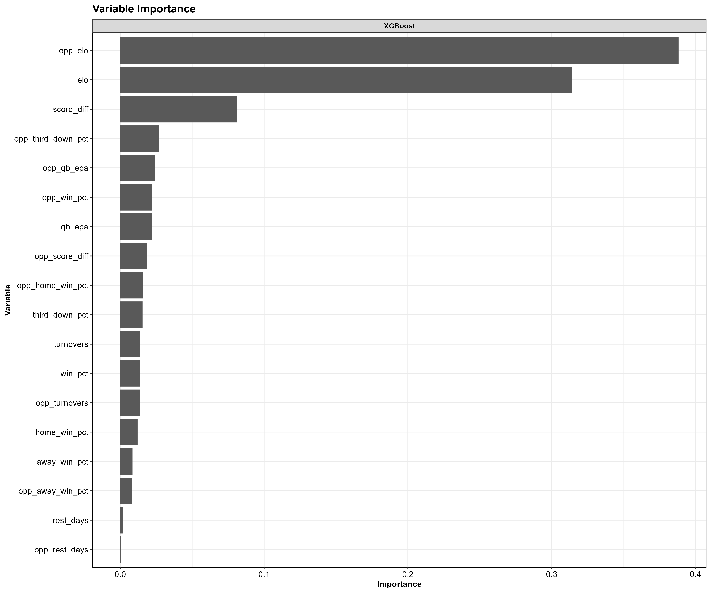

```{r setup, include = FALSE}
knitr::opts_chunk$set(eval = FALSE, warning = FALSE, message = FALSE) 
```

```{r, eval = TRUE, echo = FALSE}
library(rmarkdown)
library(knitr)
library(ggplot2)
library(dplyr)
library(flextable)
library(tidymodels)

source("../utils/utils.R")

nfl        <- readRDS(here::here("data", "football_wins.rds"))

# Load entire dataset
model_dat <- readRDS(here::here("data", "football_wins_lag_elo.rds")) 

# offense    <- readRDS(here::here("data", "offensive.rds"))
# defense    <- readRDS(here::here("data", "defensive.rds"))
nfl_train  <- readRDS(here::here("data", "class_train_data.rds"))
nfl_test   <- readRDS(here::here("data", "class_test_data.rds"))
wfs_ranks  <- readRDS(here::here("data", "class_wfs_ranks.rds"))
roc_df         <- readRDS(here::here("data", "win_roc.rds"))
holdout_result <- readRDS(here::here("data", "holdout_year_predictions.rds"))

holdout_df <-
  model_dat %>% 
  dplyr::filter(season == 2021, home == 1) %>% 
  dplyr::select(-abs_spread_line, -home, -home_fav, -spread_line) %>% 
  dplyr::select(season, week, game_id, team, opponent, fav, win, 
                div_game, rest_days, opp_rest_days, elo, opp_elo,
                score_diff, opp_score_diff, turnovers, opp_turnovers,
                win_pct, away_win_pct,
                home_win_pct,  opp_win_pct, opp_away_win_pct,
                opp_home_win_pct, qb_epa, opp_qb_epa,
                third_down_pct, opp_third_down_pct, 
                score_drives, opp_score_drives) 

# Logisitc regression model
log_reg_model <- readRDS(here::here("data", "win_model_logistic_reg.rds"))

# XGBoost model
xgb_model <- readRDS(here::here("data", "win_model_boost_tree.rds"))

# SVM RBF model
svm_model <- readRDS(here::here("data", "win_model_svm_poly.rds"))
```


# Intro
My goal with this project was make an attempt at answering the age old sports question of **"So, Who is going to win this game?"** I wanted to see if I could use historic information about a teams offensive and defensive performances to garner an accurate prediction on whether or not they will win there upcoming game. 

# Data Retrieval
I pulled NFL play-by-play data together using the `nflFastR R package`. I then did some data cleaning and wrangling tasks to get the data into a usable format. 

I started by getting the full play-by-play datasets from 1999-2021. Each year there are some ~50,000 plays run, and for each play, there are 372 columns of data giving information about what happened on that play. 

<br>

# Exploritory Data Analysis

Let's dig into some of the data and see what we can learn. 

<br>

## Season win totals

Below is a box plot showing the season win totals for each NFL team over the period of record, arranged by mean annual win total. It is not surprising to see the New England Patriots leading the league with an average of 12.6 wins per season. The Patriots are followed by the Steelers, Packers, Colts, Ravens, all teams that have seen consistent success over the last 23 years. At the bottom of the league are the Browns, Lions, Jaguars, and the Raiders. 

<center>

</center>

<br>

## QB performances

Now how about which team's quarterbacks have the highest EPA. EPA is a metric that determines how likely a team is to score points as a result of a play. If a QB does something good (long completion, run for a first down), then there team is more likely to score points on the ensuing play, thus Expected points were added (EPA is positive). On the other hand if a QB does something bad (incompletion, takes a big sack), then there team is less likely to score points on the ensuing play and expected points were removed (EPA is negative)

Below is a plot showing the for each team, the average QB EPA across the all seasons. It is not suprising to see teams like the Patriots, Packers, and Colts at the top of the league in terms of average QB EPA seeing as though these teams had Hall of Fame Quarterbacks for most of the period of time, Tom Brady, Brett Favre/Aaron Rodgers, and Peyton Manning, respectively. This plot matches very closely with the above season win totals boxplot. The teams with the best quarterbacks tend to have the most total wins at the end of a season. 

<center>

</center>

<br>

# Features


I decided I wanted to capture 4 key domains of features that may influence a teams likelihood to win an upcoming game:

- Elo Rating
- Offense
- Defense
- Off field factors

**Note:** While exploring the data and creating the features I wanted to use in the model, I created a host of utility helper functions that work off of the play-by-play output data from the `nflFastR` package. Those helper functions can be found [here](https://github.com/anguswg-ucsb/nfl_wins/blob/main/utils/utils.R).

<br>

## Elo Rating
I created an Elo rating system for each season to create a metric that keeps track of a teams rank relative to the rest of the league. Elo rating systems were first created to rate chess players and are now commonly used in many sports such as American Football, baseball, basketball, etc. Special thanks to the creators of the [elo](https://eheinzen.github.io/elo/) package, your package made my life a lot easier. Here is more information on [Elo Rating Systems](https://en.wikipedia.org/wiki/Elo_rating_system) and its inventor [Arpad Elo](https://en.wikipedia.org/wiki/Arpad_Elo). 


<center>

</center>

<br>


## Offense
 I calculated offensive and defensive statistics for every game a team played in the NFL from 1999 - 2021.


```{r, eval = TRUE, echo=FALSE}


off_table <- tibble::tibble(
  Variable    = c("Points Scored in quarter 1, 2, 3, 4", 
                  "Score Differential",
                  "Average 4th quarter Score Differential",
                  "Time of Possesion", 
                  "Third Down Conversion Rate", 
                  "Turnovers",
                  "QB EPA",
                  "Scoring Drive percentage"
                  ),
  Type        = c("Numeric", "Numeric", "Numeric", "Numeric","Numeric", "Numeric", "Numeric", "Numeric"),
  Description = c("Total Points scored at the end of each quarter",
                  "Average Score differential at the end of each quarter of the game",
                  "Average Score differential throughout the 4th quarter",
                  "Time of possesion as a percent of both teams possesion time",
                  "Percent of 3rd downs converted by offense",
                  "Total Turnovers by the offense (Fumbles lost + Interceptions",
                  "Average Quarterback EPA across all plays in the game",
                  "Percent of Drives that resulted in points" )
)

kableExtra::kable(off_table)
```

<br>

## Defense
 I replicated many of the same offensive statistics for each team's defense to represent how opposing offenses performed against there defense. 


```{r, eval = TRUE, echo=FALSE}

def_table <- tibble::tibble(
  Variable    = c("Opponent Points Scored in quarter 1, 2, 3, 4", 
                  "Opponent Third Down Conversion Rate", 
                  "Opponent Turnovers",
                  "Opponent QB EPA",
                  "Opponent Scoring Drive percentage"
                  ),
  Type        = c("Numeric", "Numeric", "Numeric", "Numeric","Numeric"),
  "Model Variable" = c("def_qtr_pts_1,2,3,4", "def_third_down_pct", "def_turnovers", "def_qb_epa", "def_score_drives_pct"),
  Description = c("Total Points allowed by defense at the end of each quarter",
                  "Percent of 3rd downs converted by opposing offenses",
                  "Total Turnovers created by defense (Fumbles lost + Interceptions",
                  "Average Quarterback EPA allowed by defense across all plays in the game",
                  "Percent of Drives against the defense that resulted in points")
)

kableExtra::kable(def_table)
```

<br>

## Off field factors

I included a handful of other information known prior to the game such as if the game is a home game, a division game, the number of days of rest between games, and the team's overall, home, and away winning percentages.

```{r, eval = TRUE, echo=FALSE}
other_fact_table <- tibble::tibble(
  Variable    = c("Home", "Division Game", "Rest days",
                  "Win %", "Home Win %", "Away Win %"
                  ),
  Type        = c("Binary", "Binary", "Numeric", "Numeric", "Numeric", "Numeric"),
"Model Variable" = c("home", "div_game", "rest_days", "win_pct", "home_win_pct", "away_win_pct"),
  Description = c("Indicating if the team is the home team (1 = home, 0 = away",
                  "Indicating if it is a division game (1 = division game, 0 = not division game",
                  "Numeric variable for the amount of rest the team had between games",
                  "Percent of all games won",
                  "Percent of home games won",
                  "Percent of away games won"
                  )
)

kableExtra::kable(other_fact_table)
```


Once all of the above variables were wrangled, cleaned, and aggregated from the NFL play-by-play data, I was left with a data frame that had 1 row for every game a team played during the season, with a column for each of the aforementioned derived variables.

## Corrolation
Let's take a look at how our offensive variables relate to wins. 

<br>

Below is a correlation matrix showing the correlation between offensive metrics with the goal of highlighting variables correlated with wins. Darker green colors indicate positive correlations while darker red colors indicate negative correlations. It is not surprising to see that offensive turnovers have a negative correlation with wins. The more often a team turns the ball over, the less likely they are to win the game. The mean scoring differential across the game has a strong positive correlation with wins, which should be the most obvious relationship, whichever team has more points throughout the game, wins more often than not. 

<center>

</center>

<br>

At this point in my analysis, I was working with *a posteriori* data, so data that was collected as a product of what happened on the field that week. If I want to make any useful predictions as to the following week wins, I would need to conjur up some *a priori* data.

## Cumulative Averages

To capture how well a team is doing throughout each season, I created lagged cumulative means for all of the above variables. Such that, for each week a team plays a game, the cumulative mean of all the preceeding weeks of data are calculated for every variable leading into the upcoming slate of games.

Below is the general method I used to get these lagged Cumulative averages values. Note, for some variables like winning percentage, the lagged cumalative averages was *not* calculated and rather only the lagged value was determined. In the example code below, the lagged winning percentage, and the lagged cumaltive average QB EPA is calculated for the Arizona Cardinals 2014 season. 

```{r, eval = TRUE, echo = TRUE}
nfl %>% 
  dplyr::filter(season == 2014, team == "ARI") %>% 
  dplyr::select(season, week, team, win, win_pct, qb_epa) %>% 
  dplyr::group_by(season, team) %>% 
  dplyr::arrange(season, week, .by_group = T) %>% 
  dplyr::mutate(
    across(c(win_pct), ~dplyr::lag(.x), .names = "{col}_lag"),
    across(c(qb_epa), ~dplyr::lag(dplyr::cummean(.x)), .names = "{col}_lag")
    ) %>% 
  dplyr::mutate(across(c(win_pct:qb_epa_lag), round, 2)) %>% 
  dplyr::ungroup() %>% 
  dplyr::relocate(season, week, team, win, win_pct, win_pct_lag, qb_epa, qb_epa_lag)

```


So for a week 5 match up, the cumulative mean of all variables is calculated from weeks 1-4.  So for each row with a game outcome (win/loss), that team has variables representing their performances in the preceding weeks. 

<br>

Now our data is set up so that all the information used to inform our prediction is data that would be available to us prior to the upcoming week of games. This is important because information such as the number of turnovers during the game is not information we would have prior to the game, and thus can't be used as a predictor in our model, we can only use historic data to inform our predictions. 

## Home team

Initially I had been running models with 2 data points for each game, one being the home team perspective and the other being the away team perspective. I pretty quickly ran into some major overfitting in my models and realized **it was a better idea to only use data from the home team.** 


# Modeling
I decided I wanted to run my data across a suite of 7 different models and see how they all perform against each other 

  - Logistic Regression
  - KKN nearest neighbors
  - XGBoost 
  - Multiadaptive regression splines (MARS)
  - MLP Neural Net
  - SVM Robust
  - SVM Poly

## Data Budget/Splits
The first step was to split up our data into testing and training splits (75% training, 25% testing). When I split my data, I chose to stratify the data by the binary win/loss value to ensure there was the same proportion of wins and losses in our training and testing data splits. 

## Data Preprocessing
Using the `recipes` package, I made ID variables for information about the game and when it happened. I then applied some recipe steps to my training data. Because I decided to only use the home teams data, this meant that there was going to be more wins than losses in my dataset because the home team tends to win more often then the away team (56% wins / 44% losses). To account for the slight imbalance of wins to losses in the data, I chose to use the `themis` package to upsample my data using the `themis::step_upsample()` function. 

  - string variables to factors
  - assigned unseen factor levels to new values 
  - created dummy variables
  - removed variables with zero variation
  - normalized all my numeric predictors

I used this general framework for each of my 7 models with some slight variations depending on the model. One-hot encoding was used for the XGBoost recipe.

```{r}
 # Logistic Regression data preprocessing recipe steps
glmnet_recipe <- 
  recipes::recipe(
    formula = win ~ .,
    data    = nfl_train
    ) %>% 
  recipes::update_role(
    game_id, team, opponent, season, week, new_role = "ID"
  ) %>% 
  recipes::step_novel(recipes::all_nominal_predictors()) %>% 
  recipes::step_dummy(recipes::all_nominal_predictors()) %>% 
  themis::step_upsample(win, over_ratio = 0.9, skip = TRUE) %>%
  recipes::step_zv(recipes::all_predictors()) %>% 
  recipes::step_normalize(recipes::all_numeric_predictors()) 

```


## Model Selection

## Cross-validation folds

I created 10 cross-validation folds from the training data. As I did with the initial training/testing split, I made sure to create **stratified resamples using the win/loss variable to ensure the same proportion of wins and losses appear in CV folds as the do in the original data.**

```{r}
# Set seed 
set.seed(432)

# Cross-validation folds
nfl_folds <- rsample::vfold_cv(nfl_train, v = 10, strata = win)
```

## Visualize CV folds
```{r}
nfl_train %>% 
  dplyr::mutate(
    Row = row_number()
  ) %>% 
  dplyr::relocate(Row) %>% 
  dplyr::left_join(
    tidy(nfl_folds), 
    by = "Row"
  ) %>% 
  ggplot() +
  geom_point(aes(x = week, y = season, col = Data), alpha = 0.5)+ 
  facet_wrap(~Fold) +
  labs(
    title = "10 Cross-validation Folds",
    subtitle = "Portion of data in each CV fold used for analysis/assessment",
    x = "Week",
    y = "Season"
  ) +
  apatheme

fold_splot <- 
  nfl_folds %>% 
  tidy() %>% 
  # dplyr::filter(Fold == "Fold01") %>% 
  dplyr::mutate(
    Data = factor(Data, levels = c("Assessment", "Analysis"))
  ) %>% 
  ggplot() +
  geom_point(aes(x = Fold, y = Row, col = Data)) 
  # scale_size_manual(values = c(3, 1)) +
  # facet_wrap(~Fold)
fold_splot
 plotly::ggplotly(fold_splot)
```

## workflowsets
Using the `workflowsets` I created a workflowset containing each of the data preprocessing recipes and corresponding model specifications.

```{r}
# Workflow set of candidate models
nfl_wfs <- 
  workflowsets::workflow_set(
    preproc = list(
      kknn_rec         = kknn_recipe,
      glmnet_rec       = glmnet_recipe,
      xgboost_rec      = xgboost_recipe,
      earth_rec        = earth_recipe,
      nnet_rec         = nnet_recipe,
      kernlab_poly_rec = kernlab_recipe,
      kernlab_rec      = kernlab_recipe
    ),
    models  = list(
      kknn       = kknn_spec,
      glmnet     = glmnet_spec,
      xgboost    = xgboost_spec,
      earth      = earth_spec,
      nnet       = nnet_spec,
      svm_poly   = kernlab_poly_spec,
      svm        = kernlab_spec
    ),
    cross = F
  )
```

## Tuning Hyperparameters
The next step was to tune our hyperparameters for each of models. Using the `tune` package I applied the `tune::tune_grid()` function across my workflowset object containing my model recipes and specifications. 20 random candidate parameters were created using the `dials::grid_latin_hypercube()` function from the `dials` package 

### Parallel processing
This step is the most time consuming and resource intensive process of a machine learning workflow. So, to speed up the process I run the tuning process across multiple cores on my computer, making use of my computer's multiple processors. 


```{r, echo = FALSE, echo = TRUE}

# Choose metrics
my_metrics <- yardstick::metric_set(roc_auc, pr_auc, accuracy, mn_log_loss)

# Set up parallelization, using computer's other cores
parallel::detectCores(logical = FALSE)
modeltime::parallel_start(6, .method = "parallel")

# Set Random seed
set.seed(589)

# Tune models in workflowset
nfl_wfs <-
  nfl_wfs %>%
  workflow_map(
    "tune_grid",
    resamples = nfl_folds ,
    grid      = 20,
    metrics   = my_metrics,
    control   = control_grid(
      verbose   = TRUE,
      save_pred = TRUE),
    verbose   = TRUE
  )

  # Stop parrallelization
modeltime::parallel_stop()
```

## Model comparisons
Now we can compare how all of our models did compared to one another and make a decision as to which one we want to use to make predictions. The plots below shows how the 6 models performed on the set of resampling data. 

<center>

</center>

If you take a look at the **ROC AUC** and **mean log loss plots** the best performing models are the Logistic Regression (logistic_reg), the Support Vector Machines (svm_poly/svm_rbf), and the Gradient Boosted Decision Trees (boost_trees). A standard threshold for log loss when it comes to binary predictions is 0.69 because that is the same probability of a 50-50 guess. The table below shows the mean log loss for each model. The best log loss you can have is 0 and the larger the number gets the worse the model is at predicting the correct outcome.


```{r, eval = TRUE, echo=FALSE}
metric_df <-
  wfs_ranks %>%
  dplyr::filter(.metric %in% c("roc_auc", "mn_log_loss")) %>% 
  dplyr::group_by(model, .metric) %>% 
  # dplyr::arrange(.metric, .by_group = T) %>% 
  dplyr::slice(1) %>% 
  dplyr::ungroup() %>% 
  tidyr::pivot_wider(
    id_cols = c(model, rank),
    names_from  = .metric, 
    values_from = mean
    ) %>% 
  dplyr::select(model, rank, mean_log_loss = mn_log_loss, roc_auc) %>% 
  dplyr::arrange(rank) %>% 
  # dplyr::mutate(chance_to_win = exp(-mn_log_loss)) %>% 
  dplyr::mutate(across(where(is.numeric), round, 3)) 

metric_df %>% 
  knitr::kable()
```


```{r}
m_log_loss %>% 
  dplyr::arrange(mean_log_loss) %>% 
  ggplot() +
  geom_point(aes(x = reorder(model, mean_log_loss), y = mean_log_loss), size = 2) +
  geom_hline(yintercept = 0.69, size = 1.5) 
```

## Variable Importance
Looking at a variable importance plot from the `vip` package can give us an idea of which variables are the most important to ours models. 

Below is the variable importance scores for the Logisitc Regression model. The most significant variables look to be both teams Elo ratings, average score differentials and winning percentages.  
<center>

</center>

<center>

</center>

-## ROC Curves
Receiver Operator Characteristic curves, (aka ROC curves) are a way of understanding how well a model is at predicting the True Positive events vs False Positive events. In this scenario a True Positive event is the model predicts a win and the team wins, while a False Positive event is the model predicts a win, and the team losses. The True Positive Rate (TPR) is on the Y axis and the False Positive Rate (FPR) is on the X axis. The TPR, or sensitivity, along the Y axis indicates the probability that the model predicted a win and the team actually won. While FPR or, 1 - specificity, along the X axis indicates the probability that the model predicted a win and the team actually lost. 

The closer the ROC curve is to the top left corner of the plot the better the model is doing at correctly classifying the data. A perfect ROC Curve would be a 90 degree angle along the top left corner of the plot.


```{r, eval = TRUE, echo=FALSE}
roc_df %>%
  ggplot() +
  geom_line(aes(x = 1 - specificity, y = sensitivity, color = model), alpha = 0.6, size = 1) +
  scale_color_manual(values = RColorBrewer::brewer.pal(6, "Dark2")) +
  geom_abline(lty = 2, color = "gray80", size = 1.5)  +
  # geom_path(show.legend = T, alpha = 0.6, size = 1.2) +
  coord_equal() +
  labs(
      title    = "ROC Curves",
      # subtitle = "Resample results from 10 Fold Cross Validation",
      x        = "False Positive Rate (1 - Specificity)",
      y        = "True Positive Rate (Sensitivity)"
    ) + 
    apatheme

```


## Predict

## 2021 Predictions

I completely held out the 2021 season's games so that I could then apply my fitted models to the data and see how the predictions fare against Vegas' predicted winners.

```{r, eval = TRUE, echo=FALSE}
# Color code TP and TN as green and FP and FN as red
colormatrix  <- ifelse(holdout_result[, c(5, 6)] == holdout_result[, c(4, 4)], "#85E088", "indianred2")

holdout_result %>% 
  flextable::flextable() %>% 
  flextable::bg(j = 5:6, bg = colormatrix)
```


```{r, eval = TRUE, echo=FALSE}
# augment(svm_model, holdout_df)
pred_holdout <-
  log_reg_model %>% 
  augment(holdout_df) %>% 
  dplyr::select(season, week, game_id, team, opponent, win, fav,
                log_reg_pred = .pred_class, 
                log_reg_prob_1 = .pred_1, 
                log_reg_prob_0 = .pred_0
                ) %>% 
      bind_cols(predict(svm_model, holdout_df)) %>% 
      # bind_cols(predict(svm_model, holdout_df, type = "prob")) %>% 
  dplyr::rename(
    svm_pred   = .pred_class
    # svm_prob_1 = .pred_1, 
    # svm_prob_0 = .pred_0
    ) %>% 
  bind_cols(predict(xgb_model, holdout_df)) %>% 
  dplyr::rename(
    xgb_pred   = .pred_class
    ) %>% 
  dplyr::mutate(
    actual_outcome = dplyr::case_when(
      win == 1 ~ "win",
      win == 0 ~ "loss"
    ),
    vegas_pred = dplyr::case_when(
      fav == 1 ~ "win",
      fav == 0 ~ "loss"
    ),
    log_reg_pred = dplyr::case_when(
      log_reg_pred == 1 ~ "win",
      log_reg_pred == 0 ~ "loss"
    ),
    svm_pred = dplyr::case_when(
      svm_pred == 1 ~ "win",
      svm_pred == 0 ~ "loss"
    ),
    xgb_pred = dplyr::case_when(
      xgb_pred == 1 ~ "win",
      xgb_pred == 0 ~ "loss"
    ),
    # log_reg_prob_1 = round(log_reg_prob_1, 2),
    #     svm_prob_1 = round(svm_prob_1, 2)
  ) %>% 
  dplyr::arrange(week) %>% 
  # dplyr::select(week, home_team = team, away_team = opponent, actual_outcome, vegas_pred, model_pred, pred_prob, vegas_colors, model_colors)
# %>%
  dplyr::select(week, home_team = team, away_team = opponent, actual_outcome, vegas_pred,
                log_reg_pred,
                svm_pred,
                xgb_pred
                # log_reg_prob_1, svm_prob_1
                )

# Color code TP and TN as green and FP and FN as red
colormatrix  <- ifelse(pred_holdout[, c(5, 6, 7, 8)] == pred_holdout[, c(4, 4, 4, 4)], "#85E088", "indianred2")

pred_holdout %>% 
  flextable::flextable() %>% 
  flextable::bg(j = c(5:8), bg = colormatrix)
```


