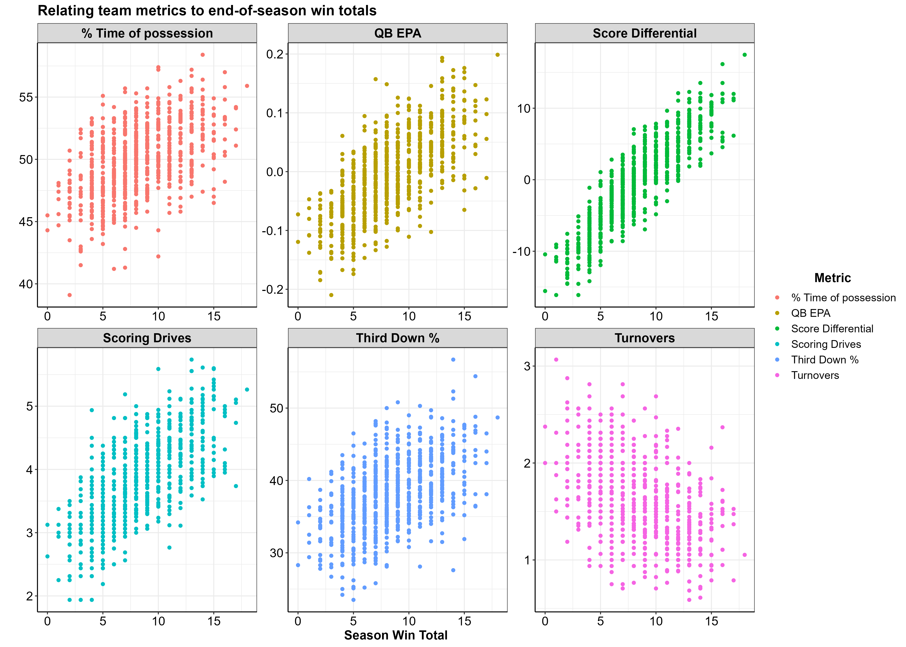
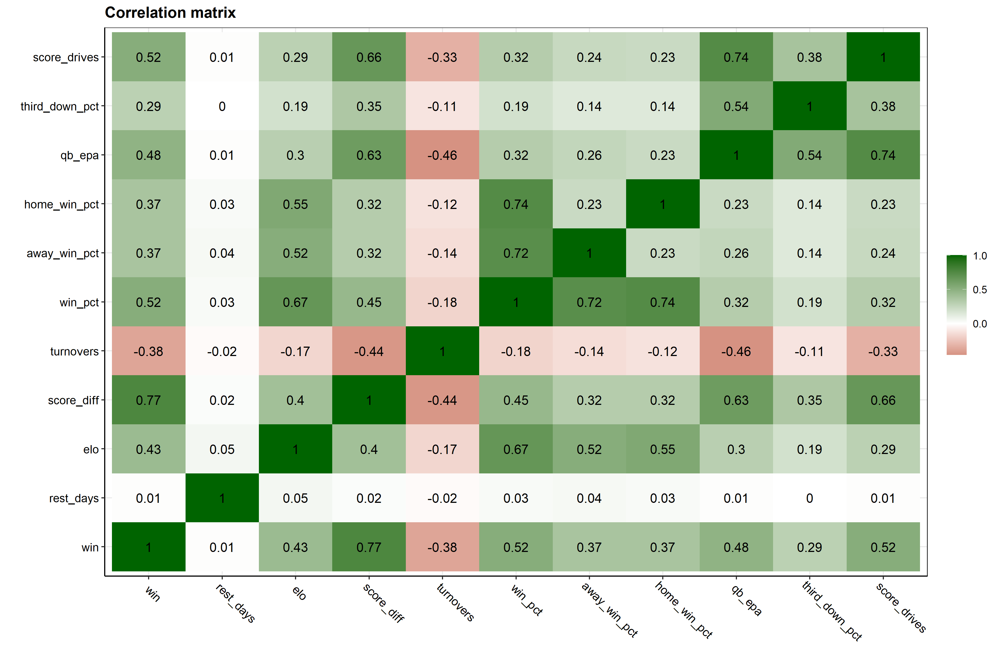
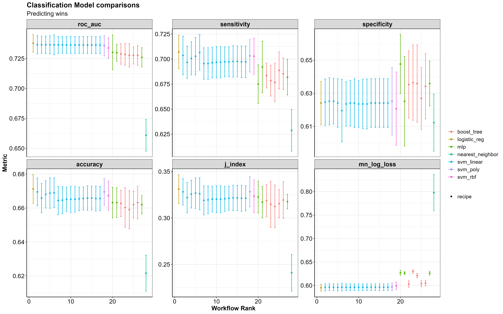
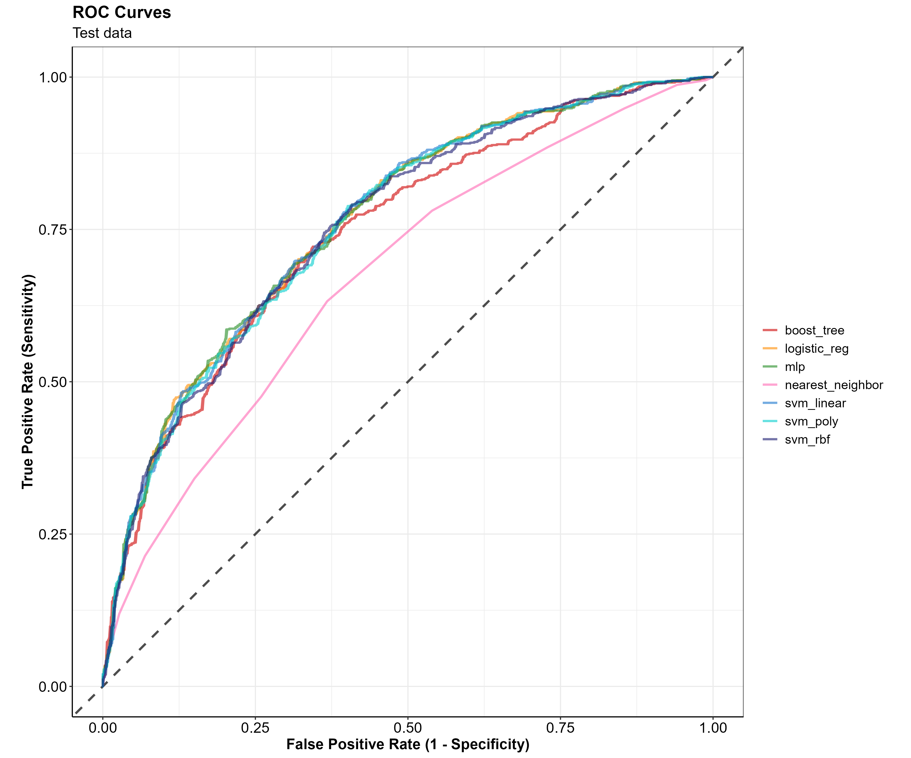

```{r setup, include = FALSE}
knitr::opts_chunk$set(eval = FALSE, warning = FALSE, message = FALSE) 
```

```{r, eval = TRUE, echo = FALSE}

# remove(list = ls())  # clear all workspace variables

library(rmarkdown)
library(knitr)
library(ggplot2)
library(dplyr)
library(flextable)
library(tidymodels)

source("utils/utils.R")

# Load entire dataset
model_dat <- readRDS(here::here("data", "football_wins_lag_elo.rds")) 

pred_holdout <- readRDS(here::here("data", "holdout_predictions.rds"))
pred_table   <- readRDS(here::here("data", "holdout_predictions_table.rds"))
confmat_tbl  <- readRDS(here::here("img", "conf_mat_metrics.png"))

nfl_split       <- readRDS(here::here("data", "class_split_data.rds"))
nfl_train       <- readRDS(here::here("data", "class_train_data.rds"))
nfl_test        <- readRDS(here::here("data", "class_test_data.rds"))

wfs_ranks       <- readRDS(here::here("data", "class_wfs_ranks.rds"))

roc_df          <- readRDS(here::here("data", "win_roc.rds"))
vip_df          <- readRDS(here::here("data", "win_variable_importance.rds"))
confmat_df      <- readRDS(here::here("data", "win_conf_matrix.rds"))
metrics_df      <- readRDS(here::here("data", "win_metrics.rds"))

holdout_result  <- readRDS(here::here("data", "holdout_year_predictions.rds"))

holdout_df <-
  model_dat %>% 
  dplyr::filter(season == 2021, home == 1) %>% 
  dplyr::select(-abs_spread_line, -home, -home_fav, -spread_line) %>% 
  dplyr::select(season, week, game_id, team, opponent, fav, win, 
                div_game, rest_days, opp_rest_days, elo, opp_elo,
                score_diff, opp_score_diff, turnovers, opp_turnovers,
                win_pct, away_win_pct,
                home_win_pct,  opp_win_pct, opp_away_win_pct,
                opp_home_win_pct, qb_epa, opp_qb_epa,
                third_down_pct, opp_third_down_pct, 
                score_drives, opp_score_drives) 

holdout_test <- 
  model_dat %>% 
  dplyr::filter(home == 1, game_id %in% nfl_test$game_id) %>%
  dplyr::select(names(holdout_df)) 

nfl        <- readRDS(here::here("data", "football_wins.rds"))

nfl_data <- 
  nfl %>% 
  dplyr::select(names(holdout_df)) %>% 
  dplyr::select(-fav, -div_game)

# Logisitc regression model
log_reg_model      <- readRDS(here::here("data", "win_model_logistic_reg.rds"))
# log_reg_last_fit   <- readRDS(here::here("data", "win_resamples_logistic_reg.rds"))
# log_reg_last_fit %>% 
#   collect_predictions() %>%
#   conf_mat(win, .pred_class) %>%
#   autoplot("heatmap")


# XGBoost model
xgb_model <- readRDS(here::here("data", "win_model_boost_tree.rds"))

# SVM RBF model
svm_lin_model <- readRDS(here::here("data", "win_model_svm_linear.rds"))

# SVM Poly model
svm_poly_model <- readRDS(here::here("data", "win_model_svm_poly.rds"))

# SVM RBF model
svm_rbf_model <- readRDS(here::here("data", "win_model_svm_rbf.rds"))

# SVM RBF model
mlp_model <- readRDS(here::here("data", "win_model_svm_poly.rds"))

# nfl_wfs <- readRDS("D:/nfl/classification/wfs/win_classification_wfs2.rds")
```

<br>
<br>

# **Introduction**

My goal with this project was to try to answer the age-old sports question, **“Who is supposed to win this game?”**.


I wanted to see if I could use historic information about a team’s offensive and defensive performances to accurately predict whether or not they would win their upcoming game.

All data ingestion, processing, analysis, and modeling was done in R, with help from the `tidyverse` and `tidymodels` ecosystems.  

<br> <br>

------------------------------------------------------------------------

# **Data Retrieval**
To start, I pulled NFL play-by-play data together using the `nflfastR` R package —performing some cleaning and wrangling tasks to get the data into a usable format.

I utilized the full play-by-play data sets from 1999-2021, which included some 50,000 plays per season. For each play, there are an additional [372 columns of data giving information about what happened on a given play.](https://www.nflfastR.com/articles/field_descriptions.html) In the end I chose to completely omit the 2021 season, using it as a holdout set of data to test my models against. Another thing to note is that all the data you see is from the perspective of the home team, and all model predictions indicate a home win or home loss.

**Note:** While exploring data and assembling the features I wanted to use for modeling, I created a host of utility helper functions that work off of the play-by-play output data from the nflfastR package. Those helper functions can be found
[here](https://github.com/anguswg-ucsb/nfl_wins/blob/main/utils/utils.R).

```{r, eval = FALSE, echo = FALSE}
# The function below takes in the NFL play-by-play returned from the `nflfastR::load_pbp()` function, and aggregates the data to game level team statistics.

# takes in NFL fast R play-by-play data and returns a cleaned tibble with game level offensive stats
get_offense <- function(season_pbp) {

  logger::log_info("\n\nCalculating {season_pbp$season[1]} offensive stats...")
  
  # Remove overtime, calculate drive time of possession, identify home teams
  season_df <-
    season_pbp %>%
    dplyr::group_by(game_id, posteam) %>%
    dplyr::ungroup() %>% 
    dplyr::group_by(game_id, qtr, posteam) %>% 
    dplyr::arrange(-game_seconds_remaining, .by_group = T) %>% 
    dplyr::mutate(
      drive_time_of_possession_sec =  
        60*as.numeric(sub(':.*', '', drive_time_of_possession)) + as.numeric(sub('.*:', '', drive_time_of_possession))
    ) %>% 
    dplyr::mutate(
      home = dplyr::case_when(
        posteam == home_team ~ 1,
        TRUE                 ~ 0
      )
    ) %>% 
    dplyr::ungroup() %>% 
    dplyr::filter(qtr < 5)  %>% 
    dplyr::filter(!posteam == "")
  
  # total scoring drives and % of drives ending with a score
  off_drive_stats <-
    season_df %>%
    dplyr::group_by(game_id, qtr, posteam, drive) %>%
    dplyr::summarize(
      drive_ended_with_score  = max(drive_ended_with_score,na.rm = F)
    ) %>%
    dplyr::ungroup() %>% 
    dplyr::group_by(game_id, drive, posteam) %>% 
    dplyr::slice(1) %>% 
    dplyr::ungroup() %>% 
    dplyr::group_by(game_id, posteam) %>% 
    dplyr::mutate(ndrives = n()) %>% 
    dplyr::summarize(
      ndrives          = mean(ndrives, na.rm = T),
      score_drives     = sum(drive_ended_with_score, na.rm = T),
      score_drives_pct = score_drives/ndrives
    ) %>%
    na.omit() %>% 
    dplyr::ungroup() %>% 
    dplyr::select(-ndrives)
  
  # Offensive quarter stats, turnovers, third down conversions, QB EPA
  off_stats <- 
    season_df %>% 
    dplyr::group_by(game_id, posteam) %>%
    dplyr::summarize(
      across(c(fumble_lost, interception, third_down_converted, third_down_failed), sum, na.rm = T),
      across(c(qb_epa), mean, na.rm = T),
      across(c(home, div_game), max, na.rm = F)
    ) %>%
    dplyr::mutate(
      third_down_pct = third_down_converted/(third_down_converted + third_down_failed),
      turnovers      = fumble_lost + interception
    ) %>% 
    dplyr::ungroup() %>% 
    dplyr::select(-third_down_converted, -third_down_failed, -fumble_lost, -interception) %>%
    dplyr::filter(!is.na(posteam)) %>% 
    dplyr::relocate(game_id, posteam, home, div_game, third_down_pct, turnovers)
  
  # Quarter score differential of possession
  off_qtr_points <- 
    season_df %>% 
    dplyr::select(game_id, qtr, drive, play_id, game_seconds_remaining, 
                posteam, posteam_score_post) %>% 
    dplyr::group_by(game_id, qtr, posteam) %>%
    dplyr::arrange(drive, .by_group = T) %>% 
    dplyr::slice(
      which.min(play_id),
      which.max(play_id)
    ) %>% 
    na.omit() %>%
    dplyr::mutate(
      start_end = dplyr::case_when(
        play_id == min(play_id) ~ "start_qtr",
        play_id == max(play_id) ~ "end_qtr"
      )
    ) %>% 
    dplyr::ungroup() %>%
    tidyr::pivot_wider(
      id_cols     = c(game_id, qtr, posteam), 
      names_from  = "start_end", 
      values_from = "posteam_score_post"
    ) %>% 
    dplyr::mutate(
      qtr_pts = end_qtr - start_qtr
    ) %>% 
    dplyr::select(game_id, qtr, posteam, qtr_pts) %>% 
    dplyr::ungroup() %>% 
    dplyr::mutate(qtr_name = paste0("qtr_", qtr)) %>%
    tidyr::pivot_longer(cols = c(qtr_pts)) %>%
    tidyr::pivot_wider(
      id_cols     = c(game_id, posteam),
      names_from  = c(name, qtr),
      names_glue  = "{name}_{qtr}",
      values_from = value
    ) %>% 
    dplyr::mutate(
      pts_scored = qtr_pts_1 + qtr_pts_2 + qtr_pts_3 + qtr_pts_4
    )
  
  # Join all data 
  off_game <-
    off_stats %>% 
    dplyr::ungroup() %>% 
    dplyr::left_join(
      off_drive_stats,
      by = c("game_id", "posteam")
    ) %>% 
    dplyr::left_join(
      off_qtr_points,
      by = c("game_id", "posteam")
    )  %>% 
    dplyr::mutate(
      season = as.numeric(substr(game_id, 1, 4)),
      week   = as.numeric(substr(game_id, 6, 7))
    ) %>% 
    dplyr::relocate(season, week, game_id, posteam, home, div_game) %>% 
    dplyr::filter(posteam != "") %>% 
    dplyr::mutate(across(where(is.numeric), round, 3))
  
  return(off_game)

}
```

<br> 
<br>
<br>

------------------------------------------------------------------------

# **Exploratory Data Analysis**

Now that we’ve gone over the main idea, let’s dig into some of the data and see what we can learn about the NFL and the data we’re working with.

<br>

## Season win totals
The first thing I wanted to see was the average number of games each NFL franchise won per season between 1999 and 2021. The box plot below shows the NFL franchises on the X axis, arranged by mean annual win total, and the average season win totals on the Y axis. The boxes are colored to match the team colors for each NFL franchise

<br>

<center>


</center>

<br>

**TLDR;** 
Patriots good, Browns bad (sorry Cleveland!)

This plot mirrors my experience watching the NFL. The New England Patriots are leading the league with an average of 12.6 wins per season. The Patriots are followed by the Steelers, Packers, Colts, Ravens—all teams that have seen consistent success over the last 23 years. At the bottom of the league for average wins per season are the Browns, Lions, Jaguars, and the Raiders.

<br> 
<br>

## QB performances
Next, I wanted to see which NFL teams had the best quarterbacks over the last 23 seasons. To do so, I used the quarterback EPA—a metric that determines how likely a team is to score points as a result of a play, and more specifically, the quarterback’s effect on that play.

**If a quarterback does something good (e.g. long completion, runs for a first down), their team is more likely to score points on the ensuing play and expected points are added (EPA is positive). On the other hand, if a QB does something bad (incomplete, takes a big sack), their team is less likely to score points and expected points are removed (EPA is negative).**

The box plot below shows the NFL franchises on the X axis, arranged by mean QB EPA per play, and the QB EPA per play on the Y axis. Like the previous plot, the boxes are colored to match the team colors for each NFL franchise.

<br> 

<center></center>

<br>

**TLDR;** 
Tom Brady good, long-list-of-Brown's-QBs bad 

This makes sense. Teams like the Patriots, Packers, and Colts are at the top of the league in terms of average QB EPA, given that these teams had great quarterbacks for most of these years (Tom Brady, Brett Favre/Aaron Rodgers, and Peyton Manning/Andrew Luck, respectively). 

This plot matches very closely with the season win totals boxplot, shown previously. Safe to say, good quarterback play has a positive impact on winning games.

<br> 
<br>

## Relating end of season win totals to team metrics
Next, I wanted to see what the end of season win totals looked like when plotted against average team level statistics for that season (per team, across all 23 seasons). The plot below shows 6 team metrics with the X axis displaying end of season win totals and the Y axis being the season average for each team.

**Note:** The Y axis values are not meant to be compared across plots, as they differ in units. The purpose of this figure is to show the relationship between team metrics and end-of-season win totals (from top left to bottom right):

<br>

<center></center>

<br>

```{r, eval = TRUE, echo=FALSE}
team_met_tbl <- tibble::tibble(
  
  Variable    = c("% Time of possession",
                  "QB EPA",
                  "Score Differential",
                  "Scoring Drive", 
                  "Third Down %", 
                  "Turnovers"
                  ),
  "Y Axis"      =  c(
    "Average percent of the game the team had possession of the ball",
    "EPA value w/ negative values indicating a negative impact on scoring",
    "Average Score Differential",
    "Number of scoring drives per game",
    "Average percent of third downs converted to first downs",
    "Number of turnovers per game"
  )
)

team_met_tbl %>% 
  kableExtra::kable() %>% 
  # kableExtra::kable(align = "c") %>% 
  kableExtra::kable_material(c("striped", "hover"))
```

<br>

Team metrics that relate to having more total wins at the end of the season are:

  - Greater % time of possession
  - Higher QB EPA
  - Higher score differential
  - Higher number of scoring drives per game
  - Higher third down %
  - Lower number of turnovers per game

<br> 
<br>

## Elo Rating

I created an Elo rating system for each season to create a metric that
keeps track of a teams rank relative to the rest of the league. Elo
rating systems were first created to rate chess players and are now
commonly used in many sports such as American Football, baseball,
basketball, etc. Special thanks to the creators of the
[elo](https://eheinzen.github.io/elo/) package, your package made my
life a lot easier. Here is more information on [Elo Rating
Systems](https://en.wikipedia.org/wiki/Elo_rating_system) and its
inventor [Arpad Elo](https://en.wikipedia.org/wiki/Arpad_Elo).

Below is a plot displaying each team on the X axis ordered from lowest to highest average Elo rating per season, with the average Elo rating on the Y axis.

<br>

<center></center>

<br>

Sadly for Browns fans, we see here the same take-home message that we saw before… Patriots good, Browns bad :’(

<br> 
<br>

## Favored teams

Because I will be making predictions on the outcome of NFL games, I thought it best to see how the teams favored for any given game (according to Las Vegas) actually did in those games. How often did the **team favored by Las Vegas win**? Furthermore, how often does the **home team win**? How often does a **favored home team win**? A **favored away team**?

The black line in the plot below indicates the percent of games won by the home team per season. The aqua blue line shows the percent of games that favored home teams won and the coral color line shows the percent of games that favored away teams won.

```{r, echo = FALSE, eval = FALSE}

# % games won by home team
home_wins <- 
  nfl %>% 
  dplyr::filter(week < 19) %>% 
  # dplyr::group_by(season, week, home) %>% 
  dplyr::group_by(season, home) %>% 
  dplyr::mutate(
    loss = dplyr::case_when(
      win == 0 ~ 1,
      win != 0 ~ 0,
      TRUE ~ 0
    )
  ) %>% 
  dplyr::summarise(
    win  = sum(win, na.rm = T),
    loss = sum(loss, na.rm = T),
  ) %>% 
  dplyr::ungroup() %>% 
  dplyr::mutate(
    games = win + loss
  ) %>% 
  na.omit() %>% 
  dplyr::mutate(
    home_win_pct = round(win/games, 3)
  ) %>% 
  dplyr::filter(home == 1) %>% 
  dplyr::select(season, home_win_pct)

# % of games the home favorite wins
favwin <- 
  nfl %>% 
  dplyr::filter(week < 19) %>% 
  dplyr::select(game_id, season, home, win, fav, abs_spread_line) %>% 
  dplyr::mutate(
    fav_win = dplyr::case_when(
      win == 1 & fav == 1 ~ 1,
      TRUE                ~ 0
    ),
    home = factor(home, levels = c(1, 0))
  ) %>% 
  dplyr::group_by(season, home, fav) %>%
  dplyr::mutate(
    games = n()
  ) %>% 
  dplyr::ungroup() %>% 
  dplyr::filter(fav == 1) %>% 
  dplyr::group_by(season, win, home) %>% 
  count() %>% 
  dplyr::ungroup() %>% 
  dplyr::group_by(season, home) %>% 
  dplyr::mutate(
    fav_win_pct = round(n/sum(n), 3)
  ) %>% 
  dplyr::ungroup() %>% 
  dplyr::group_by(season) %>%
  dplyr::mutate(
    nsum            = sum(n)
  ) %>%
  dplyr::filter(win == 1) %>% 
  dplyr::ungroup()

# Overall favorites win %
all_fav_wins <- 
  favwin %>% 
  dplyr::group_by(season) %>% 
  dplyr::summarise(
    fav_win_pct = round(sum(n)/nsum, 3)
  ) %>% 
  dplyr::slice(1) %>% 
  dplyr::ungroup()

# Join home win % with favorites win %
vegas_favorites <- 
  favwin %>% 
  dplyr::mutate(
    home_away = dplyr::case_when(
      home == 1 ~ "home_fav_win_pct",
      home == 0 ~ "away_fav_win_pct"
    )
  ) %>% 
  tidyr::pivot_wider(
    id_cols = c(season),
    names_from  = home_away,
    values_from = fav_win_pct
    ) %>% 
  dplyr::left_join(
    all_fav_wins,
    by = "season"
    ) %>% 
  dplyr::left_join(
    home_wins,
    by = "season"
  )

# Plot win % of home/away team and favorited teams
home_favorite_plot <-
    vegas_favorites %>% 
    tidyr::pivot_longer(cols = c(-season)) %>% 
    dplyr::mutate(
      name = dplyr::case_when(
        name == "home_fav_win_pct" ~ "Favored Home team",
        name == "away_fav_win_pct" ~ "Favored Away team",
        name == "fav_win_pct"      ~ "Favored Teams",
        name == "home_win_pct"     ~ "Home team win %"
      ),
      name = factor(name, levels = c("Favored Home team", "Favored Away team", "Favored Teams", "Home team win %"))
    ) %>% 
  dplyr::filter(name != "Favored Teams") %>% 
    ggplot2::ggplot() +
    ggplot2::geom_hline(yintercept = 0.5, size = 1.5, alpha = 1, linetype = "dashed") +
    ggplot2::geom_line(aes(x = season, y = value, col = name), size = 1.5, alpha = 0.7) +
    ggplot2::geom_point(aes(x = season, y = value, col = name), size = 3, alpha = 1) +
    ggplot2::scale_x_continuous(breaks = seq(1999, 2021, 2)) +
    ggplot2::scale_color_manual(values = c( "#00BFC4", "#F8766D", "black")) +
    # scale_x_continuous(breaks = seq(2000, 2020, 2)) +
    ggplot2::scale_y_continuous(limits = c(0, 1),
      labels = function(x) paste0(x*100, "%")
      ) +
    ggplot2::labs(
      title    = "How often does the favored team win?",
      subtitle = "% of game wons by the favored team",
      x        = "Season",
      y        = "Winning %"
    ) +
    apatheme 
# home_favorite_plot
# # 
# ggplot2::ggsave(
#     here::here("img", "home_favorite_win_pct2.png"),
#     home_favorite_plot,
#     width  = 14,
#     height = 10
#   )
```

<br>

<center>


</center

<br> 

Overall, it looks like a favored home team is winning 5-10% more games they’re favored in when compared to a favored away team. Anything else would be surprising, seeing as though playing away from home is an inherent disadvantage.

<br> 
<br>
<br>

------------------------------------------------------------------------

# **Feature engineering and selection**

The features I used in modeling are primarily **offensive metrics**, with a handful of other **off-field factors** that I thought might influence a team’s likelihood to win their upcoming game. For all the metrics described below, I created two sets of the same metric—one for the home team and one for the away team. 

**Note:** Later on, you will see features beginning with **"opp_"**, which simply means that the feature is representing the away team.

<br>

## Offense
Originally, I created many more features for the models to consider (this included time of possession as a percent of the game, points scored in each quarter, turnovers by the defense, and many more). As I made some initial models, however, I found that all of these were not necessary. The features shown below are the ones that had the most predictive power, after I trimmed away some of the fat.

<br>

```{r, eval = TRUE, echo=FALSE}

off_table <- tibble::tibble(
  Variable    = c("Score Differential",
                  "Third Down Conversion Rate", 
                  "Turnovers",
                  "QB EPA",
                  "Scoring Drive"
                  ),
  "Model Variable" = c("score_diff", "third_down_pct", "turnovers", "qb_epa", "score_drives"),
  Type        = c("Numeric", "Numeric","Numeric", "Numeric", "Numeric"),
  Description = c("Average score differential throughout the game",
                  "Percent of 3rd downs converted by offense",
                  "Total Turnovers by the offense (Fumbles lost + Interceptions",
                  "Average Quarterback EPA across the whole game",
                  "Number of drives in a game that result in a score (touchdown/fieldgoal)"
                  )
)

off_table %>% 
   kableExtra::kable() %>% 
  kableExtra::kable_material(c("striped", "hover"))
```

<br>
<br>

## Off-field factors
I also thought it important to include some non-football related information that can be known prior to the game. These factors include the number of days of rest between games, the team’s overall, home, and away winning percentages, and the team’s Elo rating.

<br>

```{r, eval = TRUE, echo=FALSE}
other_fact_table <- tibble::tibble(
  Variable    = c("Rest days",
                  "Win %", "Home Win %", "Away Win %", "Elo rating"
                  ),
  "Model Variable" = c("rest_days", "win_pct", "home_win_pct", "away_win_pct", "elo"),
  Type        = c("Numeric", "Numeric", "Numeric", "Numeric", "Numeric"),
  Description = c("Numeric variable for the amount of rest the team had between games",
                  "Percent of all games won",
                  "Percent of home games won",
                  "Percent of away games won",
                  "Elo rating per week in each season, relative to rest of the league"
                  )
)
other_fact_table %>% 
  kableExtra::kable() %>% 
  kableExtra::kable_material(c("striped", "hover"))
```

<br>

Once all of the above variables were wrangled, cleaned, and aggregated from the NFL play-by-play data, I was left with a data frame that had one row for every home game played during the season. Each row had two columns for each of the variables shown in the tables above, one for the home team and one for the away team.

```{r, eval = TRUE, echo = TRUE}
nfl_data %>% 
  glimpse()
```

<br>
<br>

## Corrolation

Now we can take a look at how our game level summary data relates to winning a game.

Below is a correlation matrix that highlights the relationship between variables in the data. We are most interested in the bottom row of this plot, which indicates the correlation between a team winning and all the other variables in the data.

<br>

**Note:** Darker green colors indicate positive correlations while darker red colors indicate negative correlations.

<center></center>

<br>

We can see that Elo rating has a relatively strong, positive correlation with winning. This makes a lot of sense, as a higher Elo rating (higher ranked team) is more likely to end up with a win. A positive correlation for a team’s average score differential is also intuitive. If a team, on average, has a higher score differential (they score more points than are scored against them) then they would end up winning more games. The turnover variable has a strong, negative correlation with winning. So if a team, on average, has fewer turnovers, they are also more likely to end up winning the game.

At this point in my analysis, I was working with ***a posteriori***
data, so data that was collected *after* the game (i.e. data not available to someone before the game starts, like the number of turnovers in the game). However, if I wanted to make any useful predictions about the upcoming week, I would need to create ***a priori*** data (i.e. data available *before* the event we want to predict)--which I then did by applying lags to the data, discussed below.

<br>
<br>

## Cumulative Averages
To capture how well a team is doing throughout each season, I created lagged cumulative means for all of the above variables. For each week a team plays, the cumulative mean of the **preceding weeks** of data are calculated per variable for the upcoming slate of games.

Below is the general method I used to get these lagged cumulative averages. Note that for variables like winning percentage, the lagged cumulative average was **not** calculated, and rather, only the lagged values were used. In the example code below, the lagged winning percentage and the lagged cumulative average QB EPA is calculated for the Arizona Cardinals (ARI) 2014 season.
```{r, eval = TRUE, echo = TRUE}
nfl %>% 
  dplyr::filter(season == 2014, team == "ARI") %>% 
  dplyr::select(season, week, team, win, win_pct, qb_epa) %>% 
  dplyr::group_by(season, team) %>% 
  dplyr::arrange(season, week, .by_group = T) %>% 
  dplyr::mutate(
    across(c(win_pct), ~dplyr::lag(.x), .names = "{col}_lag"),
    across(c(qb_epa),  ~dplyr::lag(dplyr::cummean(.x)), .names = "{col}_lag")
    ) %>% 
  dplyr::mutate(across(c(win_pct:qb_epa_lag), round, 2)) %>% 
  dplyr::ungroup() %>% 
  dplyr::relocate(season, week, team, win, win_pct, win_pct_lag, qb_epa, qb_epa_lag)

```

<br>

If you take a look at Arizona’s week 5 game (row 5), the **win_pct_lag** column for week 5 is represented by the teams **win_pct** from the previous week—week 4 in this case. In other words, this is the team’s winning percentage leading into the week 5 matchup. In contrast, the **qb_epa_lag** column was calculated using the mean of **qb_epa** from weeks 1-4.

I did this lagging process across all variables, such that each row with a game outcome (win/loss) has variables representing team performance up until that point in the season.

Now our data is set up such that all information informing our predictions is data that would be available **prior** to the upcoming week of games. This is important because information such as the number of touchdowns scored in the game simply isn’t available beforehand, and thus, can’t be used as a predictor in our model. We can only use historic data to inform our predictions.

<br> 
<br>
<br>

------------------------------------------------------------------------

# **Modeling**

I decided I wanted to run my data across a panel of 7 different models
and see how they all perform against each other

-   [Logistic
    Regression](https://parsnip.tidymodels.org/reference/details_logistic_reg_glmnet.html)
-   [K-nearest
    neighbors](https://parsnip.tidymodels.org/reference/details_nearest_neighbor_kknn.html)
-   [Gradient Boosted Decision
    Trees](https://parsnip.tidymodels.org/reference/details_boost_tree_xgboost.html)
-   [Multilayer
    Perceptron](https://parsnip.tidymodels.org/reference/details_mlp_nnet.html)
-   [Linear Support Vector
    Machines](https://parsnip.tidymodels.org/reference/details_svm_linear_kernlab.html)
-   [Radial basis function Support Vector
    Machines](https://parsnip.tidymodels.org/reference/details_svm_rbf_kernlab.html)
-   [Polynomial Support Vector
    Machines](https://parsnip.tidymodels.org/reference/details_svm_poly_kernlab.html)

<br>

## Data splits

The first step here was to split up the data into testing and training splits (75% training, 25% testing). When splitting, I chose to stratify the data by binary win/loss values to ensure there was an equal proportion of wins and losses in our training/testing splits.
```{r, echo = TRUE, eval = FALSE}
# Set random seed
set.seed(234)

# Partition training/testing data, stratified by win/loss
nfl_split <- rsample::initial_split(nfl_df, strata = win)

# training data split - 75%
nfl_train <- rsample::training(nfl_split)

# testinng data split - 25%
nfl_test  <- rsample::testing(nfl_split)
```

```{r, echo = TRUE, eval = TRUE}
# Partition training/testing data, stratified by win/loss
nfl_split
```

<br>

## Data Preprocessing
Using the `recipes` package, I made ID variables for information about the game. 
I then applied some recipe steps to my training data. Because I decided to only use home team data, there were going to be more wins than losses in my dataset (the home team tends to win more often than the away team: 56% wins / 44% losses).
To account for this slight imbalance, I chose to use the `themis` package to upsample my data using the `themis::step_smote()` function.

### Recipe steps

-   `step_zv` is applied to all predictors to remove all variables with
    only one value (zero-variance)
-   `step_normalize` is used to normalize all the numeric predictors in
    the training data so that they all have a standard deviation of 1
    and a mean of 0
-   `step_smote` is applied to our dependent **win** variable to fix the
    class imbalance due to having slightly more wins than losses in the
    data. The `step_smote` function works by upsampling the minority
    class and generating new, synthetic data by using the
    nearest-neighbors of the minority class instances.

Below I create the two recipe steps that we will apply to our training
data before modeling.
```{r, echo = TRUE, eval = FALSE}
# Base recipe
base_recipe <- 
  recipes::recipe(
  formula = win ~ ., 
  data    = nfl_train
  ) %>% 
  recipes::update_role(
    game_id, team, opponent, season, week, new_role = "ID"
  ) 

# Normalize, SMOTE algorithm upsampling recipe
norm_smote_recipe <- 
  base_recipe %>% 
  recipes::step_zv(recipes::all_predictors()) %>% 
  recipes::step_normalize(recipes::all_numeric_predictors())
  themis::step_smote(win, over_ratio = 0.9,  skip = T)
  
# zero variance SMOTE algorithm upsampling recipe
zv_smote_recipe <- 
  base_recipe %>% 
  recipes::step_zv(all_predictors()) %>% 
  themis::step_smote(win, over_ratio = 0.9,  skip = T)
```

<br>
<br>

## Cross-validation folds

I created 10 cross-validation folds from the training data. As I did
with the initial training/testing split, I made sure to create
**stratified resamples using the win/loss variable to ensure the same
proportion of wins and losses appear in each CV fold as the do in the
original data.**
```{r, echo = TRUE, eval = FALSE}
# Set random seed 
set.seed(432)

# Cross-validation folds
nfl_folds <- rsample::vfold_cv(nfl_train, v = 10, strata = win)
```

<br>
<br>

## Workflow sets

Using the `workflowsets` I created a `workflow_set` object containing
each of the data preprocessing recipes and corresponding model
specifications.
```{r, echo = TRUE, eval = FALSE}
# Workflow set of candidate models
nfl_wfs <-
  workflowsets::workflow_set(
    preproc = list(
      kknn_rec        = norm_smote_recipe,
      glmnet_rec      = norm_smote_recipe,
      xgboost_rec     = zv_smote_recipe,
      nnet_rec        = norm_smote_recipe,
      svm_lin_rec     = norm_smote_recipe,
      svm_poly_rec    = norm_smote_recipe,
      svm_rbf_rec     = norm_smote_recipe
    ),
    models  = list(
      knn            = knn_spec,
      glmnet         = glmnet_spec,
      xgboost        = xgboost_spec,
      nnet           = nnet_spec,
      svm_lin        = svm_lin_spec,
      svm_poly       = svm_poly_spec,
      svm_rbf        = svm_spec
    ),
    cross = F
  )
```

<br>
<br>

## Tuning Hyperparameters

The next step was to tune hyperparameters for each of our models.
Using the `tune` package, I applied the `tune::tune_grid()` function across the workflowset object containing the model recipes and specifications. Twenty random candidate parameters were then created using the `dials::grid_latin_hypercube()` function from the `dials` package.

### Parallel processing

The training/testing phase is the most time consuming and resource intensive process of a
machine learning workflow. In order to speed up the process, I ran the tuning process across multiple cores on my computer—making use of the computer’s multiple processors

### Racing methods

To get another boost in processing time, I made use of the `finetune` package and the `finetune::tune_race_anova` function. This applies a repeated measure ANOVA model to iteratively eliminate tuning parameters that are unlikely to yield the best results. Combining **parallel processing** and **racing methods** can improve processing times by [\~35
fold](https://finetune.tidymodels.org/reference/tune_race_anova.html).

```{r, eval = FALSE, echo = TRUE}
# Choose metrics
met_set <- yardstick::metric_set(
  roc_auc, accuracy, mn_log_loss, 
  sensitivity, specificity, j_index
  )

# Set up parallelization, using computer's other cores
parallel::detectCores(logical = FALSE)
modeltime::parallel_start(6, .method = "parallel")

# Set Random seed
set.seed(589)

# Efficient Tuning of models in workflowset
nfl_wfs <-
  nfl_wfs %>%
  workflowsets::workflow_map(
    "tune_race_anova",
    resamples = nfl_folds,
    grid      = 20,
    metrics   = met_set,
    control = finetune::control_race(
      verbose       = TRUE,
      save_pred     = TRUE,
      verbose_elim  = TRUE,
      save_workflow = TRUE
    ),
    verbose   = TRUE
  )

# Start parallel clusters
modeltime::parallel_stop()
```

<br> 
<br>
<br>

------------------------------------------------------------------------

# **Model Evaluation**

Now we can see how our models did compared to one another to decide which is best suited for making accurate predictions. 
The plots below show how the 7 models performed on the set of resampling data.

<center></center>

If you take a look at the **ROC AUC** and **mean log loss plots** the
best performing models are the Logistic Regression (logistic_reg), the
Support Vector Machines (svm_linear/svm_poly/svm_rbf), the Multilayer Perceptron
(mlp) and the Gradient Boosted Decision Trees (boost_trees).

In particular, boost_trees performs at approximately the same level as the mlp model,
when it comes to correctly predicting wins (sensitivity) and correctly predicting losses (specificity), 
without the increase in log loss.

A standard threshold for log loss as it pertains to binary predictions is ~0.69; anything higher than that and you aren’t beating the probability of a 50-50 guess.
The table below shows the mean log loss for each mode, the best being 0.
The larger the number gets the worse the model is at predicting the correct outcome.

The table below shows the performance metrics for each model.
```{r, eval = FALSE, echo=FALSE}
resamp_metrics <-
  wfs_ranks %>%
  dplyr::filter(.metric %in% c("accuracy", "roc_auc", "sensitivity", "specificity" ,"mn_log_loss")) %>% 
  dplyr::group_by(model, .metric) %>% 
  dplyr::slice(1) %>% 
  dplyr::ungroup() %>% 
  tidyr::pivot_wider(
    id_cols     = c(model, rank),
    names_from  = .metric, 
    values_from = mean
    ) %>% 
  dplyr::rename(mean_log_loss = mn_log_loss) %>%
  dplyr::arrange(rank) %>% 
  dplyr::mutate(across(where(is.numeric), round, 2)) 

# Flextable of metrics
resamp_metrics %>% 
  flextable::flextable() %>% 
  flextable::add_header_row(
    values    = c("", "", "Resample Metrics"),
    colwidths = c(1, 1, 5)
    ) %>%
  flextable::theme_box() %>%
  flextable::align(align = "center", part = "all")
```

<br>

```{r, eval = TRUE, echo=FALSE}
resamp_metrics <-
  wfs_ranks %>%
  dplyr::filter(.metric %in% c("accuracy", "roc_auc", "sensitivity", "specificity" ,"mn_log_loss")) %>% 
  dplyr::group_by(model, .metric) %>% 
  dplyr::slice(1) %>% 
  dplyr::ungroup() %>% 
  tidyr::pivot_wider(
    id_cols     = c(model, rank),
    names_from  = .metric, 
    values_from = mean
    ) %>% 
  dplyr::rename(mean_log_loss = mn_log_loss) %>%
  dplyr::arrange(rank) %>% 
  dplyr::mutate(across(where(is.numeric), round, 2)) 

resamp_metrics %>% 
  kableExtra::kable(align = "c") %>% 
  kableExtra::kable_material(c("striped", "hover"))
```

<br>
<br>

## Variable Importance
Looking at variable importance plots (generated from the `vip` package) can give us an idea of which variables are most important to our models.

Below are the variable importance scores for the Logistic Regression, XGBoost, and Multilayer Perceptron models. If you want to [read more
about what makes up the variable importance scores for each model you can click here](https://cran.r-project.org/web/packages/vip/vignettes/vip-introduction.pdf).

<br>

**Note:**
`vip` does not currently support SVM models, hence why no variable importance plots are shown for the Linear SVM. 

<br>

<center></center>

<br>

The most important variables in both models looks to be the team's Elo
ratings, the cumulative average score differential and the opponent's
winning percentage.

```{r, eval = FALSE, echo = FALSE}
# library(patchwork)
# # xgb_vip <-
# mlp_vip <- 
# # log_reg_vip <-
#   vip_df %>%
#       dplyr::filter(model == "mlp") %>%
#   # dplyr::filter(model == "logistic_reg") %>%
#     # dplyr::filter(model == "boost_tree") %>%
#   ggplot() +
#   geom_col(aes(x = Importance, y = reorder(Variable, Importance))) +
#   ggplot2::labs(
#     # title = "Logistic Regression",
#     title = "Multilayer Perceptron",
#     subtitle = "Variable Importance",
#     # title = "Variable Importance",
#     # subtitle = "Logistic Regression",
#     # y = "Variable"
#         y = ""
#     ) +
#   apatheme
# xgb_vip
# log_reg_vip
# vip_plots <- log_reg_vip + xgb_vip + mlp_vip
# 
# ggsave(
#     here::here("img", "var_importance.png"),
#     vip_plots,
#     width  = 16,
#     height = 6
#   )
```

<br> 
<br>
<br>

------------------------------------------------------------------------

# **Model Performance on Test Data**

Next, I selected tuning parameters for each model that had the best performance metrics on the data resamples.
Using these model parameters, I refit each model one last time using just the initial data split (fitting on training data and evaluating on testing data). I then used the final fitted models to make predictions.
Let’s check out the results!

<br>

```{r, eval = FALSE, echo=FALSE}

train_test_plot <-
  metrics_df %>% 
  dplyr::filter(!.metric %in% c("accuracy", "kap")) %>% 
  # dplyr::filter(model %in% c("logistic_reg", "boost_tree", "mlp", "svm_linear")) %>% 
  dplyr::group_by(model, .metric) %>% 
  dplyr::mutate(
    # model = factor(model, levels = rev(c("logistic_reg", "boost_tree", "mlp", "svm_linear"))),
    model = factor(model, levels = rev(c("nearest_neighbor","logistic_reg", "boost_tree", "mlp", "svm_linear", "svm_poly", "svm_rbf"))),
    data = factor(data, levels = c("train","test")),
    .metric = dplyr::case_when(
      # .metric == "roc_auc	"    ~ "ROCAUC",
      .metric == "mn_log_loss" ~ "Mean Log Loss",
      .metric == "sens"        ~ "Sensitivity",
      .metric == "spec"        ~ "Specificity"
    )
  ) %>% 
  replace(is.na(.), "ROC AUC") %>% 
  dplyr::mutate(across(where(is.numeric), round, 2)) %>% 
  ggplot2::ggplot() +
  ggplot2::geom_line(aes(y = model, x = .estimate), size = 1.5) + 
  ggplot2::geom_point(aes(y = model, x = .estimate, col = data), size = 3) +
  ggplot2::facet_wrap(~.metric) +
  ggplot2::scale_x_continuous(limits = c(0.55, 0.9), breaks = seq(0.55, 0.9, 0.1)) +
  labs(
    title = "Final Fitted Model Performance", 
    subtitle = "Training/Testing data",
    color   = "Data Split",
    x     = "",
    y = "Models"
  ) + 
  apatheme 
  # ggplot2::theme(
  #   legend.title = element_text(size = 10)
  # )
# train_test_plot
# ggsave(
#     # paste0(here::here("img"), "/vip_", unique(vip_df$model)[i], ".png"),
#     here::here("img", "train_test_metrics.png"),
#     train_test_plot,
#     width  = 12,
#     height = 10
#   )
```

<center></center>

<br>

And in table form...

```{r, eval = TRUE, echo=FALSE}
# metrics_df %>% 
#   dplyr::filter(.metric != "kap") %>% 
#   # dplyr::filter(model %in% c("logistic_reg", "boost_tree", "mlp", "svm_linear")) %>% 
#   dplyr::group_by(model, .metric) %>% 
#   tidyr::pivot_wider(
#       id_cols     = c(model, data),
#       names_from  = .metric, 
#       values_from = .estimate
#     ) %>% 
#   dplyr::mutate(across(where(is.numeric), round, 2)) %>% 
#   dplyr::rename(mean_log_loss = mn_log_loss, Model = model,  "Data split" = data, sensitivity = sens, specificity = spec) %>% 
#   flextable::flextable() %>% 
#   flextable::add_header_row(
#     values    = c("", "", "Best model metrics"),
#     colwidths = c(1, 1, 5)
#     ) %>%
#   flextable::theme_box() %>%
#   flextable::align(align = "center", part = "all") %>% 
#   # flextable::hline(i = c(1, 2, 4, 6, 8), 
#   #                  part = "body",
#   #                  border = officer::fp_border(color = "black", width = 3)) %>% 
#   flextable::hline(i = c(1, 2), 
#                    part = "header",
#                    border = officer::fp_border(color = "black", width = 2))
```

<br>
<br>

```{r, eval = TRUE, echo=FALSE}
metrics_df %>% 
  dplyr::filter(.metric != "kap") %>% 
  # dplyr::filter(model %in% c("logistic_reg", "boost_tree", "mlp", "svm_linear")) %>% 
  dplyr::group_by(model, .metric) %>% 
  tidyr::pivot_wider(
      id_cols     = c(model, data),
      names_from  = .metric, 
      values_from = .estimate
    ) %>% 
  dplyr::mutate(across(where(is.numeric), round, 2)) %>% 
  dplyr::rename(mean_log_loss = mn_log_loss, Model = model,
                "Data split" = data,
                sensitivity = sens, specificity = spec)  %>% 
  dplyr::mutate(
    `Data split` = kableExtra::cell_spec(`Data split`, color = ifelse(`Data split` == "train", "#F8766D","#00BFC4"))) %>%
  kableExtra::kable(align = "c", escape = FALSE) %>% 
  kableExtra::kable_material(c("striped", "hover"))

```

<br>

You can see that the nearest neighbor model sees a big drop in mean log loss between training and testing data. Besides this, the remaining models appear to perform similarly with both training and testing data, which gives us some more confidence that these models would perform similarly in the real world.

<br> <br>


## ROC Curves
Receiver Operator Characteristic curves, (ROC curves) are a way of understanding how well a model is predicting the True Positive events vs. the False Positive events.

In our scenario of predicting a team’s win, **a True Positive event would be where the model predicts a win and the team actually wins. A False Positive event, in contrast, would be where the model predicts a win and the team actually loses.**

The True Positive Rate (TPR) is on the Y axis and the False Positive Rate (FPR) is on the X axis of the graph below.

The TPR, or **sensitivity**, along the Y axis indicates the probability that the model predicted a win and the team actually won. While the FPR, or **1 - specificity**, along the X axis indicates the probability that the model predicted a win and the team actually lost.

The closer the ROC curve to the top left corner of the plot, the better the model is at correctly classifying the data. A perfect ROC Curve would be at a 90 degree angle along the top left corner of the plot, and would indicate that the model is able to perfectly classify the data correctly.


```{r, eval = FALSE, echo = TRUE, fig.align="center"}
roc_curve <-
  roc_df %>%
  ggplot2::ggplot() +
  ggplot2::geom_abline(
    lty   = 2, 
    alpha = 0.7,
    color = "black", 
    size  = 1)  +
  ggplot2::geom_line(
    ggplot2::aes(
      x     = 1 - specificity, 
      y     = sensitivity,
      color = model), 
    alpha = 0.6, 
    size  = 1
    ) +
  ggplot2::scale_color_manual(
    values = c("red3", "darkorange", "forestgreen", 
               "hotpink",  "dodgerblue3", "cyan3", "midnightblue")
    ) +
  ggplot2::coord_equal() +
  ggplot2::labs(
      title    = "ROC Curves",
      subtitle = "Test data",
      x        = "False Positive Rate (1 - Specificity)",
      y        = "True Positive Rate (Sensitivity)",
      col      = "Models"
    )  +
  apatheme 
```

<center></center>

<br>

It looks like all of the models are performing similarly on the test data except for the K-nearest neighbors model, which is notably worse at classifying the data. This ROC curve visually confirms what we saw in the model metric summary table. Given these metrics, I will drop the K nearest neighbors and focus on the rest of the models. Additionally, I will only use the best performing SVM model which looks to be the Linear SVM.

<br>
<br>

## Confusion Matrices

A confusion matrix is a helpful way of understanding where a
classification model is correct or incorrect in it's predictions. At
first glance, I thought the name confusion matrix came from the fact
that *I was confused*. Turns out the name has more meaning, its purpose
is to highlight *where a classification model is confused in its
predictions*...

<br>

```{r, eval = FALSE, echo = FALSE, fig.align="center", fig.width=6, fig.height=6}
# confusion matrix
# cm_df <-
#   holdout_test %>%
#   dplyr::select(win, fav) %>% 
#   yardstick::conf_mat(truth = win, fav) %>% 
#   .$table %>% 
#   as.data.frame() %>%
#   dplyr::mutate(
#     goodbad = ifelse(Prediction == Truth, "good", "bad"),
#     prop    = Freq/sum(Freq),
#     Prediction = dplyr::case_when(
#     Prediction == 1 ~ "Model Predicts win",
#     Prediction == 0 ~ "Model Predicts loss"
#     ),
#     Truth = dplyr::case_when(
#       Truth == 1 ~ "Actual win",
#       Truth == 0 ~ "Actual loss"
#       ),
#     model = "vegas"
#     ) %>% 
#     dplyr::bind_rows(confmat_df) %>% 
#     dplyr::filter(model %in% c("vegas", "logistic_reg", "svm_linear", "mlp", "boost_tree")) %>%
#     dplyr::mutate(
#       model = dplyr::case_when(
#         model == "logistic_reg"       ~ "Logisitc Reg.",
#         # model == "svm_poly"           ~ "SVM Poly",
#         model == "boost_tree"         ~ "XGBoost",
#         model == "vegas"              ~ "Vegas",
#         model == "svm_linear"         ~ "SVM Linear",
#         model == "mlp"                ~ "MLP"
#         # model == "nearest_neighbor"   ~ "KNN"
#         ),
#       Prediction = gsub("Model ", "", Prediction),
#       Prediction = factor(Prediction, levels = c("Predicts win", "Predicts loss")),
#       # model      = factor(model, levels = c("Vegas", "Nearest Neighbor", "Logisitc Reg.","XGBoost", "MLP", "SVM Poly", "SVM RBF"))
#       model      = factor(model, levels = c("Vegas", "Logisitc Reg.", "SVM Linear", "XGBoost", "MLP"))
#   ) %>% 
#   dplyr::mutate(
#     cm = dplyr::case_when(
#       Prediction == "Predicts win"  & Truth == "Actual win"   ~ "TP",
#       Prediction == "Predicts loss" & Truth == "Actual loss"  ~ "TN",
#       Prediction == "Predicts win"  & Truth == "Actual loss"  ~ "FN",
#       Prediction == "Predicts loss" & Truth == "Actual win"   ~ "FP"
#     ),
#      Freq_txt = paste0(cm, " = ", Freq)
#     # Freq_txt = paste0(Freq, "\n(", cm, ")")
#   )
# cm_plot <- 
#   cm_df %>% 
#   ggplot2::ggplot(ggplot2::aes(
#     x = Prediction,
#     y = Truth,
#     fill = goodbad)) +
#   ggplot2::geom_tile(ggplot2::aes(alpha = prop)) +
#   ggplot2::facet_grid(~model) +
#   ggplot2::scale_fill_manual(values = c(good = "#71CD5F", bad = "red")) + 
#   ggplot2::geom_text(ggplot2::aes(
#     label = sprintf("%1.0f", Freq)
#     # label = Freq_txt
#     ),
#     vjust = 1) +
#   ggplot2::labs(
#     title    = "Confusion matrix",
#     subtitle = "Test data",
#     x        = "Prediction",
#     y        = "Truth"
#     ) +
#   apatheme +
#   ggplot2::theme(
#     legend.position  = "none"
#     )
# # cm_plot
# ggsave(
#     here::here("img", "cm_plot.png"),
#     cm_plot,
#     width  = 16,
#     height = 6
#   )
```

<center></center>

<br>

**A few notes from looking at this confusion matrix:** - All three of my
models do a better job of correctly predicting losses in the test data
than Las Vegas did in the same games

-   Las Vegas's predicted more correct game winners than any of the models.

-   All of the models made more correct predictions than Las Vegas (higher specificity), doing a better job at correctly predicting losses than Las Vegas, while being worse at predicting wins 

-   The Multilayer Perceptron model correctly predicted nearly 100 more losses than the Las Vegas model!

-   \~35% of correct predictions are losses, the remaining \~65% are
    correctly predicted wins (\~43% of the test data were actual losses
    so this isn't ***too*** far off)

-   For this data/domain, having the model predict more wins than losses
    makes logical sense, **the home team tends to win more often than
    they lose**, and our data is entirely from the home team perspective 

-   The models excel at correctly predicting the True Negative cases, and correctly identify the True positive cases at a slightly lower rate than Las Vegas does 

-   In general, the models have the most trouble classifying the False Positive cases

<br>

And here are the summary statistics for these confusion matrices

```{r, eval = FALSE, echo = FALSE, fig.align="center", fig.width=6, fig.height=6}
confmat_tbl <-
  holdout_test %>%
  dplyr::select(win, fav) %>% 
  yardstick::conf_mat(truth = win, fav) %>% 
  .$table %>% 
  as.data.frame() %>%
  dplyr::mutate(
    goodbad = ifelse(Prediction == Truth, "good", "bad"),
    prop    = Freq/sum(Freq),
    Prediction = dplyr::case_when(
    Prediction == 1 ~ "Model Predicts win",
    Prediction == 0 ~ "Model Predicts loss"
    ),
    Truth = dplyr::case_when(
      Truth == 1 ~ "Actual win",
      Truth == 0 ~ "Actual loss"
      ),
    model = "vegas"
    ) %>% 
  dplyr::bind_rows(confmat_df) %>% 
#   confmat_df %>%
    dplyr::filter(model %in% c("vegas", "logistic_reg", "svm_linear", "mlp", "boost_tree")) %>%
  # dplyr::filter(model %in% c("vegas", "logistic_reg", "svm_rbf", "boost_tree", "mlp")) %>%
  dplyr::mutate(
    model = dplyr::case_when(
      model == "vegas"            ~ "Vegas",
      model == "logistic_reg"     ~ "Logisitc Reg.",
      model == "svm_linear"       ~ "SVM Linear",
      model == "boost_tree"       ~ "XGBoost",
      model == "mlp"              ~ "MLP"
      # model == "nearest_neighbor" ~ "KNN"
    ),
    Prediction = gsub("Model ", "", Prediction),
    Prediction = factor(Prediction, levels = c("Predicts win", "Predicts loss")),
    model      = factor(model, levels = c("Vegas", "Logisitc Reg.", "SVM Linear", "XGBoost", "MLP"))
  ) %>% 
  dplyr::mutate(
    cm = dplyr::case_when(
      Prediction == "Predicts win" & Truth == "Actual win" ~ "TP",
      Prediction == "Predicts loss" & Truth == "Actual loss" ~ "TN",
      Prediction == "Predicts win" & Truth == "Actual loss" ~ "FN",
      Prediction == "Predicts loss" & Truth == "Actual win" ~ "FP"
    ),
     Freq_txt = paste0(cm, " = ", Freq)
  ) %>% 
  tidyr::pivot_wider(
    id_cols     = c(model),
    names_from  = cm, 
    values_from = Freq
    ) %>% 
  dplyr::mutate(
    Accuracy          = round((TP + TN) / (TP + TN + FP + FN), 2),
    Misclassification = round((FP + FN) / (TP + TN + FP + FN), 2),
    Precision         = round((TP) / (TP + FP), 2),
    Sensitivity       = round((TP) / (TP + FN), 2),
    Specificity       = round((TN) / (TN + FP), 2)
    # f1_score          = round(2*((Precision * Sensitivity) / (Precision + Sensitivity)), 2)
  ) %>%
  dplyr::rename("Model" = "model") %>% 
  dplyr::select(-TP, -FP, -FN, -TN) %>% 
  dplyr::arrange(Model)

```

```{r, eval = FALSE, echo = FALSE, fig.align="center", fig.width=6, fig.height=6}
confmat_tbl %>%
  flextable::flextable() %>% 
  flextable::add_header_row(
    values    = c("", "Metrics"),
    colwidths = c(1, 5)
    ) %>%
  flextable::theme_box() %>% 
  flextable::align(align = "center", part = "all")

```

<br>

```{r, eval = TRUE, echo = FALSE, fig.align="center", fig.width=6, fig.height=6}
confmat_tbl %>%
  kableExtra::kable(align = "c") %>% 
  kableExtra::kable_material(c("striped", "hover"))
```

<br>

Taking a look at just the SVM model in the table above, we see a **sensitivity** of
\~0.73, which means the SVM model ***correctly predicted the home team
to win 73% of the time.*** The **specificity** of 0.64 indicates that
***64% of home team losses were correctly predicted***. Overall, the models all had comparable performance metrics and appear to correctly identify wins
and losses for the home team at the same rate.

<br>

--------------------------------------------

## Prediction from the test data

Let’s look at how the models performed on the 25% of the data that we set aside for testing. 
We can now generate predictions for the 1373 games in our testing dataset, and calculate the percent of games per year where our models correctly predicted the outcome (shown in the graph below).

<br>

```{r, eval = FALSE, echo = FALSE}

# # Predict on 2021 season, data held out from model
# pred_season <-
#   holdout_test %>% 
#   dplyr::bind_cols(setNames(stats::predict(log_reg_model, holdout_test), "log_reg_pred")) %>%
#   dplyr::bind_cols(setNames(stats::predict(svm_lin_model, holdout_test), "svm_pred")) %>%
#   dplyr::bind_cols(setNames(stats::predict(xgb_model, holdout_test), "xgb_pred")) %>%
#   dplyr::bind_cols(setNames(stats::predict(mlp_model, holdout_test), "mlp_pred")) %>%
#   dplyr::bind_cols(setNames(stats::predict(log_reg_model, holdout_test, type = "prob"),
#                            c("log_reg_prob_1", "log_reg_prob_0"))) %>%
#   dplyr::bind_cols(setNames(stats::predict(svm_lin_model, holdout_test, type = "prob"),
#                            c("svm_prob_1", "svm_prob_0"))) %>%
#   dplyr::bind_cols(setNames(stats::predict(xgb_model, holdout_test, type = "prob"),
#                            c("xgb_prob_1", "xgb_prob_0"))) %>%
#   dplyr::bind_cols(setNames(stats::predict(mlp_model, holdout_test, type = "prob"),
#                            c("mlp_prob_1", "mlp_prob_0"))) %>%
#   dplyr::select(season, week, team, opponent, fav, win,
#                 log_reg_pred, svm_pred, xgb_pred, mlp_pred,
#                 log_reg_prob_1, svm_prob_1 , xgb_prob_1, mlp_prob_1) %>% 
#   dplyr::mutate(across(where(is.numeric), round, 3)) %>% 
#   dplyr::mutate(
#       vegas_pct = dplyr::case_when(
#         win == fav ~ 1,
#         win != fav ~ 0
#       ),
#       log_reg_pct = dplyr::case_when(
#         win == log_reg_pred ~ 1,
#         win != log_reg_pred ~ 0
#       ),
#       svm_pct = dplyr::case_when(
#         win == svm_pred ~ 1,
#         win != svm_pred ~ 0
#       ),
#       xgb_pct = dplyr::case_when(
#         win == xgb_pred ~ 1,
#         win != xgb_pred ~ 0
#       ),
#       mlp_pct = dplyr::case_when(
#         win == mlp_pred ~ 1,
#         win != mlp_pred ~ 0
#       )
#     ) %>%
#   dplyr::group_by(season) %>% 
#   dplyr::summarize(
#     across(c(vegas_pct:mlp_pct), sum, na.rm = T),
#     games = n()
#     ) %>% 
#   dplyr::mutate(
#     vegas_pct   = vegas_pct/games,
#     log_reg_pct = log_reg_pct/games,
#     svm_pct     = svm_pct/games,
#     xgb_pct     = xgb_pct/games,
#     mlp_pct     = mlp_pct/games
#   ) %>% 
#   round(2) %>% 
#   dplyr::select(-games)
# 
# pred_seasons_plot <-
#   pred_season %>% 
#   setNames(c("season", "Vegas", "Logistic Reg.", "SVM Linear", "XGBoost", "MLP")) %>% 
#   tidyr::pivot_longer(c("Vegas":"MLP")) %>%
#   dplyr::mutate(
#         name = factor(name, levels = c("Vegas", "Logistic Reg.", "SVM Linear",  "XGBoost", "MLP"))
#     # name = factor(name, levels = c("Logistic Reg.", "SVM Linear",  "XGBoost", "MLP", "Vegas"))
#     # name      = factor(name, levels = c("Logisitc Reg.", "SVM Linear", "XGBoost", "MLP", "Vegas"))
#     ) %>%
#   ggplot2::ggplot() +
#   ggplot2::geom_line(ggplot2::aes(x  = season, y = value, col = name, alpha = name, size = name)) +
#     ggplot2::scale_color_manual(values = c("black", "darkorange",  "dodgerblue3", "red3", "forestgreen")) +
#   # ggplot2::scale_color_manual(values = c("darkorange",  "dodgerblue3", "red3", "forestgreen", "black")) +
#   ggplot2::scale_size_manual(values  = c(2.5, 1.2, 1.2, 1.2, 1.2)) +
#   ggplot2::scale_alpha_manual(values = c(0.7, 0.7, 0.7, 0.7, 0.7))  +
#   ggplot2::scale_x_continuous(breaks = seq(2000, 2020, 2))  +
#   ggplot2::scale_y_continuous(limits = c(0, 1),
#     labels = function(x) paste0(x*100, "%")) +
#   ggplot2::labs(
#       title    = "What % of games did we correctly predict the outcome?",
#       # title    = "What % of games is the outcome correctly predicted?",
#       # title = "Model predictions vs. Vegas favorites",
#       # title    = "Picking the game winners on the test data",
#       subtitle = "Test data",
#       # subtitle = "Model predictions and Vegas favorites for the test data",
#       # subtitle = "Model predictions vs. Vegas favorites",
#       x        = "Season",
#       y        = "% of correct predictions"
#     ) + 
#     apatheme 
#     # ggplot2::theme(
#       # plot.title = element_text(size = 20)
# #       axis.text.x         = ggplot2::element_text(angle = -45),
# #       axis.title.x        = ggplot2::element_text(hjust=0.5,  vjust = -2),
# #       axis.title.y        = ggplot2::element_text(hjust=0.5, vjust = 2)
#     # )
# pred_seasons_plot
# ggsave(
#     here::here("img", "test_data_prediction_plot.png"),
#     pred_seasons_plot,
#     width  = 14,
#     height = 8
#   )
```

<center></center>

<br> <br>

--------------------------------------------

## Holdout dataset (2021 Predictions)

Further, let’s apply the fitted models to the 2021 season holdout data to see how those predictions fare against Vegas’.
In doing so, we can visualize the percent of 2021 games Las Vegas correctly predicted and compare it to that of the ML models. 

In the graph below, the X axis has the percent of correct predictions and the Y axis is each week of the NFL season.


```{r, eval = FALSE, echo=FALSE}
# correct_picks <-
#   pred_holdout %>%
#   dplyr::arrange(week) %>%
#   dplyr::mutate(
#       vegas_pct = dplyr::case_when(
#         win == fav ~ 1,
#         win != fav ~ 0
#       ),
#       log_reg_pct = dplyr::case_when(
#         win == log_reg_pred ~ 1,
#         win != log_reg_pred ~ 0
#       ),
#       svm_pct = dplyr::case_when(
#         win == svm_pred ~ 1,
#         win != svm_pred ~ 0
#       ),
#       xgb_pct = dplyr::case_when(
#         win == xgb_pred ~ 1,
#         win != xgb_pred ~ 0
#       ),
#       mlp_pct = dplyr::case_when(
#         win == mlp_pred ~ 1,
#         win != mlp_pred ~ 0
#       )
#     ) %>%
#   dplyr::group_by(week) %>%
#   dplyr::summarize(
#     across(c(vegas_pct:mlp_pct), sum, na.rm = T),
#     games       = n()
#     ) %>%
#   dplyr::mutate(
#     vegas_pct    = vegas_pct/games,
#     log_reg_pct  = log_reg_pct/games,
#     svm_pct      = svm_pct/games,
#     xgb_pct      = xgb_pct/games,
#     mlp_pct      = mlp_pct/games
#   ) %>%
#   round(2) %>%
#   dplyr::select(-games)
```

```{r, eval = FALSE, echo=FALSE}
# % of correct picks by week
# week_picks <- 
#   correct_picks %>% 
#   dplyr::filter(week <= 21) %>%
#   setNames(c("week", "Vegas", "Logistic Reg.", "SVM", "XGBoost", "MLP")) %>%
#   tidyr::pivot_longer(c("Logistic Reg.":"MLP")) %>%
#   dplyr::mutate(
#     name = factor(name, levels = c("Logistic Reg.", "SVM",  "XGBoost", "MLP"))
#     ) 

# holdout_grid_plot <- 
#   ggplot2::ggplot() +
#   ggplot2::geom_line(data = week_picks, aes(x = week, y = Vegas), col = "black", alpha = 0.6, size = 2.5) +
#   ggplot2::geom_line(data = week_picks, aes(x = week, y = value, col = name), size = 1.5) +
#   ggplot2::facet_grid(name~.) +
#   ggplot2::scale_color_manual(values = c("forestgreen",  "darkorange", "red3", "dodgerblue3")) +
#   ggplot2::scale_x_continuous(breaks = seq(2, 22, 1)) +
#   ggplot2::scale_y_continuous(limits = c(0, 1),
#     labels = function(x) paste0(x*100, "%")
#     ) +
#   ggplot2::labs(
#       title    = "% of correct picks by week (2021)",
#       subtitle = "Model predictions vs. Vegas (black line)",
#       x = "Week",
#       y = "% of correct predictions"
#     ) + 
#     apatheme +
#     ggplot2::theme(
#       # axis.title.x        = ggplot2::element_text(hjust=0.5,  vjust = -2),
#       # axis.title.y        = ggplot2::element_text(hjust=0.5, vjust = 2),
#       panel.grid.minor.x = element_blank()
#     )
# holdout_grid_plot
# ggsave(
#   here::here("img", "holdout_facet_line_plot.png"),
#   holdout_grid_plot,
#   width  = 12,
#   height = 10
#   )

# # % of correct picks by week
# point_picks_plot <- 
 #  lollipop_df <- 
 #    correct_picks %>%
 #  dplyr::filter(week <= 21) %>%
 #  setNames(c("week", "Vegas", "Logistic Reg.", "SVM", "XGBoost", "MLP")) %>%
 #  tidyr::pivot_longer(c("Logistic Reg.":"MLP")) %>%
 #  tidyr::pivot_longer(c("Vegas"), names_to = "vegas_name", values_to = "vegas_val") %>%
 #  # tidyr::pivot_longer(c("Vegas":"MLP")) %>%
 #  dplyr::mutate(
 #    name = factor(name, levels = c("Logistic Reg.", "SVM",  "XGBoost", "MLP")),
 #    vegas_name = factor(vegas_name, levels = c("Vegas")),
 #    )
 #  # tidyr::pivot_longer(c(vegas_pct:xgb_pct)) %>%
 # lollipop_points_plot <-
 #  # lollipop_wrap_plot <-
 #   lollipop_df %>% 
 #    ggplot2::ggplot() +
 #    ggplot2::geom_segment(aes(x = week, xend = week, y = value, yend = vegas_val), col = "black", alpha = 0.6, size = 1) +
 #    ggplot2::geom_point(aes(x = week, y = value, col = name), size = 5) +
 #    ggplot2::facet_wrap(~name) +
 #    ggplot2::geom_point(aes(x = week, y = vegas_val, col = vegas_name), alpha = 0.7, size = 5) +
 #    ggplot2::scale_color_manual(values = c("forestgreen",  "dodgerblue3", "darkorange", "black", "red3")) + 
 #    # ggplot2::scale_size_manual(values = c(4, 4, 4, 4, 6)) +
 #    # ggplot2::scale_alpha_manual(values = c(0.8, 0.8, 0.8, 0.8, 0.8)) +
 #    ggplot2::scale_x_continuous(breaks = seq(2, 22, 1)) +
 #    ggplot2::scale_y_continuous(limits = c(0, 1),
 #      labels = function(x) paste0(x*100, "%")
 #      ) +
 #    # ggplot2::geom_line(aes(x = week, y = value, col = name)) 
 #    ggplot2::labs(
 #        title    = "% of correct picks by week (2021)",
 #        subtitle = "Model predictions vs. Vegas",
 #        x = "Week",
 #        y = "% of correct predictions"
 #      ) +
 #      apatheme +
 #      ggplot2::theme(
 #        axis.title.x        = ggplot2::element_text(hjust=0.5,  vjust = -2),
 #        axis.title.y        = ggplot2::element_text(hjust=0.5, vjust = 2),
 #        panel.grid.minor.x = ggplot2::element_blank()
 #      )

# ggsave(
#     here::here("img", "holdout_lollipop_wrap_plot.png"),
#     lollipop_wrap_plot,
#     width  = 12,
#     height = 10
#   )
# ggsave(
#     here::here("img", "holdout_lollipop_plot.png"),
#     lollipop_points_plot,
#     width  = 12,
#     height = 10
#   )
```

<br>

<center></center>

<br>

Looks like our predictions are right in line with Vegas! Some weeks we do a little better than Vegas, some weeks a little worse.


```{r, eval = FALSE, echo=FALSE}
# Predict on 2021 season, data held out from model
# pred_holdout <-
#   holdout_df %>%
#   dplyr::bind_cols(setNames(stats::predict(log_reg_model, holdout_df), "log_reg_pred")) %>%
# 
#   dplyr::bind_cols(setNames(stats::predict(svm_lin_model, holdout_df), "svm_pred")) %>%
#   dplyr::bind_cols(setNames(stats::predict(xgb_model, holdout_df), "xgb_pred")) %>%
#     dplyr::bind_cols(setNames(stats::predict(mlp_model, holdout_df), "mlp_pred")) %>%
#   dplyr::bind_cols(setNames(stats::predict(log_reg_model, holdout_df, type = "prob"),
#                            c("log_reg_prob_1", "log_reg_prob_0"))) %>%
#   dplyr::bind_cols(setNames(stats::predict(svm_lin_model, holdout_df, type = "prob"),
#                            c("svm_prob_1", "svm_prob_0"))) %>%
#   dplyr::bind_cols(setNames(stats::predict(xgb_model, holdout_df, type = "prob"),
#                            c("xgb_prob_1", "xgb_prob_0"))) %>%
#   dplyr::bind_cols(setNames(stats::predict(mlp_model, holdout_df, type = "prob"),
#                            c("mlp_prob_1", "mlp_prob_0"))) %>%
#   dplyr::select(season, week, team, opponent, fav, win,
#                 log_reg_pred, svm_pred, xgb_pred, mlp_pred,
#                 log_reg_prob_1, svm_prob_1 , xgb_prob_1, mlp_prob_1) %>%
#   dplyr::mutate(across(where(is.numeric), round, 3))
# saveRDS(pred_holdout, here::here("data", "holdout_predictions.rds"))
```

```{r, eval = FALSE, echo=FALSE}
# # Clean data for table, set colors 
# pred_table <-
#   pred_holdout %>%
#   dplyr::mutate(
#     actual_outcome = dplyr::case_when(
#       win == 1 ~ "win",
#       win == 0 ~ "loss"
#     ),
#     vegas_pred = dplyr::case_when(
#       fav == 1 ~ "win",
#       fav == 0 ~ "loss"
#     ),
#     log_reg_pred = dplyr::case_when(
#       log_reg_pred == 1 ~ "win",
#       log_reg_pred == 0 ~ "loss"
#     ),
#     svm_pred = dplyr::case_when(
#       svm_pred == 1 ~ "win",
#       svm_pred == 0 ~ "loss"
#     ),
#     xgb_pred = dplyr::case_when(
#       xgb_pred == 1 ~ "win",
#       xgb_pred == 0 ~ "loss"
#       ),
#     mlp_pred = dplyr::case_when(
#       mlp_pred == 1 ~ "win",
#       mlp_pred == 0 ~ "loss"
#       )
#     ) %>%
#   dplyr::arrange(week) %>%
#   dplyr::select(week, home_team = team, away_team = opponent, actual_outcome, vegas_pred,
#                 log_reg_pred,
#                 svm_pred,
#                 xgb_pred,
#                 mlp_pred
#                 )
# saveRDS(pred_table, here::here("data", "holdout_predictions_table.rds"))
```

<br> 
<br>
<br>

------------------------------------------------------------------------

# **Weekly Results**

The table below shows actual outcomes of the 2021 season, the favored team according to Las Vegas, and predictions from our fitted models. 
Green cells indicate that the prediction lined up with the actual game outcome, whereas red means that the prediction was incorrect. 
Note that the table is from the home team’s perspective (i.e. a win in the actual_outcome column means the home team won).

First, let’s check out a week where our models outperformed Vegas.

<br>

## Good week of predictions

All of our models did better than Vegas in week 12 (i.e. we correctly predicted the outcome more that Vegas did)

```{r, eval = TRUE, echo = TRUE, ft.htmlscroll = FALSE}
# A week with more correct predictions than Las Vegas
good_week <- 
  pred_table %>% 
  dplyr::filter(week == 12) 

# Color code TP and TN as green and FP and FN as red
good_week_color <- ifelse(good_week[, c(5, 6, 7, 8, 9)] == good_week[, c(4, 4, 4, 4, 4)],
                          "#85E088", "indianred2")

# Flextable with color coding
good_week %>% 
  flextable::flextable() %>% 
  flextable::bg(j = c(5:9), bg = good_week_color) %>%
  flextable::add_header_row(
    values    = c(" ", "Vegas", "Models"),
    colwidths = c(4, 1, 4)
    ) %>% 
  flextable::theme_box() %>% 
  flextable::align(align = "center", part = "all") %>% 
  flextable::fit_to_width(max_width = 6)
```

<center><h4>Total correct predictions for week 12</h4/><center>
```{r, eval = TRUE, echo = FALSE, ft.htmlscroll = FALSE}
# Total correct picks by Vegas and models
good_week %>% 
  tidyr::pivot_longer(cols = c(vegas_pred:mlp_pred)) %>% 
  dplyr::mutate(
    correct = dplyr::case_when(
      actual_outcome == value ~ 1,
      actual_outcome != value ~ 0
      )
  ) %>% 
  dplyr::group_by(name) %>% 
  dplyr::summarise(total_correct = sum(correct, na.rm = T)) %>% 
  tidyr::pivot_wider(names_from = name, values_from = total_correct) %>%
  dplyr::relocate(vegas_pred, log_reg_pred, svm_pred, xgb_pred, mlp_pred) %>% 
  # flextable::flextable() %>% 
  # flextable::add_header_row(
  #   values    = c("# of correct picks"),
  #   colwidths = c(5)
  #   ) %>% 
  # flextable::theme_box() %>% 
  # flextable::align(align = "center", part = "all") %>% 
  # flextable::fit_to_width(max_width = 6)
  kableExtra::kable(align = "c", col.names = c("Vegas", "Logistic Reg.", "SVM Linear", "XGBoost", "MLP" )) %>%
  kableExtra::kable_material(c("striped", "hover"))
```

<br> <br>
<br>

------------------------------------------------------------------------

## Bad week of predictions
And now looking at week 4 where the models performed worse than Vegas...
```{r, eval = TRUE, echo = TRUE, fig.align="center", fig.width=12, fig.height=10}
# A week with fewer correct predictions than Las Vegas
bad_week <- 
  pred_table %>% 
  dplyr::filter(week == 4)

# Color code TP and TN as green and FP and FN as red
bad_week_color <- ifelse(bad_week[, c(5, 6, 7, 8, 9)] == bad_week[, c(4, 4, 4, 4, 4)],
                         "#85E088", "indianred2")

# Flextable with color coding
bad_week %>% 
  flextable::flextable() %>% 
  flextable::bg(j = c(5:9), bg = bad_week_color) %>% 
  flextable::add_header_row(
    values    = c(" ", "Vegas", "Models"), 
    colwidths = c(4, 1, 4)
    ) %>% 
  flextable::theme_box() %>% 
  flextable::align(align = "center", part = "all") %>% 
   flextable::fit_to_width(max_width = 6)

```

<br>

<center><h4>Total correct predictions for week 4</h4/><center>
```{r, eval = TRUE, echo = FALSE, ft.htmlscroll = FALSE}
# Total correct picks by Vegas and models
bad_week %>% 
  tidyr::pivot_longer(cols = c(vegas_pred:mlp_pred)) %>% 
  dplyr::mutate(
    correct = dplyr::case_when(
      actual_outcome == value ~ 1,
      actual_outcome != value ~ 0
      )
  ) %>% 
  dplyr::group_by(name) %>% 
  dplyr::summarise(total_correct = sum(correct, na.rm = T)) %>% 
  tidyr::pivot_wider(names_from = name, values_from = total_correct) %>%
  dplyr::relocate(vegas_pred, log_reg_pred, svm_pred, xgb_pred, mlp_pred) %>% 
  # flextable::flextable() %>% 
  # flextable::add_header_row(
  #   values    = c("# of correct picks"),
  #   colwidths = c(5)
  #   ) %>% 
  # flextable::theme_box() %>% 
  # flextable::align(align = "center", part = "all") %>% 
  # flextable::fit_to_width(max_width = 6)
  kableExtra::kable(align = "c", col.names = c("Vegas", "Logistic Reg.", "SVM Linear", "XGBoost", "MLP" )) %>%
  kableExtra::kable_material(c("striped", "hover"))
```

<br> 
<br>
<br>

------------------------------------------------------------------------

# **Limitations and future plans**

One of the biggest limitations to these models, is that there is no accounting for injuries to players. A team that loses its starting quarterback or any key players to injury before or during the game is going to likely have a much worse shot of winning a game. I considered created a binary variable that indicated whether a team was missing its starting quarterback or was making a transition to a different quarterback. However I didn't end up doing this because I didn't have an easily accesible data with this information. I figured I could create my own variable indicating if a quarterback change was made using snap percentages but I didn't go down this path. I may address this in future, if I get an idea of how I want to do it. 

I also wanted to include two other variables, **bad_win_pct** and **good_win_pct**, which would indicate the percent of games a team wins against teams under .500 and teams over .500, respectively. I didn't think of this them until I was finishing this write up, and chose not to go back and add them in. I'm planning on exploring these variables further in the future.

I am currently working on a building out an REST API that will scrape current game data, feed this data into one of these models, and return predictions to end users. My goal is to have this operational by week 2 of the 2022 season.

<br> 
<br>
<br>

------------------------------------------------------------------------

# **Conclusion**
We did it! We implemented NFL data into a Machine learning workflow and generated some reasonably accurate predictions.

To recap what happened for the skimmers out there: 

  - Started with raw NFL play-by-play data 
  - Cleaned and processed the data into a model-ready format 
  - Selected a handful of ML models 
  - Trained and tested the models with prepped data 
  - Split our data into training and testing datasets 
  - Trained our models using training data and evaluated them using 10 fold cross validation. 
  - Determined optimal hyperparameters and used them to refit our models on the entire dataset 
  - Generated predictions, comparing them to the predicted favorites according to Las Vegas

I’m not a huge sports bettor, but I really just wanted to make a model that could potentially make me money if I was.

